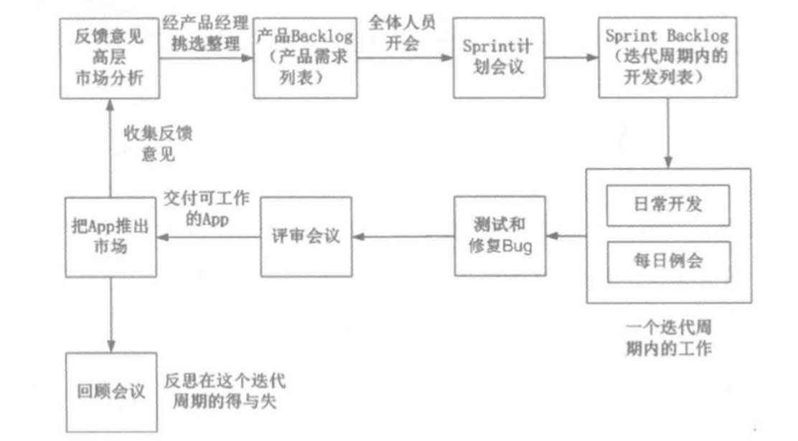

# App 后台开发运维和架构

## App 后台入门

### App 后台的功能

> App 后台/后端的两个重要作用是远程存储数据和消息中转

### App 后台架构

有什么业务？

遇到什么问题？

有什么可行的技术解决方案？

掌握了以上的架构设计的框架，有什么好处？

分享架构文章时，套用这个架构的框架，问自己问题：作者是在什么**业务逻辑**遇到那些**问题**，采用了那些技术**解决方案**。

#### 设计 App 架构

1. 根据 App 合集，梳理出 App 的**业务流程**，把每个业务流程列出
2. 把每个业务流程可能会遇到的**问题**整理出来
3. 根据整理出的问题，探讨可行的**技术解决方案**
4. 把所有**技术解决方案有机融合**，就是一个App 后台的**初步架构**

#### 架构的演变是由业务驱动

> 当 App 处于不同的发展阶段，架构上需要做变化

- 刚上线，查询用户的数据是**每次查询数据库**，随着**用户量的增大**，数据库的**查询压力**也随之增大，可能需要考虑**缓存**，或者把数据查询迁移到 **NoSQL** 数据库

- 初期架构不合理，到了后期因为业务发展的需要**改变架构是很困难的**。但要初期要弄好一个好的架构，有可能**耽误后台的研发进度**，是 App 的**上架时间推迟**，这时又要面对巨大的**资金和时间压**力。

### App 和 App 后台的通信

#### HTTP 协议还是私有协议

- 通用语言通信
  - HTTP 协议

- 暗语通信
  - 私有协议
  - 对设计能力要求高
  - 两个端口工作人员增加工作量
  - 对App的安全性和性能要求高

#### 长连接 VS 短链接

- 长连接：服务器保持通信数量有限，达到通信数量的限制，必须增加服务器继续和后台通信
  - Socket/WebSocket
  - 程序员素质要求高
  - 开发困难
  - 手游和聊天推送服务

- 短链接
  - 开发效率高
  - 减少开发人员的认知成本

- App 调用后端提供 API
  - 1. API用途
  - 2. 输入什么
  - 3. 结果是什么
    - 轻量级数据交换格式：JSON(JavaScript Object Notation)

### App 后台和 Web 后端的区别

- 输出流量：API设计、图片处理
  - 节省流量方法
    - App 下载经过压缩的缩略图（几十KB以下）
    - 用户查看原图时才下载原图
- 移动手机弱网络环境
  - 推送服务器已经发送的信息，客户端网络原因收不到信息，而推送服务器认为已经发送
- 手机电量有限

### 选择服务器

> IDC VS 云服务器

#### IDC 升级 CPU 或升级内存容量

- 和客户经理商谈所需硬件的价格或在线选择具体的配置
- 在线支付或银行转账
- 确认起到账后，等待IDC安排工作人员升级硬件

#### 云服务器升级硬件

- 选择升级后的硬件配置
- 网络支付
- 重启服务器，升级。升级带宽，不用重启服务器

- **负载均衡**
- **云数据库**
- **云内存存储**

### 选择语言

1. 选择开发效率最高的编程语言
2. 一个系统中，不同的业务逻辑可以用不同的编程语言实现

- Web网站：PHP
- 推送服务器：Golang/Erlang

#### 思维模式

**Openfire** 开源的聊天服务器

认识新事物，从**整体到局部**

“抓核心、做减法” - 从纷繁复杂的万物万象中，发现重点是哪里、关键是什么，抓住这个核心，就能做到化繁为简。

- **软件技术核心问题**
  - 软件的**使用场景**
  - 软件的**运行原理**

### App 开发过程

#### 1. 项目启动阶段

- App 项目启动之前，由产品经理（创业公司里都是公司创始人）介绍个人对A匹配的想法。
  - 1.App 做**什么业务**
  - 2.有**哪些界面，每个界面有什么，每个界面之间的怎么跳转的**
  - 3.产品经理根据以上的这些想法**画出原型图**
  - 4.原型图导出为一堆**HTMl文件**，在浏览器打开index.html文件
  - 5.PM把原型图交给UI设计师出设计稿。**UI设计**是根据自己的美术功底**美化原型图**
    - 调整整个界面的**布局**
    - 每个界面**元素的位置、大小、颜色**
    - **标注**每个界面的**元素**
    - UX交互设计师负责**设计交互**，例如，A 界面怎么跳到 B 界面，是从上往下跳转，还是从下往上跳转
  - 6.UI设计师设计稿后，产品经理和整个项目相关人员开**产品会议**。
    - 产品经理亲自**介绍原型图**，把整个产品的**业务逻辑**用原型图向相关的人员演示，还有回复大家对产品的**疑问**
  - 7. 产品会议后，相关的人员领取属于自身的人物（或者由上级分派），相关的人员同时**估算研发时间**，**研发总监或技术总监**根据各种**估算时间**指定**安排工作计划**

#### 2. 研发阶段

- 后台开发人员根据产品和业务需求设计后台架构
- Android/IOS先设计前端的架构，或根据设计稿开始先做界面，凡是需要后台交互的部分先不做

- 后端架构设计完成后，初步设定API接口
  - 1. API有什么用的？
  - 2. API的输入参数是什么？
  - 3. API返回什么数据？

- 后台研发人员对Android/iOS 研发人员**说明其 App 设定的API接口**，让其了解相关内容。这个 API 接口初期先**不用实现其功能**。只需要返回一些**测试数据**一便前端人员开发，后台人员在研发过程中把这些**接口的功能实现**。这样前端和后端的开发进度都**不会耽误**。当然，这些 API 接口以后**不排除有改动的可能**，为保证信息的通常，任何对 API 接口的改动请**及时通知相关人员**

#### 3. 测试阶段

指定开发计划时就应该规划**功能测试周期**，一般是一个月测试一次为宜。

两三个月测试一次，那么积累的问题非常多。

创业团队没有专门的测试人员，更多的情况是“人人都是测试员”。整个创业团队里的每个都充当测试人员，测试App里的每个功能，记录下所有发现的问题，整理后提高给相关的负责人修复。

#### 4. 正式上线阶段

> App 测试完毕后就开始准备上架

- iOS，提交到 App store 审核，需要7-15个工作日
- Android 应用，提交到各个应用市场，例如：小米、豌豆荚、应用宝等

- 正式推出阶段，每个团队都要面对下面的问题
  - 提交到各个应用市场，潜在用户也**未必发现**这个App？
  - 怎么让**更多的用户**了解这个 App？
  - 用户了解这个 App 后怎么让用户下载？
  - 怎么保证用户经常使用 App，增加**用户的黏性**

这些问题是创业团队中**市场推广人员**和**运营人员**需要解决的，当然团队中的每个成员也可以为解决这些问题贡献一份力量。

创业团队中的职权很难分清，例如，App 后台人员兼职做运维，甚至是前端，理由很现实；没额外的资金聘请人员负责这些工作。

- 一个创业团队只有4个人
  - 1个创世人
  - 1个App后台
  - 1个Android研发人员
  - 1个iOS研发人员

按照这样的人员分配，研发外的所有的工作都由创始人负责

创业团队中工作能力成长快，大量的问题需要开发人员处理，同时在创业团队里对人员技能要求比较高，要一转多长，在有需要的时候加班也不是什么稀奇的事情

### App 开发模式 —— 敏捷开发

> 适用于需求多变、开发周期短的项目

- 传统的软件开发模式（瀑布流开发模型）
  - 问题评估
    - 计算解决方案
      - 设计系统架构
        - 开发代码
          - 测试部署
            - 部署和使用系统
              - 维护解决方案

问题：开发周期过长，迭代速度慢。

移动互联网行业发展速度块，需求不断变化，产品更新迭代的频率高，基于移动互联网的以上特点，引入了Scrum 敏捷开发框架

#### Scrum

> 是敏捷开发框架，是一个**增量的、迭代的**开发过程。这个框架中，整个开发周期包括诺干个**小的迭代周期**，每个小的迭代周期为一个**Sprint**，每个 Sprint 的建议长度为**2-4周**。使用 BackLog 来管理产品或项目的需求，产品 Backlog 是一个按照商业价值排序的需求列表，列表条目的体现形式通常为用户故事。

> Scrum 的开发团队总是对开发**对客户具有较高价值的需求**。在每个迭代过程中开发团队产品 Backlog 挑选最有价值的需求进行开发。Sprint 中挑选的需求经过 Sprint 计划会议上的分析、讨论和评估得到一个 Sprint 的任务列表，成为 Sprint Backlog。迭代结束时团队将交付潜在可交付的产品。

Sprint Backlog 4周时间，2天的 Sprint 计划会议时间，2.5周的开发时间，开发的日子里每日例会必不可少，1周的测试修复 Bug 时间，1天的 Sprint 评审会议和 Sprint 回顾会议。

#### Sprint 计划会议

- Sprint 计划会议之前，PM所要实现的产品需求（产品 Backlog）以用户故事（即从用户的角度去描述用户所需的功能）的形式确定下来，并画出原型图，UI根据原型图完成设计稿（在Sprint 计划会议前设计搞很重要，因为设计稿对估算时间的非常大）。PM同时确定各个产品需求的优先级。

Sprint 计划会议期间（一般是2天），开发团队的成员不应该做任何开发工作，要将全部精力放在把产品需求分解成一个个开发任务，并估算开发时间。

##### 估算开发时间

1. 对于所需要使用的**新技术**，要估算**学习和调研时间**
2. 根据统计，每个程序员每天的**有效工作时间**是**5个小时左右**，其他时间都被沟通、喝水、休息、上洗手间等琐事占据，如果某个任务估算时间查过5个小时，那就代表了这个任务完成需要超过一天的时间。
3. 开发人员对开发任务的估算尽可能精细，一般来说，每个任务的估算时间不应该查过5个小时，如果超过5个小时，就应该把这个任务在细分为多个更小的任务。只要尽可能**精细地估算任务**，总体估算时间是大概精确的，因为有的任务估算的时间比实际完成的时间多，有的时间任务估算的时间比实际完成的时间少，平衡后总量是差不多的。当然有时会遇到意料之外的**技术难题**，这时所估算时间既要大打折扣。

最后根据PM的**优先级**和开发人员的**估算时间**，确定这个**迭代周期**最终的**开发任务和其对应的优先级**，即完成 Sprint Backlog

#### 日常开发

- API接口返回假数据的好处
  - 整个开发计算有个总体的规范
  - 相当于TDD（测试驱动开发）

开发过程中遇到任何问题，必须及时找相关人员沟通。这样有个关键的地方，沟通可能会打断别人工作，打断别人的工作有两种情况：一种是别人正在投入、忘我地进行某项关键性工作；另外一种是别人正在进行一些零碎的、不重要的工作。对于第一种情况，打断别人的工作后别人心情也不好，而且其重新切换到投入，忘我的工作状态很困难

- 保证沟通的效果
  - 非非常紧急的问题，可以等相关人员休息时候再沟通
  - 解决一个问题，先梳理情绪，在梳理人际关系，最后才是问题本身。多微笑，别苦着脸，平时待人和善，说好话，存好心，做好事，沟通的时候对事不对人
  - 对于关键性工作可以试一下番茄工作法：设计一个很短的时间周期（25分钟）专注于工作，中途不允许被任何人打扰，过了这个时间周期后休息5分钟

- Scrum master(技术总监)
  - 团规和外部的沟通必须统一通过 Scrum master。例如市场部、运营部的同时有什么需求要开发团队完成。必须经过 Scrum master**同意**后再由 Scrum master 和开发团队沟通
  - 开发人员有**重大的决策**，也必须经 Scrum master 同意。Scrum master 的最大作用是**屏蔽外部对开发团队的影响**，是开发的**进度**和开发的**效率**得到保证。

  - 定期团建活动：加强团队的凝聚力

Sprint Backlog中，需求不能变更，UI确定后原则上做小修改（但这点无法得到保障）。产品有新的需求，下一个Sprint Backlog 在考虑。

#### 每日例会

> 团队成员应该整理**各自的任务列表**

- **昨天完成了那些任务**，每个任务的使用**多少时间**，**没完成的任务**估算还要**多少时间**
- **剩余的开发时间**

例会中PM和DEV团队中的成员都要参加。如果可以的话，让**运营人员和市场人员**也参加，这样可以是团队每个成员都对公司的**产品有个整体的了解**

- 每个人在例会上报告以下3方面的事情
  - **昨天做了那些工作？**
  - **今天准备做哪些工作？**
  - **有什么工作需要其他同时配置？**

**避免在会议上讨论问题**，如果真的需要，在会议后和同时讨论，不要浪费整个团队的时间

#### 测试和修复 Bug

> 产品开发完成就进入测试和修复 Bug 的阶段。如果人手不足，可以使用交叉测试的方法，即 Android 开发人员测试iphone的App，iPhone开发人员测试 Android的App，后台、运营、UI等人员看情况分配测试任务。

- 测试人员把测试得到的问题提交到Bug 管理软件，每个 Bug应该包含3部分
  - **问题描述和重现步骤**
  - **测试人员**
  - 负责**解决这个问题的人员**，如果测试人员不知道具体负责人，把问题提交给技术总监，由技术总监指派解决问题的研发人员

#### 评审会议

> 在测试和修复 Bug完后全体人员开评审会议

相关的开发人员在评审会议中向全体人员演示 App 的功能。iPhone 屏幕的映像传输到电视机上。

#### 回顾会议

> 研发完成后回顾会议，每个成员都在会议中提两点

- 这轮迭代过程中做得**好的地方**
- 这轮迭代过程中做的**不好的地方**

- 这个过程两轮，即每个成员都要提**两点做的好的地方**和**两点做的不好的地方**
- 注意当一个成员提出自己的意见时，其他成员**不做任何的评价**

#### 及时反馈

> 精益理念中很重要的两点是快速反馈和快速迭代。快速迭代是通过Scrum 这个敏捷开发框架实现。

产品投入到市场后，怎么快速收集用户的反馈呢？

- 建立相关的QQ群，收集意见
- 在App中，有个意见反馈的功能，能把反馈的意见发送到服务器
- 后台中有个系统的账号。每个用户注册后就自动加这个系统账号为好友，可以随时通过聊天功能向这个系统账号提问题。PM经常登录这个系统账号和用户交流。
