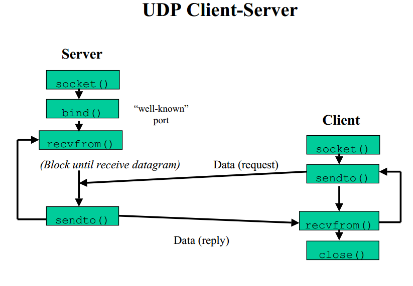
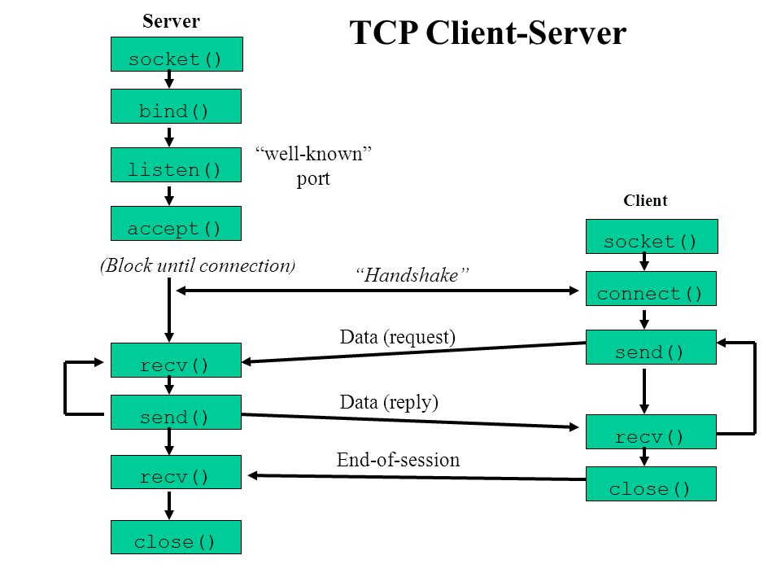
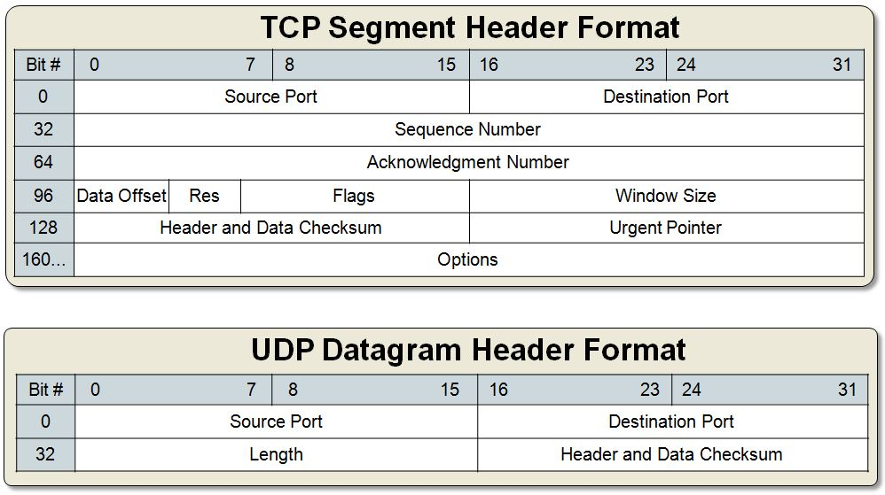
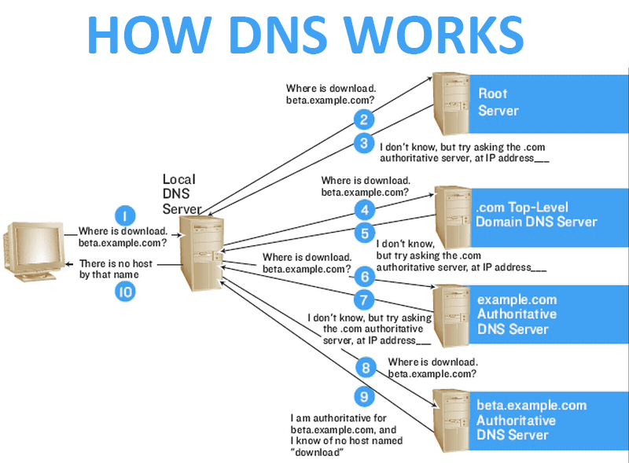
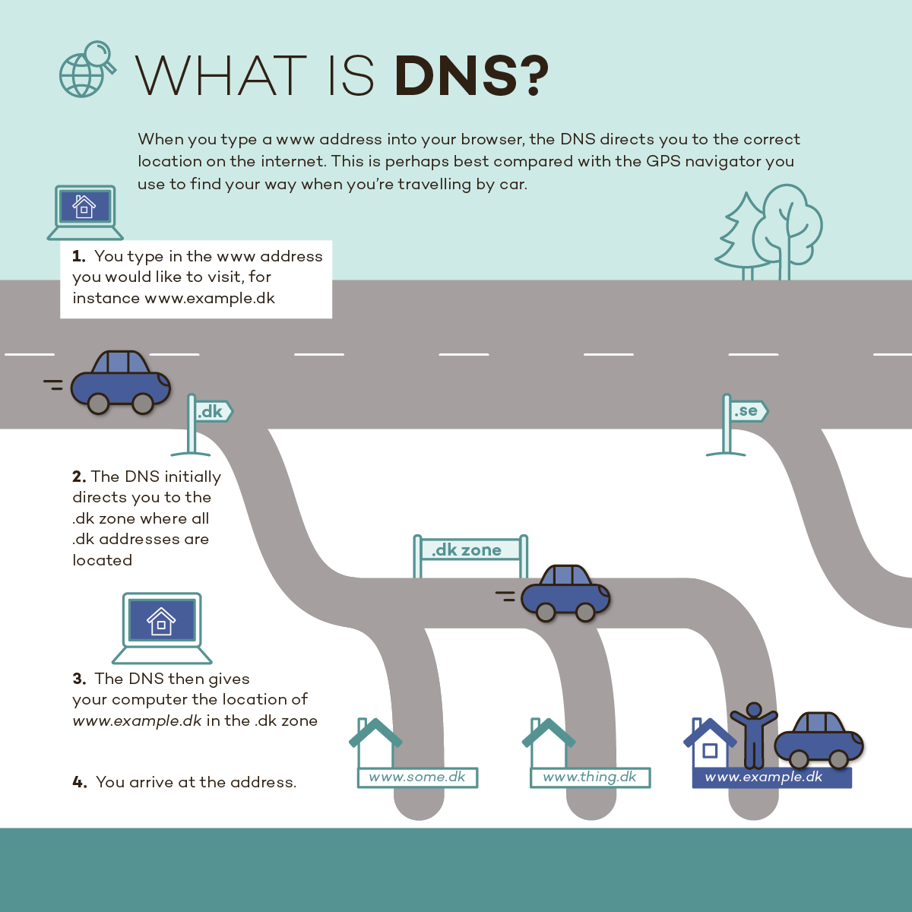

# DNS服务

## Sockets: C/S

任何两台主机之间通信都是通过进程进行通信。

### 应用层协议

httpd服务实现超文本传输

ftp服务实现文件传输

smtp 服务实现邮件传输

POP3 或 IMAP4 服务实现邮件收取








- Client: 发起应用请求的程序
- Server: 响应请求（提供服务）的程序
  - LISTEN: Socket

- 传输层协议：TCP，UDP，SCTP
  - TCP: Transmission Control Protocol，传输控制协议
    - 面向连接的协议：双方通信之前需要事先建立虚连接
  - UDP: User Datagram Protocol，用户数据包协议
    - 无连接的协议：双方无需通信之前需要事先建立虚连接

- TCP发送报文叫做TCP套接字
- UDP发送报文叫做UDP套接字
- raw sockets: 裸套接字（不需要传输层TCP或UDP，直接调用IP分组包）

## DNS: Domain Name Service, 应用层协议

- port: `53/UDP`, `53/TCP`
- www.wovert.com FQDN(Full Qualified Domain Name) 完全合格域名/全称域名，是指主机名加上全路径





[IETF](http://ietf.org/)

## 名称解析：名称转换

- 公共库
  - `getipbyhostname()` 根据IP获取主机名
  - `gethostnamebyip()` 根据主机名获取IP

- 本地hosts文件格式： `ip hosts alias`

- 根域
  - TLD: top level domain(顶级域)
    - 组织域：`.com .net .org .gov .edu .mil(军工部门)`
    - 国家域：`.iq .tw .hk .jp .cn`

- `www.wovert.com.`
  - www(三级域，主机域)
  - wovert(二级域)
  - com(一级域或顶级域)
  - .(根域)

- 查看www.wovert.com相对应的IP地址

本地hosts->DNS缓存(TTL，在内存里)->DNS服务器->根域名服务器->.com服务器，返回给DNS服务器-> 查找wovert服务器，返回给DNS服务器->查找www对应的地址，返回给DNS服务器 -> 在DNS服务器缓存

域名: wovert.com

www.wovert.com(主机名，FQDN: Full Qualified Domain Name)

## DNS查询类型

- 递归查询：client->DNS Server(客户端指定的DNS服务器)
- 迭代查询(客户端指定的DNS服务器找不到，此DNS服务器迭代请求查询客户端要查询的FQDN)：DNS Server(顶级域) -> DNS Server(二级域) -> .....

## DNS名称解析方式

解决高并发DNS服务器请求问题？读取，更新(多个服务器同步数据),多加一个服务器解决不了问题。分层设计解决此问题。先查找根域->顶级域->二级域->三级域，最终返回

DNS是分布式数据库系统

- 根据名称->查找IP：正向解析
- 根据IP->查找名称：反向解析
  - 4.3.2.1.in-addr.arpa.
    - 4
    - 3
    - 2
    - 1
    - in-addr.arpa
    - .
- . -> in-addr.arpa -> 1 -> 2 -> 3 -> [1-9]
- 注意：二者的名称空间，非为同一个空间，即非为同一棵树；因此，也不是同一个解析库

- 域：wovert.com. 1.1.1.1
  - www.wovert.com 2.2.2.2
  - ftp.wovert.com. 3.3.3.3
  - bbs.wovert.com. 4.4.4.4
  - news.wovert.com. 5.5.5.5

##　DNS服务器类型

- 负责解析至少一个域
  - 主名称服务器
  - 辅助名称服务器（主服务器宕机时，使用辅助名称服务器）
- 不负责解析
  - 缓存名称服务器

## 一次完成的查询请求经过的流程

1. Client 查找本地文件hosts文件
2. 查找本地 DNS Local Cache
3. 查找 DNS Server(recursive)
4. 自己负责解析的域：直接查询数据库并返回答案
5. 不是自己负责解析域：Server Cache -> iteration(迭代)

## 解析答案

- 肯定答案：有并且有结果（可以缓存）
- 否定答案：不存在查询的键，因此，不存在与其查询键对应的值（可以统一缓存时间）

- 权威答案：由直接负责的DNS服务器返回的答案
- 非权威答案：有缓存 DNS 返回的答案

## 主-辅DNS服务器

- 主DNS服务器：维护负责解析的域数据库的那台服务器；**读写操作**均可进行
- 从DNS服务器：从主DNS服务器那里或其它的从DNS服务器那里"复制"一份解析库；但只能进行**读操作**

### "复制"操作的实施方式

- 序列号：serial,数据库的版本号,主服务器数据库内容发生变化时其版本号递增；
- 刷新时间间隔：refresh,从服务器每多久到主服务器检查序列号更新状况
- 重试时间间隔：retry,从服务器从主服务器请求同步解析库失败时，再次发起尝试请求的时间间隔；时间间隔必须短于 refersh
- 过期时长：expire,从服务器始终联系不到主服务器时，多久之后放弃从主服务器同步数据；停止提供服务
- 否定答案的缓存时长

**主服务器数据更新时"通知"从服务器随时更新数据**

### 区域传送（同步方式）

- 全量传送：axfr,传送整个数据库(第一次传送时)
- 增量传送：ixfr, 仅传送变量的数据

- DNSsec(安全DNS)
  - DNS 截取 -> 完整性校验认证（校验码签名）
  - 本地局域网需要使用DNS服务器，自动化运维

## 区域(zone， 物理概念，解析库文件)和域(domain，逻辑概念)

- wovert.com域
  - FQDN -> IP
    - 正向解析库；正向解析区域
  - IP -> FQDN
    - 反向解析库；反向解析区域

- 父域的区域比子域要大

## 区域数据库文件

DNS服务器必须指定根域域名服务器地址

- 资源记录(每一行都是资源记录)：Resource Record，简称RR

### 记录有类型

> A, AAAA, PTR, SOA, NS, CNAME, MX

- SOA: Start Of Authority 起始授权(权威)记录
  - 一个区域解析库有且只能有一个SOA记录，而且必须放在第一条；（岛屿）
- NS: Name Resolving 域名解析记录
  - 一个区域解析库可以有多个NS记录(多个岛主)；其中一个为主的；（岛主）
- A: Address 地址记录
  - FQDN -> IPv4
- AAAA: 地址记录
  - FQDN -> IPv6
- CNAME: Canonical Name 别名记录
- PTR：Pointer
  - IP -> FQDN (反向解析)
- MX: Mail eXchanger 邮件交换器

优先级：0-99, 数字越小优先级越高

### 资源记录的定义格式

`语法： name [TTL] IN RR_TYPE value`

### SOA：

- name: 当前区域的名字；例如："wovert.com."后者"2.3.4.in-addr.arpa."
- IN 关键字
- RR_TYPE 资源类型
- value: 有三部分组成
  - 1.当前区域的区域名称（也可以使用主DNS服务器名称）
  - 2.当前区域管理员的邮箱地址； 但地址中不能使用@符号，一般使用点号来替代；
  - 3.(主从服务协调属性的定义以及否定答案的TTL)

- 例如：

``` dns-config
wovert.com. 86400 IN SOA wovert.com. admin.wovert.com. (
2017010801  ;serial
2H          ;refresh time hour
10M         ;retry, minute
1W          ;expire, week
1D          ;negative answer ttl, day
)

- 86400: 1 days
```

### NS

- name: 当前区域的区域名称
- value: 当前区域的某DNS服务器的名字，例如`ns.wovert.com.`
  - 注意：一个区域可以有多个ns记录

- 例如: 指定域名解析服务器

``` dns-config
wovert.com. 86400 IN NS ns1.wovert.com.
wovert.com. 86400 IN NS ns2.wovert.com.
```

### MX

- name: 当前区域的区域名称
- value: 当前区域某邮件交换器的主机名
  - 注意：MX记录可以有多个；但每个记录的value之前应该有一个数字表示其优先级；

- 例如：

``` dns-config
wovert.com. IN MX 10 mx1.wovert.com
wovert.com. IN MX 20 mx2.wovert.com
```

### A

- name: FQDN, 例如`www.wovert.com.`
- value: IPv4地址

- 例如：

``` dns-config
www.wovert.com. IN A 1.1.1.1
www.wovert.com. IN A 1.1.1.2
bbs.wovert.com. IN A 1.1.1.1
ns1 IN A 1.1.1.1
mx1 IN A 1.1.1.1
```

### AAAA

- name: FQDN
- value: IPv6

### PTR

- name: IP地址，有特定格式，IP反过来写，而且加特定后缀
  - 例如`1.2.3.4`的记录应该写为`4.3.2.1.in-addr.arpa`
- value: FQDN

- 例如

``` dns-config
4.3.2.1.in-addr.arpa. IN PTR www.wovert.com.
```

### CNAME

- name: FQDN 格式的别名
- value: FQDN 格式的正式名字

- 例如：`web.wovert.com. IN CNAME www.wovert.com.`

## 注意

1. TTL可以从全局继承
2. @表示当前区域的名称
3. 相邻的两条记录其name相同时，后面的可省略
4. 对于正向区域来说，各MX，NS等类型的记录为value为FQDN，此FQDN应该有一个A记录

## 域名解析服务

**dnpod.cn, dns.la**

## bind服务

### bind介绍

- BIND: Berkeley Internet Name Domain, `ISC.org`
  - dns：协议
  - bind：DNS协议的一种实现
  - named：bind程序的运行的进程名

``` SHELL
# yum info bind
 9.9.4
# yum list all bind*
# yum info bind-libs
# rpm -ql bind-libs  

```

- 程序包：
  - `bind-libs`：被bind和bind-utils包中的程序共同用到的库文件
  - `bind-utils`：bind 客户端程序集，例如：**dig, host, nslookup**等

  - `bind`: 提供的 `DNS Server` 程序、以及几个常用的测试程序
  - `bind-chroot`：选装,让 `named` 运行于 `jail` 模式下
    - 假根下操作，容器里操作，防止在根进程操作下被劫持

### bind安装

``` SHELL
# yum -y install bind
# yum list all bind*
```

### bind配置

``` SHELL
# rpm -ql bind

/usr/sbin/named
/usr/sbin/named-checkconf 检查配置文件是否有错误
19：59
```

- 主配置文件: `/etc/named.conf`
- 区域解析库文件: `/var/named/*.zone`

#### 主配置文件, 可包含其它配置文件

- `/etc/named.iscdlv.key`
- `/etc/named.rfc1912.zones`
- `/ecc/named.root.key`

#### 解析库文件

- `/var/named/`目录下；一般名字为：ZONE_NAME.zone
- 注意：
  - 1.一台DNS服务器可同时为多个区域提供解析
  - 2.必须要有根区域解析库文件：`named.ca`
  - 3.还应该有两个区域解析库文件：localhost和127.0.0.1的正反向解析库
    - 正向解析库文件：`named.localhost`
    - 反向解析库文件：`named.loopback`

#### rndc: remote name domain controller，name server control utility 远程名称域管理工具

- `953/tcp`，但默认监听于127.0.0.1地址，因此仅允许本地使用

#### bind程序安装完成之后，默认即可做缓存名称服务器使用；如果没有专门负责解析的区域，直接即可启动服务

- CentOS 6: `# service named start`
- CentOS 7: `# systemctl start named.service`

#### 主配置文件格式：

- 全局配置段: `options {...}`
- 日志配置段: `logging {...}`
- 区域配置段: `zone {...}`
  - 那些由本机负责解析的区域，或转发的区域

- 缓存名称服务器的配置：
  - 监听能与外部主机通信的地址（不是127.0.0.1）
  - `listen-on port 53 { 172.16.0.2; };`
  - 注意：每个配置语句必须以分号结尾，花括号前后都有空格

  - 学习时，建议关闭dnssec功能
    - `dnssec-enable no;`
    - `dnssec-validation no;`
    - `dnssec-lookaside no;`

  - 关闭仅允许查询：
    - `allow-query { localhost; };`

#### 检查配置文件语法错误

``` SHELL
# named-checkconf -h (help)
# named-checkconf /etc/named.conf
```

- 53/TCP：区域传送
- 53/UDP：解析

### 测试工具

`dig, host, nslookup`

#### dig命令

`dig [-t RR_TYPE] name [@SERVER] [query options]` 用于测试dns系统，因此其不会查询hosts文件

``` OPTIONS 查询选项
  +[no]trace：跟踪解析过程
  +[no]recurse：进行递归解析
```

Flags: qr(query request) ra(request answer)

- QUESTION SECTION: 问答段
- ANSWER SECTION:回答段
- AUTHORITY SECTION: 权威段
- ADDITIONAL SECTION: 附加段
- Query time：
- SERVER
- WHEN
- MSG SIZE

``` SHELL
# dig -t A www.taobao.com` 没有@IP，通过本机测试
# dig -t A www.sina.com @114.114.114.114
# dig -t A www.taobao.com +trace
```

- 注意：反向解析测试 `# dig -x IP`

- 模拟完全区域传送：`# dig -t axfr DOMAIN [@SERVER]`

#### host命令

`host [-t RR_TYPE] name SERVER_IP`

``` SHELL
# host -t A www.baidu.com IP地址
# host -t NS baidu.com 域名服务器
# host -t MX baidu.com 邮件服务器
```

#### nslookup命令

`nslookup [-options] [name] [server]`

- 交互式模式：

``` Interactive
nslookup>
server IP : 以指定的IP为DNS服务器进行查询
set q=RR_TYPE: 要查询的资源记录类型
www.sohu.com 要查询的名称
```

#### rndc命令：named服务控制命令

``` shell
# rndc status
# rndc stats
# rndc flush 清空缓存DNS服务器
# rndc reload [zone] reload configuration file and zones
# rndc refresh zone 冻结zones
# rndc stop 关闭DNS服务器
```

### 配置解析一个正向区域

> 以wovert.com域为例

#### 1.定义区域

- 在主配置文件中或主配置文件辅助配置文件中实现

``` zone
zone "ZONE_NAME" IN {
type {master|slave|hint|forward};
file "ZONE_NAME.zone";  #相对路径/var/named路径下
};
```

- hint：根服务器
- forward：转发服务器
- 注意：区域名字即为域名；ZONE_NAME => wovert.com

#### 2.建立区域数据文件(主要记录为A或AAAA记录)

- 在`/var/named`目录下建立区域数据文件

``` shell
# cd /var/named/`
# vim wovert.com.zone
$TTL 3600
$ORIGIN wovert.com.
@ IN SOA wovert.com. dnsadmin.wovert.com. (
  2017010801
  1H
  10M
  3D
  1D )
  IN  NS  ns1 或则 ns1.wovert.com.
  IN  NS  ns2
  IN  MX  10  mx1
  IN  MX  20  mx2
ns1 IN A 172.16.0.2
mx1 IN A 172.16.0.10
mx2 IN A 172.16.0.11
www IN A 172.16.7.0
web IN CNAME www
bbs IN A 1721.16.7.0
bbs IN A 1721.16.7.1
```

- 权限及属组修改

``` shell
# chgrp named /var/named/wovert.com.zone
# chmod o= /var/named/wovert.com.zone
```

- 检查语法错误

``` shell
# named-checkzone ZONE_NAME /var/named/ZONE_FILE
# named-checkconf
```

#### 3.让服务器重载配置文件和区域数据文件

``` shell
# rndc reload
# systemctl reload named.service
```

### 配置解析一个反向区域：

#### 1. 定义区域

- 在主配置文件中或主配置文件辅助配置文件中实现

``` dns-config
zone "0.16.172.in-addr.arpa." IN {
type {master|slave|hint|forward};
file "172.16.0.zone"; # 相对路径/var/named路径下
};
```

- 注意：反向区域的名字
- 反写的网段地址`.in-addr.arpa`
  - `0.16.172.in-addr.arpa`

#### 2.定义区域解析库文件

``` dns-config
$TTL 3600
$ORIGIN 0.16.172.in-addr.arpa.
@     IN    SOA         ns1.wovert.com. nsadmin.wovert.com. (
            2017110102
            1H  
            10M
            3D  
            12H )
      IN    NS          ns1.wovert.com.
71    IN    PTR         ns1.wovert.com.
61    IN    PTR         ns1.wovert.com.
71    IN    PTR         mx1.wovert.com.
61    IN    PTR         mx2.wovert.com.
71    IN    PTR         bbs.wovert.com.
61    IN    PTR         bbs.wovert.com.
71    IN    PTR         www.wovert.com.
```

- 权限及属组修改

``` shell
# chgrp named /var/named/172.16.zone
# chmod o= /var/named/172.16.zone
```

- 检查语法错误

``` shell
# named-checkzone 16.172.in-addr.arpa /var/named/172.16.zone
# named-checkconf
```

#### 3.让服务器重载配置文件和区域数据文件

``` shell
# rndc reload
# systemctl reload named.service
```

#### 4.测试

`# dig -x 172.16.0.1`

## 主从服务器

- 注意：从服务器时区域级别的概念
- 主服务器区域:从服务器区域

- 级联复制:复制从服务器的区域的从服务器

## 配合一个从区域

- On Slave
1. 定义区域

定义一个从区域

``` dns-config
zone "ZONE_NAME" IN {
  type slave;
  file "slaves/ZONE_NAME.zone";
  masters { MASTER_IP; };
};
```

- 配置文件语法检查：`# named-checkconf`

`/var/named/slaves => named.named 770`

2. 重载配置

``` shell
# rndc reload
# systemctl reload named.service
# cd /var/named
# vim wovert.zone

新增NS记录
IN NS ns2
ns2 IN A 192.168.1.3

SOA的序列表一定要加1，才能更新到从服务器
# named-checkzone wovert.com /var/named/wovert.com.zone
# rndc reload
# rndc status

新增域名
# vim /var/named/wovert.zone
pop3 IN	A	192.168.1.71
修改序列号+1
# rndc reload
# systemctl status named.service


手动传输区域文件：
# dig -t axfr wovert.com
```

- On Master
1. 确保区域数据文件中为每个从服务器配置NS记录；并且在正向区域文件需要每个从服务器的NS记录的主机名要有一个A记录，且此A后面的地址为真正的从服务器的IP地址；

``` SHELL
# /etc/named.conf
  listen-on port 53 { 127.0.0.1; 192.168.1.3; };
  dnssec-enable no;
  dnssec-validation no;
  dnssec-lookaside no;

此时为缓存DNS服务器
# systemctl start named.service

配置正向区域的从服务器
# vim /etc/named.rfc1912.zones
  zone "wovert.com" IN {
    type slave;
    file "slaves/wovert.com.zone";
    masters { 192.168.1.2;  };
  };

# named-checkconf
# rndc reload
# systemctl status named.service
# cd /var/named/slaves
# ls -l
# dig -t A www.wovert.com @192.168.1.3

检查主服务器发送的通知
# systemctl status named.service
# dig -t A pop3.wovert.com @192.168.1.3
# dig -t axfr wovert.com @192.168.1.2

注意：时间要同步；`ntpdate`命令；同步到时间服务器
```

## 子域授权

### 正向解析区域授权子域的方式：

- 定义子域

``` dns-config
ops.wovert.com. IN NS ns1.ops.wovert.com
ops.wovert.com. IN NS ns2.ops.wovert.com
```

- 子域有主从服务器

``` dns-config
ns1.ops.wovert.com. IN A IP.AD.DR.ESS
ns2.ops.wovert.com. IN A IP.AD.DR.ESS

wovert.com IN NS ns1.wovert.com
ns1.wovert.com IN A 1.1.1.1

fin.wovert.com
www.fin.wovert.com
ops.wovert.com
www.ops.wovert.com
ns.ops.wovert.com
```

### 1.子域服务器(172.16.100.69)

- 在主服务器上授权子域服务器: `172.16.100.67`

``` shell
# vim /etc/named/wovert.com.zone
  ops IN NS ns1.ops
  ns1.ops IN A 172.16.100.69

修改serial
# rndc reload
```

### 2.配置子域服务器(172.16.100.69)

``` SHELL
# yum -y install bind
# vim /etc/named.conf
  listen-on port 53 { 127.0.0.1; 172.16.100.69; };

三个NO
# systemctl start named.service
# systemctl status named.service
# ss -tunl
```

### 3.定义一个区域

``` SHELL
# vim /etc/named.rfc1912.zones
  zone "ops.wovert.com" IN {
    type master;
    file "ops.wovert.com.zone";
  };

# cd /var/named
# vim ops.wovert.com.zone
  $TTL 3600
  $ORIGIN ops.wovert.com.
  @	IN	SOA	ns1.ops.wovert.com. nsadmin.ops.wovert.com. (
    2018010801
    1H
    10M
    1D
    2H )
  IN NS ns1
ns1 IN A 172.16.100.69
www IN A 172.16.100.69
# chmod o= ops.wovert.com.zone
# chgrp named ops.wovert.com.zone
# named-checkconf
# named-checkzone ops.wovert.com.zone /var/named/ops.wovert.com.zone
# rndc reload
# dig -t A www.ops.wovert.com @172.16.100.69
# dig -t A www.ops.wovert.com @172.16.100.67
# dig -t A www.wovert.com @172.16.100.67
```

## 定义转发

> 注意：被转发的服务器必须允许为当前服务器做递归

## 1.区域转发：仅转发对某特定区域的解析请求

``` dns-config
zone "ZONE_NAME" IN {
  type forward;
  forward {first|only};
  forwarders { SERVER_IP; }
};
```

- first:首先转发；转发器不响应时，自行去迭代查询
- only：只转发

172.16.100.69

``` shell
# vim /etc/named.rfc1912.zones
  zone "wovert.com" IN {
    type forward;
    forward only;
    forwarders { 172.16.100.67; 172.16.100.68; };
  };

# named-checkconf
# rndc reload
# dig -t A www.wovert.com @172.16.100.69
父域解析子域，子域解析父域
allow-query {}
```

### 2.全局转发：针对凡本地没有通过zone定义的区域查询请求，通通转发给某转发器

172.16.100.69

``` shell
# vim /etc/named.conf`
  options {
    ... ...
    forward {only|first};
    forwarders { 172.16.100.67; };
    ... ...
  };

# rndc reload
# dig -t A www.baidu.com @172.16.100.69
```

## bind中的安全相关的配置

acl：访问控制列表；把一个或多个地址归并一个命令的集合，随后通过此名称即可对此集全内人所有主机实现统一调用；

``` config
acl acl_name {
  ip;
  net/prelen;
};
```

示例

``` config
acl mynet {
  172.16.0.0/16;
  127.0.0.0/8;
};
```

### bind有四个内置的acl

- none：没有一个主机
- any：任意主机
- local：本机
- localnet：本机所在的IP所属的网络

### 访问控制指令：

- allow-query {}：允许查询的主机；白名单；
- allow-transfer {}:允许向哪些主机做区域传送；默认为向所有主机；应该配置仅允许从服务器
- allow-recursion {};允许哪些主机向当前DNS服务器发起递归查询请求
- allow-update {}; DDNS，允许动态更新区域数据库文件中的内容；

- 主服务器：vim /etc/named.rfc1912.zones

``` config
zone "wovert.com" IN {
  type master;
  file "wovert.com";
  allow-transfer { slave; };
};

# vim /etc/named.conf
  options之前定义acl
  acl slaves {
    172.16.100.68;
    127.0.0.1;
  };

  acl mynet {
    127.0.0.0/8; # 只能自己递归查询
  };

  options {
    listen-on port 53 { 172.16.100.67; 127.0.0.1; };
    ...

    # recursion yes;
    allow-recursion { mynet; }; 只允许mynet网络递归
  };

# named-checkconf
# rndc reload
```

172.16.100.68上测试

``` shell
# dig -t axfr wovert.com @172.16.100.67
```

172.16.100.67

``` shell
# dig -t axfr wovert.com @127.0.0.1;
# systemctl restart named.service
```

### Slave

``` shell
zone "wovert.com" IN {
  type slave;
  file "slaves/wovert.com.zone";
  masters { 172.16.100.67; };
  allow-transfer { none; };
  allow-update { none; };
};
```

## bind view

- 国内服务器：
  - 电信IP => 电信DNS
  - 网通IP => 网通DNS

- 视图

``` view
view VIEW_NAME {
  zone
  zone
  zone
};

view internal {
  Match-clients { 172.16.0.0/8; };
  zone "wovert.com" {
    type master;
    file "lingyigma.com/internal"；
  };
};

view external {
  match-clients { any; };
  zone "wovert.com" {
    type master;
    file "lingyigma.com/external"；
  };
};
```

- 主服务器：172.16.100.67
- 从服务器：172.16.100.68

## 1.从服务器

``` shell
# yum -y install bind
# vim /etc/namde.conf
  listen-on port 53 { 127.0.0.1; 172.16.100.68; }
  dnssec-enable no;
  dnssec-validation no;
  densec-lookaside no;

# systemctl start named.service
# systemctl status named.service
# vim /etc/named.rfc1912.zones
  // 配置正向从区域
  zone "wovert.com"　IN {
    type slave;
    file "slaves/wovert.com.zone";
    masters { 172.16.100.67; };
  };

# named-checkconf`
```

## 2.主服务器

``` shell
# cd /var/named/`
# vim wovert.com.zone
  201700916 加上+1
  // 新增NS记录
  IN  NS  ns2
  ns2 IN  A 172.16.100.68

# named-checkzone wovert.com /var/named.wovert.com.zone
# rndc reload
# rndc status
```

## 3. 从服务器上

``` shell
# rndc reload
# systemctl status named.service
```

## 4. 主服务器上之后

``` shell
二进制文件
# cd /var/named/slaves/wovert.com.zone
```

## 5. 测试

`# dig -t A www.wovert.com @172.16.100.68`

## 6. 在主服务器上增加新的

`# vim /var/named/wovert.com.zone`

pop3 IN A 172.16.100.72
并且修改序列号,+1

``` shell
# rndc reload`
# systemctl status naemd.service
```

## 7. 从服务器

``` shell
# systemctl status named.servie
# dig -t A pop2.wovert.com @172.16.100.68
```

## 反向解析 1. 从服务器

``` shell
# vim /etc/named.rfc1912.zones`
  zone "100.16.172.in-addr.arpa" IN {
    type slave;
    file "slaves/172.16.100.zone";
    masters { 172.16.100.67; };
 };
`
# named-checkconf`
```

## 反向解析 2. 主服务器

``` shell
# vim /var/named/wovert.com.zone`
  增加序列号
  IN  NS  ns2.wovert.com.
  68  IN  PTR ns2.wovert.com.

# named-checkzone 100.16.172.in-addr.arpa /var/named/172.16.100.zone
# rndc reload
```

## 3. 从服务器

`# rndc reload`

## 4. 主服务器

`# rndc reload`

## 5. 从服务器

``` shell
# ls -l /var/named/slaves/172.16.100.zone
# dig -x 172.16.100.67 @172.16.100.68
```

## 6. 主服务器，新增记录

``` shell
# vim /var/named/172.16.100.zone
  增加序列号,+1
  72 IN PTR pop3.wovert.com.

# rndc reload
# systemctl status named.service
# dig -x 172.16.100.72 @172.16.100.68
```

博客：正向解析区域、反向解析区域、主/从、子域、基本安全控制
