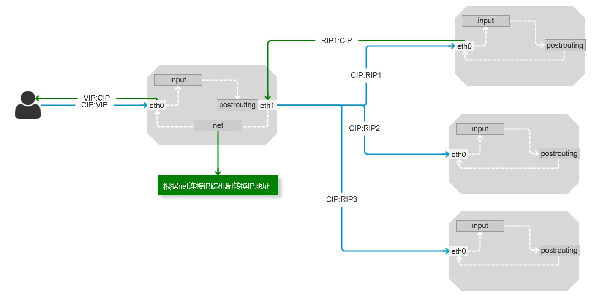
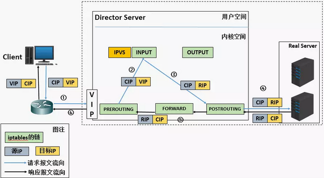
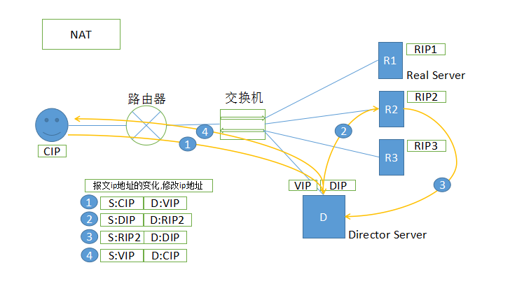
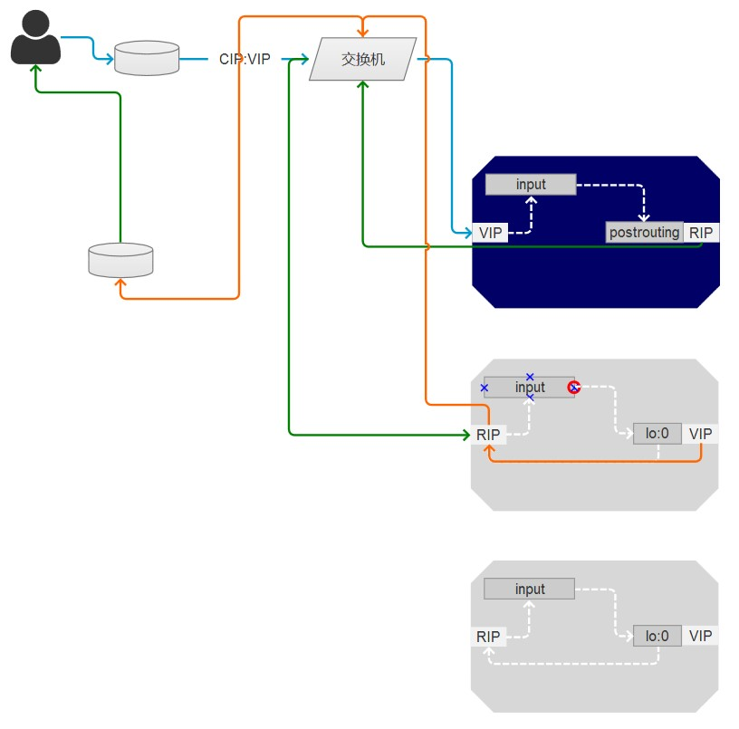
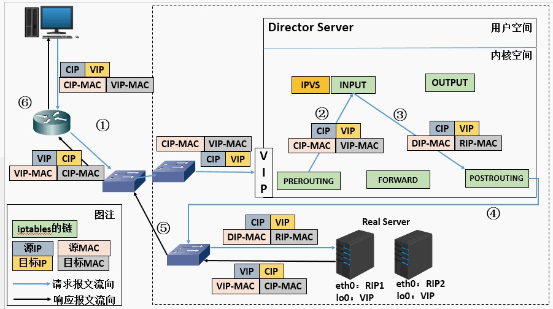
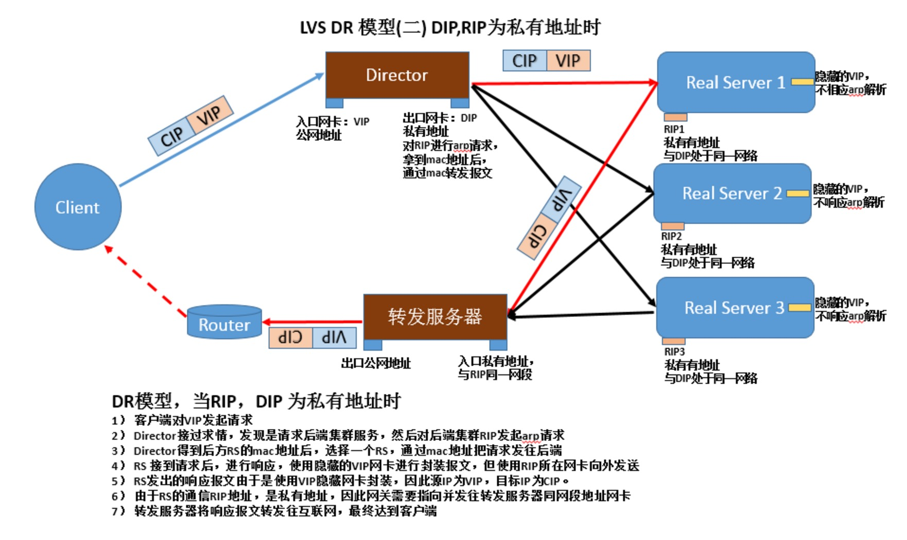
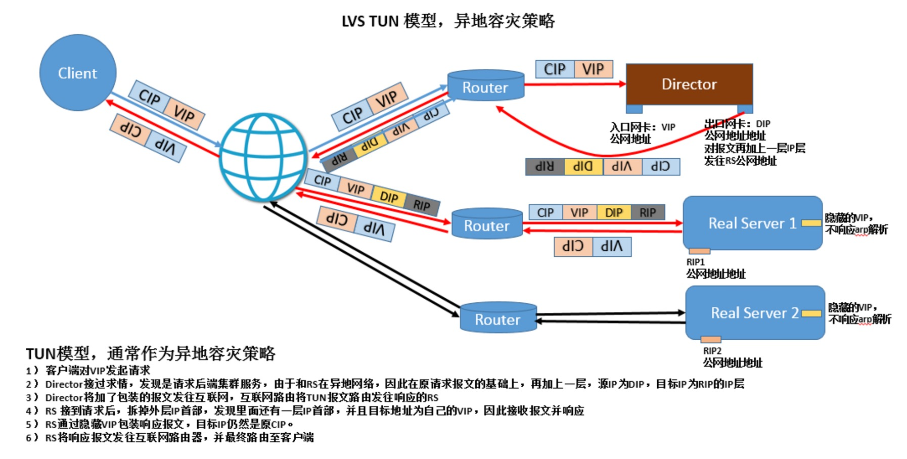
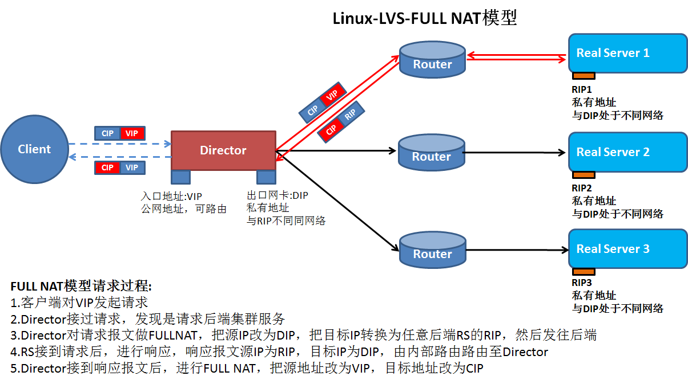

# Linux Cluster

> 集群：将多台主机组织起来满足同一个需求

## 系统扩展的方式

- Scale UP：向上扩展，垂直扩展
- Scale OUT：向外扩展，水平扩展

## 集群的类型

- LB：Load Balancing，负载均衡集群
  - VIP: 负载均衡器，调度器，分发器
  - RIP: 后端主机(backend server, upstreaming server),"真"服务器(real server)

- HA: High Availability，高可用集群
  - Active：活动服务器
  - Passive：备用服务器(standby)

  - SPOF: Single Point Of Failure，单点故障

  - Availability=MTBF/(MTBF+MTTR)
    - [0,1]
    - 99%,99.9%,99.99%,99.999%
    - 99.99%比99%可用性高了10倍
    - 1000个小时：
    - 99%：990，不在线10个小时
    - 99.9%：999，不在线1个小时
    - 99.9%：999.99，不在线0.01个小时

    - MTBF: Mean Time Between Failures，平均故障间隔时间
    - MTTR: Mean Time To Repaire，修复前平均时间
- HP：High Performance，高性能集群
  - [top500](https://www.top500.org)排名的的超级计算机
  - 天气预报、地形
  - 天河一号超级计算机系统
- DS: Distributed System，分布式系统
  - hadoop:
    - mapreduce（分布式运算）
    - hdfs（分布式存储）

## LB集群的实现

- 硬件
  - F5：BIG-IP(10几万)
  - Citrix Netscaler
  - A10公司的A10
  - Array
  - Redware
- 软件
  - LVS: Linux Virtual Server
  - Haproxy
  - Nginx
  - ats(apache traffice server, 雅虎捐给apache软件基金会)
  - perbal

## 基于工作的协议层次划分

- 传输层(内核)：lvs(支持400w并发), haproxy(伪装), nginx(伪装)
- 应用层(用户空间，负载大)：haproxy(mode http), nginx, ats, perlbal

- CDN？
- 并发（由峰值决定）

## HA集群的实现方案

- keepalived：vrrp协议
- ais
  - hearbeat
  - cman+rgmanager(RHCS)
  - corosync + pacemaker

## 系统构建

- 分层
- 分割
- 分布式
  - 应用
  - 数据
  - 存储
  - 计算

## LVS

> Linux Virtual Server 章文嵩(song1)

- L4：四层路由，四层交换；根据请求报文的目标IP和目标PORT将其调度转发至后端的某主机

[LVS 介绍博客](http://superproxy.github.io/docs/lvs/index.html)

### iptbles

- iptables/netfilter
  - PREROUTING-->INPUT
  - PREROUTING-->FORWAD-->POSTROUTING
  - OUTPUT-->POSTROUTING

### LVS 命令

- ipvsadm/ipvs
  - ipvsadm: **用户空间命令行工具**，用于管理集群服务及集群服务上的Real Server
  - ipvs: **工作于内核上的netfilter的INPUT钩子之上的程序**(强行逆行到POSTROUTING)，i可根据用户定义的集群实现请求转发
    - input->postrouting
  - 支持基于TCP、UDP、SCTP、AH、EST、AH_EST等协议进行调度

### lvs集群的专用术语

- VS: Virtual Server, Director(调度器), Dispatcher(分发器), Balancer(负载均衡器)
- RS: Real Server(后端主机)
  
- CIP：Client IP(客户端IP)
- VIP: Vitural Server IP(公网IP，网卡别名上绑定)
- DIP: Director IP(调度器IP，内网IP,与RIP通信的IP)
- RIP: Real Server IP(后端IP)

### LVS集群的类型

- lvs-nat
- lvs-dr
- lvs-tun
- lvs-fullnat

### lvs-nat类型：目标地址转换

> 多目标的DNAT，通过将请求报文中的目标地址和目标端口修改为挑选出的某RS的RIP和PORT实现转发





1. RIP和DIP必须在同一IP网络，且应该使用私有地址；RS的网关要指向DIP（保证响应报文必须经由vs）
2. 请求报文和响应报文都经由Director转发(使用连接追踪机制，但是影响并发性能。400万并发管理连接追踪文件)，较高负载下，Director易于称为系统性能瓶颈；
3. 支持端口映射；
4. VS必须是Linux，RS可以是任意OS；

### lvs-dr类型：Direct Routing直接路由，VS和RS并列（默认类型）

> 通过为请求报文的重新封装一个MAC地址进行转发，源MAC是DIP所在接口的MAC，目标MAC是挑选出某RS的RIP所在接口的MAC地址；IP首部不会发送变化(CIP<-->VIP)





1. 确保前段路由器将目标IP为VIP的请求报文发往Director
- 解决方案：
  - 1.在路由器上静态绑定VIP和Director的MAC地址；
  
  - 2.禁止RS响应VIP的ARP请求，禁止RS的VIP进行通告(运营商的路由器不能控制)
    - 2.1 arptables
    - 2.2 推荐使用：修改RS的内核参数，并把VIP绑定本地回环接口lo的别名上；`arp_ignore, arp_announce`
2. RS的RIP可以使用私有地址，也可以使用公网地址
3. RS跟Director必须在同一物理网络；RS的网关必须不能指向DIP
4. 请求报文必须由Director调度，但响应报文必须不能经由Director
5. 不支持端口映射
6. RS可以使用大多的OS

每一个RS和DS都有VIP，地址冲突？本地局域网arp请求，如果有相关的arp请求，则出现IP地址冲突。隔离RIP地址，避免IP地址冲突。每一个 RS 设置 arptables控制arp请求和响应报文。Linux较新版本当中提供与外部通信的接口之外，还有 lo 接口。一个报文从外网接口进来，经过lo接口到达主机（转发），RIP配置在物理接口上，VIP配置在lo的别名上。比如：lo:0 接口（内网接口）对arp请求不给响应。调整内核参数之后，只在他们网络断响应，其其他网络接口地址不会响应ARP请求(隔离了ARP响应)。避免IP地址不会冲突。通常每个主机都向整个网络通告，但可以设置为每个接口向它所在的网络断通告。只有DS的VIP会响应给前段路由的ARP广播请求，因为本地的地址肯定是MAC地址请求的，当请求报文到达路由器的时候，CIP:VIP的报文，会发送给VIP的主机，而其他别名上定义的VIP不能响应ARP广播请求。ARP广播请求得到DS的mac地址之后封装数据包,CIP:VIP(路由器MAC:DS的MAC), DS收到报文后，在input链上发现这是集群服务，想办法给予某个挑选算法转发给RS。怎么转？数据报文CIP:VIP不变，原MAC是DS的MAC地址，目标MAC是RS的MAC地址，基于交换机发送给目标RS主机。报文中检查CIP:VIP，发现本机有VIP，封装数据报文后，经由RS的RIP接口到交换机到路由器(另一个与RIP网段的网络，可以与外网通信的接口)转发给CIP。

RS隔离广播ARP请求的响应

### lvs-tun类型：tunnel

> 转发方式：不修改请求报文的IP首部（源IP为CIP，目标IP为VIP），而是原IP首部之外再封装一个IP首部（源IP为DIP，目标IP为挑选出RS的RIP）



1. RIP，DIP，VIP全得就公网地址；
2. RS网管不能指向也不可能指向DIP；
3. 请求报文经由Director转发，但响应报文将直接发送CIP；
4. 不支持端口映射；
5. RS的OS必须支持隧道功能；

- VIP(北京)
  - RS(纽约) 有VIP
  - RS(东京) 有VIP
  - RS(伦敦) 有VIP

DS 如何将请报文转发出 VS 的 VIP？伪装VIP:RIP报文给RS

### lvs-fullnat类型：alibaba开发，不是标准类型

> 基于DNA模型，转发方式：通过同时修改请求报文的源地址(CIP-->DIP)和目标IP地址(VIP-->RIP)进行转发



1. VIP是公网地址，RIP 和 DIP 是私网地址，且通常不在同一网络中，但需要经由路由器互通
2. RS收到的请求报文源 IP 为 DIP，因此响应报文将直接响应给 DIP
3. 请求和响应报文都经由 Director
4. 支持端口映射

## 负载均衡集群中会话保持的方式

1. 源地址哈希：session sticky (LVS:SH)
2. 会话集群：session cluster (复制)
3. 会话服务器：session server (单点)

## lvs scheduler 调度方法

> 根据其调度时是否考虑后端主机的当前负载，可分为静态方法和动态方法两类

### 静态方法：仅根据算法本身进行调度（不考虑后端负载）

- RR: Round Robin, 轮询/轮调/轮叫
- WRR: Weighted RR，加权轮询
  - 1,2,3 => RS1
  - 4,5,6 => RS2
  - 7,8,9 => RS3
- SH: Source Hashing 源地址哈希（用户会话保持机制，购物车）
  - Director会话表（CIP与RIP对应表，问题：RIP挂掉）
  - 第一次CIP与RIP对应表，设置超时时长
  - 之后从对应表查找，找到在对应表的RIP中查找，没有则记录对应表
  - Redis服务器存储会话，主从会话集群
- DH: Destination Hasing 目标地址哈希(用于正向代理负载算法)
  - 正向web代理（缓存）集群，负载均衡内网用户对外部服务器的请求
  - 保存的是目标地址哈希
  - 哈希的是目标地址
    - 提高缓存命中率
  - client -> DS(1.1.1.1/index.html => Proxy1 1.2.3.4/index => Proxy2) -> Proxy1, Proxy2 ->

### 动态方法：根据算法及各RS当前的负载状态进行调度

- LC: Least connection, 最少连接
  - Overhead=Active(活动连接数量) x 256 + Inactive(非活动连接)
    - 活动连接：要求请求/处理请求/响应请求
    - 非活动连接：服务器等待客户端请求
    - 值越大负载大
- WLC: Weighted LC，加权最少连接
  - Overhead=(Active x 256 + Inactive)/weight
  - 值越大负载大
  - **默认调度，通用的调用都方法**
- SED: Shorted Expections Delay，最短期望延迟
  - Overhead=(Active+1) x 256/weight
  - 最开始使用,RS1(w:1),RS2(w:3),RS3(w:8), (0+1)x256/{1,3,8}=...
  - 第二次使用时问题，始终在w:8服务器里
  - **放弃了非活动连接**
- NQ: Never Queue，永不排队
  - 第一轮没有权重计算，第二次开始计算权重计算
- LBLC: Locality-Based LC，动态的DH算法
  - 提高了均衡性
  - **失去了命中率**，但可以拿到之前的缓存数据
- LBLCR：LBLC with Replication 带复制功能的LBLC
  - 两个缓存服务器同步数据，比原始服务器上获取资源节省

## ipvs

- `ipvs`: 内核中的协议栈上实现
  - `ipvsadmin`：用户空间的服务管理工具
  - 四层交换和四层路由
  - 一个ipvs主机(DS)可以同时定义多个 cluster service
    - 一个DS 提供2个Web服务器或2个MySQL服务器
  - 一个 `ipvs` 服务至少应该有一个 RS

## ipvsadm命令用法

### 内核是否支持ipvs

``` shell
# uname -r
# grep -A 11 -i 'IPVS' /boot/config-3.10.0-229......
```

### 安装ipvsadm工具

``` shell
# yum -y install ipvsadm
# rpm -ql ipvsadm
# man ipvsadm
```

### 管理集群服务：CRUD

``` shell
ipvsadm -A|E -t|u|f service-address [-s scheduler]
  -A: append
  -E: edit
  -D: delete

  -t: tcp
  -u: udp
  -f: firewall mark

  service-address:
    -t,tcp => vip:port
    -u,udp, vip:port
    -f fwm, mark

  -s scheduler：默认为wlc

ipvsadm -D -t|u|f service-address
  -D 删除
```

### 管理集群上的RS

``` shell
ipvsadm -a|e -t|u|f service-address -r server-address [-g|i|m] [-w weight]
  -a: append
  -e: edit
  -r server-address
    RS的地址
    rip[:port]
  -g,gateway,dr类型，默认类型
  -i,ipip,tun类型
  -m,masquerade,nat

  -w weight

查看
ipvsadm -L|l [options]
  -n,--numeric：数字格式显示ip:port
  --exact：精确值，不做单位换算
  -c,--connection：显示ipvs连接
  --stats：统计数据
  --rate：速率，单位：秒，接发报文数、字节数等

清空
  -C: clear

保存
ipvsadm -S > /path/to/some_rule_file
ipvsadm-save > /path/to/some_rule_file

重载
ipvsadm -R < /path/to/some_rule_file
ipvsadm-restore < /path/to/some_rule_file

清空计数器
  -Z： zero

# ipvsadm -Ln
# ipvsadm -A -t 172.18.100.6:80 -s rr
# ipvsadm -Ln
# ipvsadm -a -t 172.18.100.6:80 -r 192.168.10.11 -m -w 1
# ipvsadm -Ln --rate
  CPS: Connection per Second 每秒连接数
  InPPS: input Packet Per Second 每秒入栈报文数
  OutPPS: Ouput Packet Per Second
  InBPS: In Byte Per Second
  OutBPS: Out Byte Per Second

# ipvsadm -Ln --stats
  Conns: 总连接数量
  InPkts
  OutPkts
  InBytes
  OutBytes:

# ipvsadm -a -t 172.18.100.6:80 -r 192.168.10.12 -m -w 3

另外一个集群服务(另外一个网卡)
# ipvsadm -A -t 172.18.100.6:3306 -s wlc
# ipvsadm -a -t 172.18.100.6:3306 -r 192.168.100.21 -m -w 1
# ipvsadm -a -t 172.18.100.6:3306 -r 192.168.100.22 -m -w 2
# ipvsadm -Ln

修改集群服务rr- 只能改属性，不能改地址
# ipvsadm -E -t 172.18.100.6:80 -s wrr
# ipvsadm -Ln
# ipvsadm -e -t 172.18.100.6:80 -r 192.168.10.11 -m -w 10
# ipvsadm -Ln

保存规则
# ipvsadm -S > /etc/ipvsadm-config.v1
# cat /etc/ipvsadm-config.v1

清空
# ipvsadm -C
# ipvsadm -Ln

重载
# ipvsadm -R < /etc/ipvsadm-config.v1

# rpm -ql ipvsadm
# cat /usr/lib/systemd/system/ipvsadm.service
# ipvsadm -Ln
# ipvsadm-save > /etc/sysconfig/ipvsadm
# systemctl stop ipvsadm
# cat /etc/sysconfig/ipvsadm
# ipvsadm -C
# ipvsadm -Ln
# systemctl stat ipvsadm.service
# ipvsadm -Ln
# systemctl enable ipvsadm.service

 Director: 172.18.100.6，192.168.10.254(Host-only或vmnet02)
RS1:192.168.10.11/24
  gateway:192.168.10.254(Host-only或vmnet02)
RS2:192.168.10.12/24
  gateway:192.168.10.254(Host-only或vmnet02)
共享存储、数据同步
```

## lvs-nat示例

1. 配置各个服务器网络配置
- 网卡类型
- IP地址、子网掩码、网关
2. RS安装httpd,telnet-service服务
3. Director

``` shell
# iptables -F
# less /usr/lib/systemd/system/firewalld.service
# vim /etc/sysctl.conf
  net.ipv4.ip_forward = 1
# sysctl -p
# cat /proc/sys/net/ipv4/ip_forward
```

4. RS1

``` shell
# vim /var/www/html/index.html
  <h1>RS1</h1>
# systemctl start httpd.service
```

5. RS2

``` shell
# vim /var/www/html/index.html
 <h1>RS2</h1>
# systemctl start httpd.service
```

6. Director

``` shell
# curl http://192.168.10.11
# curl http://192.168.10.12
# ipvsadm -Ln
# ipvsadm -C
# ipvsadm -A -t 172.18.100.6:80 -s rr
# ipvsadm -a -t 172.18.100.6:80 -r 192.168.10.11:80 -m -w 1
# ipvsadm -a -t 172.18.100.6:80 -r 192.168.10.12:80 -m -w 2
```

7. Test Server

``` shell
# curl http://172.19.100.6
# curl http://172.19.100.6
# curl http://172.19.100.6
```

8. Director

``` shell
# ipvsadm -Ln
# ipvsadm -E -t 172.19.100.6:80 -s wrr
# ipvsadm -Ln
```

9. Test Server

``` shell
# curl http://172.19.100.6
# curl http://172.19.100.6
# curl http://172.19.100.6
```

10. Director

`# ipvsadm -Ln`

## 共享存储

> 服务器写操作时，使用共享存储

## 负载均衡进群设计时的要点

1. session保持
- session sticky(ip hash)
- session cluster
- session server

2. 数据共享
- 共享存储
  - NAS: Network Attached Storage
    - 文件服务器,访问接口是**文件**级别（FNS,Samba）
  - SAN: Storage Area Network
    - 访问接口是**块**级别
    - SCSI协议借助于其他网络技术（FC,以太网）
  - DS：Distributed Storage，常用方法
    - 访问接口通常是**文件**级别
    - 接口可以是文件系统，也可以API
    - ceph，内核级分布式存储
- 数据同步
  - 博客：rsync + inotify 实现数据同步
  - 主从服务器
    - 主服务器：仅写操作
    - 从服务器：仅读操作

- 数据格式
  - 结构化数据（定义数据类型)：存储于SQL数据库中
  - 半结构化数据（描述数据）：xml,json,存储于文件系统或NoSQL
  - 非结构化数据：文件系统, DS

## lvs-nat 设计要点

1. DIP与RIP在同一IP网络，RIP的网关指向DIP
2. 支持端口映射
3. 是否用到共享存储取决于业务需求

实战作业：负载均衡一个PHP应用

- 测试：NAS

1. 是否需要会话保持（session）
2. 是否需要共享存储（图片）

## lvs-dr(Director Routing)

- 在各主机（Diretor,RS）均要配置VIP，因此，要解决地址的冲突问题，目标是让各RS上的VIP不可见，仅用接受目标地址为VIP的报文，同时可作为响应报文的源地址

1. 再前段的网关接口上静态绑定
2. 在各RS上使用arptables
3. 在个RS上修改内核参数，来限制arp响应通告
  - 限制响应界别：arp_ignore = 1
    - 0: default, 使用本地任意接口上配置的地址进行响应
    - 1: 仅在请求的目标IP配置在本地主机的接口报文的接口上时，才给予响应
    - 2-8

  - 限制通告界别：apr_announce = 2
    - 0: 默认，把本机所有的所有每个接口进行通告
    - 1: 尽量避免向非本地网络通告
    - 2: 总是避免

先限制通告，在设置IP

``` shell
Director:
  VIP: 172.18.100.7,DIP:172.17.100.6
RS1:
  VIP: 172.18.100.7, RIP: 172.18.100.11
RS1:
  VIP: 172.18.100.7, RIP: 172.18.100.12
```

1. 配置网络

所有网卡桥接

2. Director

``` shell
# ip addr add 172.18.100.7/16 dev eno16777736
# ip addr del 172.18.100.7/16 dev eno16777736
# ifconfig eno16777736:0 172.18.100.7 netmask 255.255.255.255 broadcast 172.18.100.7
# ifconfig
```

3. RS1

``` shell
lo的别名上配置VIP
# vim skp.sh
#!/bin/bash
case $1 in
start)
echo 1 > /proc/sys/net/ipv4/conf/all/arp_ignore
echo 1 > /proc/sys/net/ipv4/conf/lo/arp_ignore
echo 2 > /proc/sys/net/ipv4/conf/all/arp_announce
echo 2 > /proc/sys/net/ipv4/conf/lo/arp_announce
;;
stop)
echo 0 > /proc/sys/net/ipv4/conf/all/arp_ignore
echo 0 > /proc/sys/net/ipv4/conf/lo/arp_ignore
echo 0 > /proc/sys/net/ipv4/conf/all/arp_announce
echo 0 > /proc/sys/net/ipv4/conf/lo/arp_announce
esac
# ./skp.sh start
# cat /proc/sys/net/ipv4/conf/arp_ignore
# cat /proc/sys/net/ipv4/conf/arp_announce
# scp skp.sh root@172.18.100.12:/root/
# ifconfig lo:0 172.19.100.7 netmask 255.255.255.255 broadcast 172.18.100.7
# route add -host 172.18.100.7 dev lo:0
# ifconfig
```

4. RS2

``` shell
# ./skp.sh start
# cat /proc/sys/net/ipv4/conf/arp_ignore
# cat /proc/sys/net/ipv4/conf/arp_announce
# ifconfig lo:0 172.19.100.7 netmask 255.255.255.255 broadcast 172.18.100.7
# route add -host 172.18.100.7 dev lo:0
# ifconfig
```

5. test server

``` shell
# ping 172.18.100.7
# arp -vn | grep 172.18.100.7
mac地址
```

6. Director

``` shell
# ipvsadm -C
# ipvsadm -A -t 172.18.100.7:80 -s rr
# ipvsadm -a -t 172.18.100.7:80 -r 172.18.100.11 -g -w 1
# ipvsadm -a -t 172.18.100.7:80 -r 172.18.100.12 -g -w 2s
# ipvsadm -Ln
```

7. test server

``` shell
# curl http://172.18.100.7
# curl http://172.18.100.7
# curl http://172.18.100.7
# curl http://172.18.100.7
```

8. 源地址绑定- Director

`# ipvsadm -E -t 172.18.100.7:80 -s sh`

7. test server

``` shell
# curl http://172.18.100.7
# curl http://172.18.100.7
```

## 设计要点

1. 各主机一个接口，但需要在同一物理网络中
2. RIP的网关不能指向DIP
3. RIP和DIP通常在同一网络，但此二者未必会在VIP在同一网络
4. 各RS需要先设置讷河参数，在设置VIP和路由

``` shell
echo 1 > /proc/sys/net/ipv4/conf/all/apr_ignore
echo 1 > /proc/sys/net/ipv4/conf/lo/apr_ignore
echo 2 > /proc/sys/net/ipv4/conf/all/apr_announce
echo 2 > /proc/sys/net/ipv4/conf/lo/apr_announce

设置接口IP
# ifconfig lo:0 $vip netmask 255.255.255.255 broadcase $vip
# route add -host $vip dev lo:0
```

## fwd: FireWall Mark

> 在netfilter上给报文打标记;mangle表

``` shell
172.18.100.6
# ipvsadm -C

打标记的方法
# iptables -t mange -A PREROUTING -d 172.18.100.7 -p tcp --dport 80 -j MARK --set-mark 1
# iptables -t mange -vnL
# ipvsadm -A -f 1 -s rr
# ipvsadm -a -f 1 -r 172.18.100.11 -g -w 1
# ipvsadm -a -f 1 -r 172.18.100.12 -g -w 2
# ipvsadm -Ln
```

- 优点
  - 两个服务同时打一个标记
  - LVS持久连接，类似SH算法

## LVS persistence：持久连接

- 基于持久连接模版，能实现无使用任何算法调度，都能进行在一段时间内，将来自于同一源IP的请求始终发往同一RS

- ipvs的持久类型
  - 每端口持久（PPC: per port connection）一个服务
  - 每客户端持久（PCC:per client connection）
  - 每FWM持久（PFWMC）同一标记服务

### 定义持久连接服务的方法：

``` shell
# ipvsadm .... -p [timeout] second

# ipvsadm -LN
# ipvsadm -E -f 1 -s rr -p 300

测试服务其，访问次测试，始终访问同一个服务器
# curl http://172.18.100.7
# curl http://172.18.100.7
# curl http://172.18.100.7

Director
# ipvsadm -A -t 172.18.100.7:23 -s rr -p 300
# ipvsadm -a -t 172.18.100.7:23 -r 172.18.100.11 -g -w 1
# ipvsadm -a -t 172.18.100.7:23 -r 172.18.100.12 -g -w 1

RS1
# systemctl start telnet.socket
# useradd fedora
# passwd fedora

RS2
# systemctl start telnet.socket
# useradd fedora
# passwd fedora

test server
# telent 172.18.100.7
# ifconfig

退出，在登录，PPC
```

### PCC，两个服务访问同一个服务器持久连接

``` shell
# ipvsadm -C
# iptables -t mangle -F

:0所有端口
# ipvsadm -A -t 172.18.100.7:0 -s rr -p
# ipvsadm -a -t 172.18.100.7:0 -r 172.18.100.11 -g -w 1
# ipvsadm -a -t 172.18.100.7:0 -r 172.18.100.12 -g -w 1

test server: 两个服务访问同一个服务器
# curl http://172.18.100.7
# telent 172.18.100.7
```

### 80,443

``` shell
Director
# cd /etc/pki/CA
# (umask 077;openssl genrsa -out private/cakey.pem 2048)
# openssl req -new -x509 -key private/cakey.pem -out cacert.pem -days 365
CN
BJ
BJ
Wovert
Ops
ca.wovert.com
caadmin@vowert.com
# touch index.txt
# echo 01 > serial

RS1
# yum -y install mod_ssl
# cd /etc/httpd && mkdir ssl
# cd ssl
# (umask 077; openssl genrsa -out httpd.key 1024)
# openssl req -new -key httpd.key -out httpd.csr
CN
BJ
BJ
Wovert
Ops
www.wovert.com
webmaster@vowert.com
# scp httpd.cs root@172.18.100.6:/tmp

Directory
# openssl ca -in /tmp/httpd.csr -out /tmp/httpd.crt -days 365
# cd /tmp/
# scp httpd.crt root@172.18.100.11:/etc/httpd/ssl/

RS1
# scp -rp ssl/ root@172.18.100.12:/etc/httpd/
# vm conf.d/ssl.conf
  SSLCertificateFile /etc/httpd/ssl/httpd.crt
  SSLCertificateKeyFile /etc/ttpd/ssl/httpd.key
# cp conf.d/ssl.conf root@172.18.100.12:/etc/httpd/conf.d/
# systemctl restart httpd.service

RS2
# yum -y install mod_ssl
# systmeclt restart httpd.service

test server
# curl -k https://172.18.100.11
# curl -k https://172.18.100.12

Director，两个服务绑定在一起
# ipvsadm -C
# iptables t mangle -A PREROUTING -d 172.18.100.7 -p tcp -m multiport --dports 80,443 -j MARK --set-mark 10
# iptables -t mangle -vnL
# ipvsadm -A -f 10 -s rr -p 300
# ipvsadm -a -f 10 -r 172.18.100.11 -g -w 1
# ipvsadm -a -f 10 -r 172.18.100.12 -g -w 2
# ipvsadm -Ln

test server
# curl -k http://172.18.100.7
# curl -k https://172.18.100.7
```

### 注意

1. Director不可用时，整个系统不可用；SPOF
2. 某RS不可用时，Director是否仍会向其调度请求
- 对RS做健康状态监测，并按需增删
  - a.网络层探测；ping命令
  - b.传输层探测；nmap命令
    - 端口可用性探测
  - c.应用层探测；curl命令

- 脚本性能很差，建议使用C语言编写