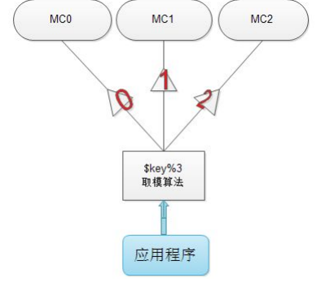
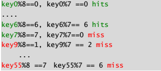
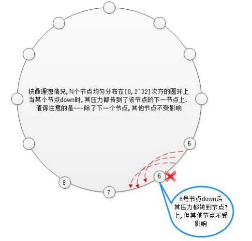
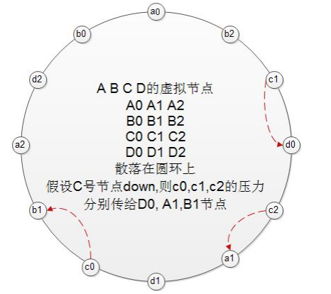

# memcached介绍

- 数据结构模型：
  - 结构化数据：关系型数据库
    - 多表文件IO，排序 => 缓存数据
  - 半结构化数据：xml,json，NoSQL(Redis,Hbase,MongoDB)
  - 非结构化数据：文件系统

- K/V
  - memcached: 存储于内存中
  - redis: 存储于内存中，周期性地将数据同步于辅存上

## memcached

> Livejournal旗下的Danga Interactive

- [livejournal](https://www.livejournal.com/)
- [danga](http://danga.com/)
- [memcached](http://memecached.org)

Free & open source, high-performance, distributed object caching system

有livejournal旗下的danga公司开发

## Memcached features

- k/v缓存：可序列化数据；（打散，流式化数据）存储箱：key,value,flag,expire time
- 功能的实现一半依赖于服务端，一半依赖客户端
- 分布式缓存(memcached协议)：互不通信的分布式集群
- O(1)的执行效率
- 清理过期数据: LRU
  - 缓存项过期
  - 缓存空间用尽

## Kinds of Cache System

- 代理式缓存
  - 请求 -> 代理服务器(未命中) -> 后台查找数据 -> 返回给代理服务器(缓存数据) -> 响应请求
- 旁路式缓存
  - 请求 -> 缓存服务器(有数据直接直接响应，没有则请求原始数据) -> 原始存储端请求数据
  - 客户端决定缓存：差哪个缓存，怎么缓存

## 分布式系统主机路由

- 取模法：key -> hash计算key -> 1
  - 缺点：增加节点之后，之前节点都缓存失效
- 一致性hash
  - 环形
  - 服务器IP hash计算 23^ 取模

### 分布式取模算法

> 取模算法：N个节点要从0->N-1编号，key对N取模，余i，则key落在第i台服务器上



取模算法对缓存命中率的影响

假设有8台服务器运行中，突然down一台，则求余的底数变为7，后果：



从数学的概念上来讲，有N台服务器，变为N-1台，每N(N-1)个数中，只有(n-1)个单元，所以，命中率在服务器down的短期内，急剧下降至(N-1)/(N(N-1)) = 1/(N-1),所以，服务器越多，则down机的后果越严重。

### 一致性哈希算法原理

通俗理解一致性哈希：把各服务器节点映射放在钟表的各个时刻上，把key也映射到钟表的某个时刻上，该key沿钟表顺时针走，碰到的第一个节点即为该key的存储节点，如下图：

问题1：时钟上的指针最大才11点，如果有上百个memcached节点怎么办？


时钟只是为了便于理解做的比喻，实际应用中，我们可以在圆环上分布[0,2^32-1]的数字，这样，全世界的服务器都可以装下了。
问题2：如何把“节点名”，“键名”转化成整数？
　　可以使用函数，如crc32()，也可以自己去设计转化规则，但注意转化后的碰撞率要低，即不同的节点名，转换为相同的整数的概率要低。

一致性哈希对其他节点的影响

通过下图可以看出，当某个节点down后，只影响该节点顺时针之后的1个节点，而其他节点不受影响。因此，Consistent Hashing最大限度地抑制了键的重新分布。



### 一致性哈希+虚拟节点对缓存命中率的影响

由上图可以看到，理想状态下，
1）节点在圆环上分配均匀，因此承担的任务也平均，但事实上，一般的hash函数对于节点在圆环上的映射，并不均匀
2）当某个节点down后，直接冲击下一个节点对下一个节点冲击过大，能否把down节点上的压力平均的分担到所有节点上

解决方案：引入虚拟节点来达到目的

虚拟节点即N个真实节点，把每个真实节点映射成M个虚拟节点，再把M*N个虚拟节点，散列在圆环上，各真实节点对应的虚拟节点相互交错分布，这样，某个真实节点down后，则把其影响平均分担到其他所有节点上。



## Setup Memcahed

``` sh
# yum info memcached
# yum -y install memcached
# rpm -ql memcahed
```

- 11211/tcp,11211/udp
- 主程序：memecached
- 环境配置文件：`/etc/sysconfig/memcached`
  - PORT="11211"
  - USER="memcached"
  - MAXCONN="1024"
  - CACHESIZE="64"
  - OPTIONS=""

`# systemcl start memcahced.servie`

## 协议格式

- 文本协议
- 二进制协议

## memcached客户端程序

- telnet
  - `# yum -y install telnet`
  - `# telnet 172.16.100.6 11211`
- 命令
  - 统计类：`stats, stat items, stats slabs, stats sizes`
    - stats
      - pid
      - uptime 运行多长时间 秒
      - time 当前系统时间戳
      - version 版本号
      - libevent 基于那个并发库
      - cmd_get get命令运行过多少次
      - get_hits get命中了多少次
  - 存储类：`set, add, replace, append, prepend`
  - 获取数据：`get keyname, delete keyname, incr/decr (加+)`
  - 清空：`flush_all`

```
add key flag expires length

mykey键名 flag 缓存有效时间(秒) 5个字节
set mykey 0  60 5
hello
stats items
get mykey

统计数据
stats

新增16字节
append mykey 0 300 16
get mykey

新增16字节
prepend mykey 0 300 16
get mykey

incr mykey 1
```

## memcached程序的常用选项

- -l <ip_addr>：监听的地址
- -u <username>：assume the identify of <username>
- -m <num>：缓存空间大小，单位为MB; 默认为64MB
- -c <num>：最大并发连接数，默认为1024
- -p <num>：TCP port, 11211
- -U <num>：UDP Port, 11211， -U 0关掉
- -M：缓存空间耗尽时，向请求者返回错误信息，而不是基于LRU算法进行缓存清理
- -f <factor>：growth factor，增长因子
  - `# memcached -u memcached -f 1.1 -vv`
- t <thread>：处理用于请求的线程数
- B <proto>：ascii or binary

- memcached 默认没有认证机制，但可借助于SASL进行认证

## slab：内存分配器

`stats slab`

## PHP连接memecached服务的模块

- memcache：php-perl-memcache 扩展
- memcached：php-perl-memcached

## 可提供工具程序的程序包

``` sh
# yum -y install libmemcached
# memstat --help
# systemctl start memcached
# memstat --servers=127.0.0.1
```

##　LB Cluster保持会话地方法

- session stick
- session cluster
- session server

《LVS Web PHP session memcached.txt》

- 博客作业：nginx调度负载均衡用户请求至后端多个ammp主机，PHP的会话保存于memcached中