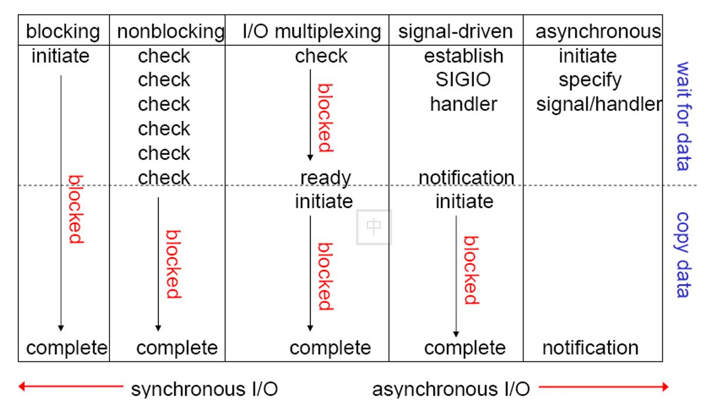
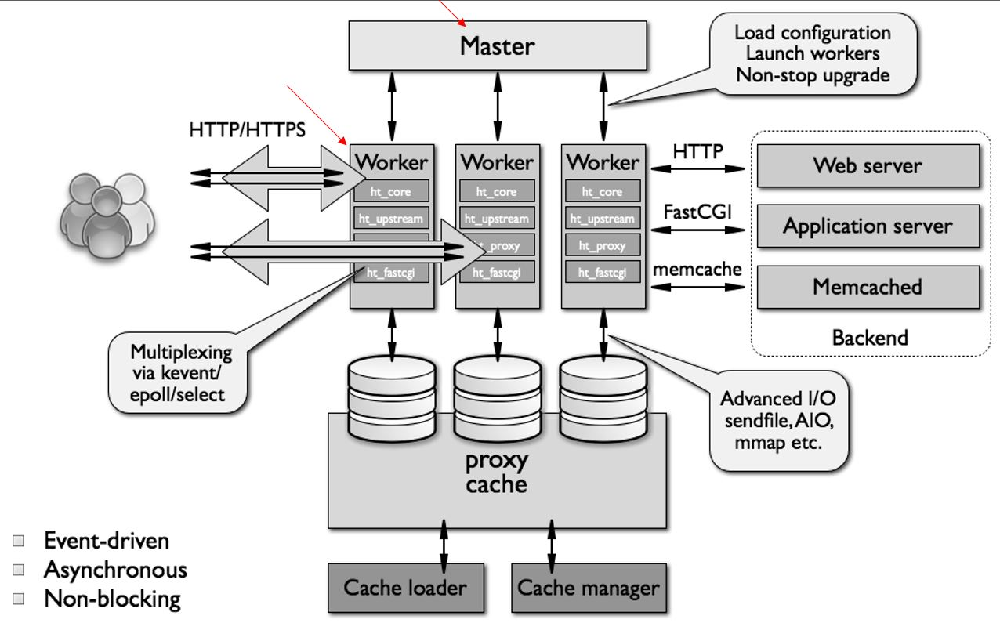

# Nginx -[零壹码博客](https://lingyima.com)

> engine X: nginx, Igor Sysoev, Rambler Media 服务器 [Nginx官网](http://nginx.org/en/docs)

- C10K(Connections 10000并发)
- 解决 C10K[Nginx官网](http://nginx.org/)
- 二次开发：[tengine](http://tengine.taobao.org/), [OpenResty](https://openresty.org/en/)

## 常见HTTP服务器

- httpd-Apache 基金会
- IIS-Microsoft
- GWS-Google

## HTTP请求

- Request
  - 请求行
  - 请求头
  - 请求体
- Response
  - 状态行
  - 响应头
  - 响应体

- curl -v https://lingyima.com
  - -v: 显示 request/response

## I/O模型

### 进程间同步与异步

> 关注的是消息通知机制

- 同步：synchronous
  - 一个任务的完成依赖于另外一个任务的时候，那么被依赖的任务B完成之后，依赖的任务A才能完成
- 异步：asynchronous
  - 调用者A无需等待被调用者B，只是通知被调用者B，依赖的任务A继续执行，被依赖的任务B也继续执行。被依赖者B使用回调函数反映给调用者A

### 同步/异步

> 消息通知（被调用者角度如何处理）

- 同步：被调用者必须完成（在面馆点菜，必须在面馆等待菜完成）
- 异步：被调用者直接返回，即使不能完成（在面馆点菜，菜做完了会消息通知你）

- 同步消息通知：等待对方返回消息
- 异步消息通知：被调用者通过状态、通知或回调函数通知调用者
  - 状态：调用者每隔一段时间就需要检查一次，轮循
  - 通知：发短信
  - 回调：与通知相似

### 阻塞/非阻塞（调用者的角度如何处理）

> 调用者等待结果返回之前所处的状态

- 阻塞：block（挂起）：调用结果返回之前，调用者会被挂起（暂停），一直等待消息通知，不能执行其他任务的状态。只有被调用者成功返回消息时，调用者才会被唤醒，并继续完成任务。
- 非阻塞：nonblock（活动）：调用结果返回之前，调用者不会被挂起

- 阻塞：调用者挂起（在面馆点菜，被冷冻不能做其他行为）
- 非阻塞：调用者继续执行其他任务（在面馆点菜，继续玩儿游戏）

### 阻塞/非阻塞/同步/异步

- 同步阻塞：等待调用者返回之前，不能继续操作，而且要挂起效率最低
- 同步非阻塞：调用结果完成之前，不能返回。可以做其他事情且不能离开办理事务地方
- 异步阻塞：等待消息通知时不能做其他事情，阻塞，银行等待；点菜不能离开餐馆（等待消息时阻塞）
- 异步非阻塞：点菜离开餐馆该干嘛干嘛，做好了之后短信通知客户去领

### 常用 I/O 场景

- 网络IO：本质是 socket 读取
- 磁盘IO：流

《Unix高级网络编程》

#### 每次 IO 都会经由两个阶段

1. 第一步**数据**首先加载至**内核内存空间**（缓冲区）
2. 第二步**数据**从内核缓冲区复制到**用户空间**的进程的内存中去

#### 一个 read 操作

1. 等待数据准备完成，wait for data
2. 数据从内核复制到用户空间进程, copy data

### I/O 模型

> Comparison of five I/O Models

#### 1. 同步阻塞：blockIO

> 全部忙等

#### 2. 同步非阻塞：nonblockIO

- 第一阶段忙等(数据从磁盘到内核内存，调用者忙等，同步非阻塞，轮循：用户进程询问内核完成没有，不停的相互转换)
- 第二阶段阻塞（数据从内核内存空间到用户内存空间，阻塞状态）
- 示例：购买热面，购买之后做其他事情，然后不停的问厨司好没有，厨师查看此用户碗里有没有，反馈给用户。多个用户询问，厨司忙死

#### 3. IO multiplexing(IO 复用)

> select(BSD，数组1024，prefok(httpd))，poll(链表)

- 第一阶段阻塞(屏幕轮询)
- 第二阶段阻塞

- 看屏幕(阻塞),满屏更新，更新有限, 不用轮询
- 一个用户的好了刷新整个屏幕
- 一次满屏刷新
- 屏幕数量有限，即并发有限，, 后台压力依然存在
- 第一阶段，系统调用询问，询问状况，看屏幕，变同步阻塞(屏幕)了~~~

#### 4. Signal Driven IO

> 信号驱动/事件驱动 IO (event(httpd-2.4), epoll, kqueue, /dev/poll)

- 第一阶段非阻塞，信号通知(短信，真正解放了~)
  - 不用忙等、不看屏幕、非阻塞
- 第二阶段阻塞（吃饭要阻塞的~）
  - 调用多个进程，还是阻塞等待

#### 5. Asynchronous IO

> 异步 IO (NodeJS)

- 第一阶段非阻塞（调用者被解放）
- 第二阶段非阻塞(内核空间自动完成复制数据到用户空进)



I/O multiplexing: 阻塞在 IO 复用上，而不是阻塞在内核上，而不是第一次调用上


## Nginx 的特性

- 模块化设计、较好扩展性(3rd modules)
- High reliability
  - master/worker
- 支持热部署
  - 不停机而更新配置文件、更换日志文件、更新服务器程序版本
- 低内存消耗
  - 10000个keep-alive连接模式下的非活动连接仅消耗2.5MB内存
  - 非活动连接：没有传输数据
- event-driven, aio, mmap(内存映射直接访问磁盘)

## Nginx 基本功能

- 纯静态资源的 web 服务器，能缓存打开的文件描述符
- http, smtp, pop3 协议的反向代理服务器，缓存、负载均衡
  - 正向代理：本地代理（地址转换）
  - 反向代理：远程代理（地址转换）
- 支持FastCGI (fpm, lnmp), uWSCGI 等协议
- 模块化（非DSO机制），著名模块有zip，SSI及图像大小调整
- 支持 SSL

### web 服务器相关的功能

- 虚拟主机、keepalive、访问日志（用户行为分析）、url rewrite、路径别名、基于 IP 及用户的访问控制、支持速率限制及并发数限制 ...

## Nginx 扩展功能

- 基于名称和IP的虚拟主机
- 支持keepalive
- 支持平滑升级
- 定制访问日志 ，支持使用日志缓冲区提高日志存储性能
- 支持url rewrite
- 支持路径别名
- 支持基于IP及用户的访问控制
- 支持速率限制，支持并发数限制

## Nginx arch

### master/worker

- 一个master进程，可生成一个或多个worker进程，每个worker响应n个请求
  - master：加载配置文件、管理worker进程、平滑升级
  - worker：http服务、http代理、fastcgi代理



- 事件驱动： epoll, kqueue, /dev/poll (event ports)
- 消息通知：select, poll, rt signals
- 磁盘IO
  - 支持sendfile, sendfile64
  - 支持AIO
  - 支持mmap（内存与磁盘映射关系）

- Linux 线程性能比进程性能并不更优越，因为 Linux 进程已经很轻量级

## Nginx 用来做什么？

- 静态资源的 web 服务器
- http 协议反向代理服务器

## Nginx 模块类型

- 核心模块：Core modules
- 标准模块：Standard HTTP modules
  - Standard HTTP modules
  - Optional HTTP modules
  - Mail modules
- 3rd party modules(第三方模块)

## 安装 Nginx 前提

- [pcre库](https://sourceforge.net/projects/pcre/files/pcre/) 用于解析正则
- [zlib库](http://www.zlib.net/) 压缩资源
- [openssl下载地址](https://github.com/openssl/openssl) 安全加密

## 编译安装 Nginx

> major.minor(偶数，稳定版).release

- Nginx 在 epel 源

``` shell
~]# yum search nginx
~]# vim /etc/yum.repos.d/nginx.repo
[nginx]
name=nginx repo
baseurl=http://nginx.org/packages/OS/OSRELEASE/$basearch/
gpgcheck=0
enabled=1`

~]# yum -y groupinstall "Development Tools" "Server Platform Development"`
~]# yum -y install pcre-devel openssl-devel zlib-devel
~]# `./configure \
--prefix=/usr/local/nginx \
--sbin-path=/usr/sbin/nginx \
--conf-path=/etc/nginx/nginx.conf \
--error-log-path=/var/log/nginx/error.log \
--http-log-path=/var/log/nginx/access.log \
--pid-path=/var/run/nginx/nginx.pid \
--lock-path=/var/lock/nginx.lock \

--user=www \
--group=www \

- 临时文件缓冲目录
--http-client-body-temp-path=/var/tmp/nginx/client \ 上传文件临时缓冲目录(高并发上传大文件临时存放目录)
--http-proxy-temp-path=/var/tmp/nginx/proxy \ 代理服务器缓冲目录
--http-fastcgi-temp-path=/var/tmp/nginx/fastcgi \ Fastcgi 临时缓冲目录
--http-uwsgi-temp-path=/var/tmp/nginx/uwsgi \
--http-scgi-temp-path=/var/cahe/nginx/scgi

- 编译模块：启用--with, 禁用--without
--with-http_ssl_module \
--with-http_stub_status_module \ 状态页
--with-http_gzip_static_module \
--with-http_flv_module \
--with-http_mp4_module \
--with-debug \

- 安装 pcre, zlib, openssl 源码
--with-pcre=../pcre-8.39 \
--with-zlib=../zlib-1.2.8 \
--with-openssl=../openssl-master

~]# make && make install
```

Nginx不支持动态装载米快，所以要确保编译php工作为fpm机制时将ngx_http_fastcgi_module编译到Nginx程序中，在./configure时候要加入--enable-fpm选项

php-fpm程序包

php-fpm包提供fcgi模式的php程序端，其不能和php程序包同时安装。RPM形式安装完成后提供主配置文件/etc/php-fpm.conf，分段配置文件/etc/php-fpm.d/*。

/etc/php-fpm.d/www.conf配置文件(根据实际情况配置)：

; 表示注释该行信息

listen  = 127.0.0.1:9000 监听端口，0.0.0.0表示本机所有地址;支持远程调用应该监听在本机的远程通信端口

;listen.backlog =  -1 后援等待队列的长度，-1表示无限制(服务器可以接受请求的客户端Socket的最大数量)

listen.allowed_clients = 127.0.0.1 授权允许可请求主机，基于IP的控制机制，注释表示允许所

;listen.owner =  nobody 监听服务进程的主机默认以什么用户身份运行，nobody表示普通用户

;listen.group =  nobody 监听服务进程的主机默认以什么用户组身份运行

;listen.mode =  0666 监听服务进程的主机默认以什么权限运行

user = apache 用户，RPM包制作者修改，编译安装非此结果

group = apache 用户组，RPM包制作者修改，编译安装非此结果

pm  = static|dynamic 进程控制器生成子进程方式

;pm.status_path =  /status 状态机制

;ping.path = /ping ping机制，一般用于提供监控机制

php_admin_value[error_log]  = 连接池错误日志位置

php_admin_flag[log_errors]  = on 是否在错误日志中将于管理相关的标志打开

php_value[session.save_handler]  = files php的session记录存放形式：文件

php_value[session.save_path]  = php的session记录存放路径，集群是关键

pm连接池模式有两种，pm = static|dynamic

static：固定数量的子进程；pm.max_children；

dynamic：子进程数据以动态模式管理；选择该项需呀启用以下配置

pm.start_servers= 开始启用进程数

pm.min_spare_servers= 最小空闲进程数

pm.max_spare_servers=最大空闲进程数

;pm.max_requests = 每个子进程自多允许响应多少请求，超过就kill


查看连接状态，发现 SYN_RECV 状态的较多，约500

通过tcpdump 抓包发现，部分80端口的tcp请求没有建立成功。在收到client发送的 SYN 包后，服务器没有响应

综合以上，确定是同时到达80端口的tcp 建立链接的请求过多， 服务器没有及时响应。

问题处理：

1. 对于服务器不能及时处理建立链接的请求，可能是系统中队列设置过小。
`/proc/sys/net/ipv4/tcp_max_syn_backlog`  中的值已经修改， 这个不是系统的瓶颈。

2. nginx监听80端口限制。
经查阅，发现nginx的listen 命令有参数backlog 用来指定队列大小。 而nginx 默认的值为511， 这就验证了SYN_RECV状态到500左右就会出现问题了。

修改 nginx 配置， 将backlog 参数改大， 重启nginx 。 一切正常

## Nginx 信号控制

`~]# nginx -s {stop|}`

- TERM,INT: Quick shutdown
- QUIT： gracefull shutdown，优雅关闭进程，等待请求结束后在关闭
- HUP: 平滑重读配置文件(旧进程使用就配置文件，新进程使用新配置文件)
- USR1: 重读日志，在日志按月/日分割时有用
- USR2: 平滑升级
- WINCH: 优雅关闭旧的进程（配合USR2来进行升级）

## nginx 服务

- /usr/local/nginx/
  - conf 配置文件
  - html 网页文件
  - logs 日志文件
  - sbin 二进制程序

- 启动服务: `# /usr/local/nginx/sbin/nginx`
- 重读配置文件: `# nginx -HUB PID`
- 关闭服务-PID(主进程号): `# kill -QUIT pid`
- kill -signal : `# cat /usr/local/nginx/log/nginx.pid`

## Nginx 配置文件

- 备份 nginx.conf 文件 : `~]# cd /etc/nginx/ && cp nginx.conf{,.bak}`

### 配置文件的组成部分

- 主配置文件：`/etc/nginx/nginx.conf`
  - 导入其他相关配置文件指令：`include conf.d/*.conf`

- fastcgi,scgi,uwscgi 的相关配置（主配置中引入此类文件）
  - fastcgi.conf (fastcgi相关配置)
  - fastcgi_params (fastcgi 参数配置文件)
  - fastcgi.conf.default (fastcgi 默认配置文件)
  - uwsgi_params(Pyton 相关参数配置文件)

- mime.types

### 配置指令（必须以分号结尾）

> `directive value1 [value2...];`

- 支持使用变量：
  - 内置变量：由模块引入，可直接引用
  - 自定义变量：`set variable_name value;`
    - 引用变量：`$variable_name`

### 配置文件结构

- main block：全局配置(对http及mail模块均有效)
- event{ ...}：事件驱动的相关配置
- http { ... }：http 协议的相关配置
- mail { ... }：mail 相关的配置

- http相关的配置

``` nginx.conf
http {
  ...
  server {
    server_name
    root
    alias
    location /uri/ {
      ...
    }
  }
  server {...}
  ...
}
```

### main block

- 配置指令的类别
  - 正常运行必备的配置；
  - 优化性能的配置；
  - 用于调试、定位问题的配置；

#### 正常运行必备的配置

---

``` config
user USERNAME [GROUPNAME];
```

> 指定用于运行 worker 进程的用户和组

`user nginx nginx;`

---

``` config
pid /PATH/TO/PID_FILE;
```

> 指定nginx进程pid文件路径

pid /var/run/nginx.pid;

---

``` config
worker_rlimit_nofile number;
```

> 单个 worker 进程所能够打开的最大文件句柄

`worker_rlimit_nofile 1024;`

> 每个进程最多可打开的文件数

``` shell
~]# ulimit -a
  open files: 1024
~]# ulimit -n 500 修改
```

配置文件中修改可打开的文件数

``` shell
~]# vim /etc/security/limits.conf
  soft nofile 65535 默认：默认可打开文件数
  hard nofile 100000 解释：ulimit可最多修改个数
```

查看最多可打开连接数: `# cat /proc/sys/fs/file-max`

---

#### 性能优化相关的配置

---

``` config
worker_process number | auto;
```

> worker 进程数；

通常应该为 CPU 的核心数减1（原因操作系统运行一个Core）；

auto: nginx 1.8+支持

Nginx进程平均耗费10M-12M内存

- 16 core：
- 15 core: 每个worker进程绑定每个核心（不用进程调度）
- 1 core：运行操作系统

`worker_process auto;`

``` shell
~]# ps aux
~]# lscpu
  CPU(s) : 4 (CPU总个数)
  On-line CPU(s) list: 0-3 (CPU 顺序)
  座：2 (CPU2个)
  Core(s) per socket: 2 (每个CPU 有 2 核)
```

---

``` config
worker_cpu_affinity cpumask ...;
```

> Nginx 绑定具体 CPU

- worker_cpu_affinity auto [cpumask];
- cpumask: 0000 0000 - 1111 1111
- 0000 0001：第0颗
- 0000 0010: 第1颗
- 0000 0100：第2颗
- 0000 1000：第3颗

``` config
worker_processes 2;
worker_cpu_affinity 0010 0100; 第1个和第2个颗
~]# ps axo command,pid,psr
```

---

``` config
worker_priority number;
```

> 进程优先级: [-20,19] 100-139

``` config
worker_priority -5;
~]# ps axo command,pid,psr,ni
```

---

#### 调式、定位问题

``` config
daemon on | off;
```

> 是否守护进程方式启动nginx进程；默认on; 调试时 off，前台查看信息

---

``` config
master_process on | off;
```

> 正常：是否以`master/worker`模型启动nginx进程; 调试：off

---

``` config
error_log file | stderr | syslog:server=address[,parameters=value] | memory:size [debug | info | notice |warn | error | crit | alert | emerg];
```

> 错误日志文件的记录方式及其日志级别

- 方式：
  -`file /PATH/TO/SOME_LOG_FILE;`
  - `stderr`：发送到错误输出; 当前终端
  - `syslog:server=address[,parameter=value]`:发送给 syslog 服务器
  - `memory:size` （大量并发时性能更佳）
    - 打开缓冲：写入内存，然后定期写入到磁盘上
- 日志级别:
  - debug 依赖于 `configure` 时的`--with-debug`模块选项;

---

### 事件相关的配置

---

``` config
worker_connections number;
```

> 每个worker进程所能够**并发**打开的最大连接数: 65535

- 依赖于：`worker_rlimit_nofile` 最大打开
- 最大并发连接数：`worker_processes x worker_connections <= worker_rlimit_nofile x worker_processes`

---

``` config
use method;
```

> 并发请求处理时使用的方法: `use epoll;`

---

``` config
accept_mutex on(default) 或 off;
```

> 启用时，表示用于让多个`worker`进程轮流的、序列化的响应新请求

---

``` config
lock_file logs/nginx.lock;
```

---

### http 配置

#### 定义套接字相关功能

- 配置一个虚拟主机

``` config
server {
  listen PORT;
  server_name HOSTNAME;
  root /PATH/TO/DOCUMENTROOT;
  location / {...}
}
```

1. 基于**port**的虚拟主机 : `listen` 指令要使用不同的端口
2. 基于 **hostname** 的虚拟主机 : `server_name`指令指向不同的主机名
3. 基于 **ip** 的虚拟主机 : `listen IP:PORT`;

- listen address[:port][default_server][ssl][backlog=number][rcvbuf=size][sndbuf=size]
- listen port [default_server][ssl];
- listen unix:path [default_server][ssl];

  - `default_server`: 默认虚拟主机
  - `ssl`：限制只能通过 ssl 连接提供服务
  - `backlog`：后援队列的长度
  - `rcvbuf`: 接受缓冲区大小
  - `sndbuf`：发送缓冲区大小

- `server_name name;`
  - 指明当前 server 的主机名;
  - 后可跟一个或空白字符分隔的多个主机；
  - 支持使用`*`任意长度的任意字符；
  - 支持 ~ 起始的正则表达式模式字符串；

#### 应用策略：主机名匹配优先级

1. 精确匹配
2. 左侧`*`通配符匹配 （`*`:任意长度任意字符，.:任意字符）
3. 右侧`*`通配符匹配
4. 正则表达式模式(`~`)匹配

``` shell
1. server_name www.lingyima.com;
2. server_name *.lingyima.com
3. server_name www.lingyi.*;
4. server_name ~^.*\.lingyima\..*$;
5. mail.lingyima.com, www.lingyima.com
```

---

``` config
tcp_nodelay on | off;
默认 on(告诉服务器直接发送请求数据，不要延迟)
```

- 对 **keepalived** 模式下的连接是否启用 TCP_NODELAY 选项；
- off: 服务器将小数据多个报文合并起来发送一个，web客户端影响速率(请求小图片，服务器等待第二个数据报文一起发送，客户端得不到图片)
- on: 服务器不等待合并报文，直接发送小报文
- （请求小的报文，服务器不发送了。比如图片...）

---

``` config
tcp_nopush on | off; 默认 off
sendfile 启用下才会生效
```

---

``` config
sendfile on | off;
```

- 是否启用sendfile功能，默认off
- on: 在内核中直接包装响应报文给内存，不用往用户空间返回
- 推荐：on

---

#### 定义路径相关配置

---

``` config
root path;
```

> 设置web资源路径映射；

用于指明用户请求的URL所对应的本地文件系统上的文档所在目录路径

Context: `http,server,location,if in location`

`root html;` 相对于安装 nginx 的 prefix 配置路径

- 标准化（运维阶段：稳定->标准化->自动化）
  - OS 硬件配置标准化
  - OS 标准化
  - application 版本标准化
  - 配置文件标准化
  - 配置路径标准化

---

``` config
location [ = | ~ | ~* | ^~] uri {...}
```

> 根据用户请求的 URI 来匹配定义的 location，匹配到时，此请求将被相应的 location 块中的指令所处理

`location @name {...}`

##### 匹配优先级：`=、^~, ~/~*, 不带符号`

1. `=`：URI精确匹配
2. `^~`：对URI的左半部分匹配检查，不分区字符大小写
3. `~`：区分字符大小写正则表达式模式匹配
4. `~*`：不区分字符大小写正则表达式模式匹配
5. 不带符号的

同一个优先级，匹配长的优先级更高~~

``` config
  server {
    location / {
      ...
    }
    location ~*\.txt {
      gzip on;
    }
  }
```

---

``` config
alias path;
```

> 定义路径别名，文档映射的一种机制；仅能用于location上下文

``` config
location /i/ {
  alias /web/v2/images/;
}
http://fqdn.com/i/a.jpg => /web/v2/images/a.jpg
```

- 注意：
  - root 指令，给定的路径对应于 location 中的`/uri/`，左侧的/
  - alias指令，给定的路径对应于location中的`/uri/`，右侧的/

---

``` config
index file ...
```

> 设置默认主页

- Context: http, server, location

---

``` config
error_page code ... [=response] uri;
```

> 根据用户请求的资源的http响应的状态码实现错误页重定向

- error_page 404 =200 /404.html;
  - 404以200状态响应
  - http://www.lingyima.com/hello.html ->因为资源不存在而被改为 http://www.lingyima.com/404.html

- error_page 404 /404.html;
  - 客户端响应码为**404**

- error_page 404 =200 /404.html;
  - 客户端响应码为**200**

---

``` config
try_files file ... uri;
```

> try_files file 尝试访问没有文件，则显示最后一个文件内容

- Context: server, location

``` config
location /images/ {
  try_files $uri /images/default.gif;
}
location /test/ {
  try_files /web/host1/test/test1.html /web/host1/test/test2.html /web/host1/test/test3.html http://192.168.1.61/index.html;
}
```

``` config
# nginx -t
# nginx -s reload
```

---

### 定义客户端请求的相关配置

``` config
keepalive_timeout timeout [header_timeout];
```

> 设定保持连接的超时时长，0表示禁止长连接；默认为 65s;

客户端连接服务器nginx连接超时时长

---

``` config
keepalive_requests number;
```

> 在一次长连接上所允许请求的资源的最大数量，默认为100

---

``` config
keepalive_disable none | browser ...;
```

> 对哪种浏览器禁用长连接；

---

``` config
send_timeout time;
```

> 向客户端发送响应报文的超时时长；特别的，是指两次写操作(写入socket文件)之间的间隔时长；

---

``` config
client_body_buffer_size size;
```

> 用于接受客户端请求报文的body部分的缓冲区大小；默认为16k；超时此文件时，其将被暂存到磁盘上；

---

``` config
client_body_temp_path path [level1 [ level2 [level3]]]
```

> 设定用于存储客户端请求报文的body部分的临时存储路径及子目录结构和数量， URI md5 首字符[0-f]

- /var/tmp/body/2 1 2
  - 2个16个进制
  - 2: 00-ff = 256
  - 1: 00-0f = 15
  - 2: 00-ff = 256

### 对客户端请求进行限制的相关配置

``` config
Syntax: limit_rate rate;
Context: http, server, location, if in location
```

> 限制响应给客户端的传输速率，单位是bytes/second，0表示无限制；

``` shell
# vim nginx.conf
  location /donwload/ {
    limit_rate 20;
    root /web/host1;
  }
# nginx -t
# nginx -s reload
# mkdir /web/host1/download
# dd if=/dev/zero of=/web/host1/donwload/test.img bs=1m count=50
# wget http://192.168.1.71/download/test.img
```

---

``` config
Syntax: limit_except method ... {...}
Context: http,server,location if in location
```

> 限制对指定的请求方法之外的其他方法的使用客户端

``` config
# 表示除了GET和POST之外的其他方法仅允许192.168.1.0/32中主机使用
limit_except GET POST {
  allow 192.168.1.0/32;
  deny all;
}

# curl -X PUT http://host/donwload/index.html
```

- 403 forbidden => 没有权限
- 405 Not Allowed：没有写权限

---

### 文件操作优化的配置

``` config
Syntax: aio on | off | threads[=pool]多少个线程;
Default: aio off;
Context: http, server, location
```

> 是否启用aio功能

---

``` config
Syntax: directio size | off;
Default: directio off;
```

> 直接IO输入磁盘上，没有缓存到内存上; 影响性能，但数据可靠性增强

---

``` config
Syntax: open_file_cache max=N [inactive=time];
Default: open_file_cache off;
Context: http, server, location
```

> 打开的文件缓存

- nginx可以缓存一下三种信息：缓存文件元数据(非文件内容)
  - (1) 文件的描述符、文件大小和最近一次的修改时间
  - (2) 打开的目录的结构
  - (3) 没有找到的文件或没有权限访问的文件的相关信息

- max=N：可缓存的缓存项上限；达到上限后会使用LRU算法实现缓存管理（清除LRU条目）
- inactive=time：缓存项的超时时长，在此处指定的时长内未被命中的缓存项即为非活动项；
- LRU：最近最少使用算法

---

``` config
Syntax: open_file_cache_errors on | off;
Default: open_file_cache_errors off;
Context: http, server, location
```

> 是否缓存查找时发送错误的文件一类的信息

---

``` config
Syntax: open_file_cache_min_uses number;
Default: open_file_cache_min_uses 1;
Context: http, server, location
```

> 在 open_file_cache 指令的 inactive 参数指定的时长内，至少命中此处指定的次数方可不被归类到非活动项

---

``` config
Syntax: open_file_cache_valid time;
Default: open_file_cache_valid 60s;
Context: http, server, location
```

> (什么时候删除)缓存项有效性的检查频率；默认是60s;

---

## ngx_http_access_module模块

> 实现基于客户端 ip 的访问控制功能

- http_access_module 局限性：
  - $remote_addr: proxy_ip
  - $x_forwarded_for: client_ip, proxy_ip1, proxy_ip2,...

- http_access_module 局限性 solution：
  - 采用别 http 头信息控制访问，http_x_forward_for
  - 结合 geo 模块
  - http 自定义变量传递

``` config
Syntax: allow address | CIDR | unix: | all;
Context: http, server, location, limit_except

  CIDR: 网段
  unix: socket
  all:
```

---

``` config
Syntax: deny address | CIDR | unix: | all;
Context: http, server, location, limit_except
```

---

## ngx_http_auth_basic_module 模块

> 实现基于用户的信任登录访问控制功能

``` config
Syntax: auth_basic string | off;
Default: auth_basic off;
Context: http,server,location,limit_except;
```

> 使用basic机制进行用户认证

``` config
location / {
  auth_basic "closed site";
  auth_basic_user_file conf/htpasswd;
}

```

``` config
# comment
name1:password1
name2:password2:comment
name3:password3
```

---

``` config
auth_basic_user_file file
```

> 认证用的账号密码文件

- 文件格式：明文密码
  - `name:password:comment`

- 密码格式：httpd模块
  - `htpasswd` 命令

- 示例：-m=md5, -c=create file

``` shell
# yum -y install httpd-tools
# htpasswd -c -m /etc/nginx/.ngxpasswd tom
# htpasswd -m /etc/nginx/.ngxpasswd jerry
```

认证

``` config
location /admin/ {
  auth_basic "Admin Area";
  auth_basic_user_file /etc/nginx/.ngxpasswd;
}
```

- solution
  - Nginx 结合 Lua 实现高效验证
  - Nginx 和 LDAP 打通，利用 nginx-auth-ldap 模块

---

## ngx_http_stub_status_module 模块

> 用于输出 nginx 的基本状态信息（脚本获取状态信息）

``` config
Syntax: stub_status;
Default: --
Context: server, location
```

``` config
stub_status
```

``` config
location /status {
  stub_status;
}
```

- 地址访问：https://ip/status

- Active connections: 1 活动的连接数
- Server accepts handled requests  服务器接受处理的请求数
- 155 155 298  (握手数|连接数|请求数)
- Reading:0 Writing:1 Waiting:0

- Active connections: 处于活动状态的客户端连接数量
- 请求、等待、响应等

- 服务器接受处理请求数量，过去的结果
  - accepts：已经**接受**的客户端连接的总数
  - handled：已经**处理完成**的客户端请求的总数
  - request：客户端发来的**总的请求数**

- 当下结果
  - Reading: 处于读取客户端**请求报文首部**的连接数量
  - Writing: 处于向客户端发送**响应报文**过程中的连接数
  - Waiting: 处于等待客户端发出请求的**空闲**连接数
    - 很多参数，keep-alive太长了

## [ngx_http_random_index_module 模块](http://nginx.org/en/docs/http/ngx_http_random_index_module.html)

> 目录中选择一个随机主页

``` config
Syntax: random_index on | off;
Default: random_index off;
Context: location
```

实例代码

``` config
location /{
  root /usr/share/nginx/html;
  random_index on;
  #index index.html idnex.htm;
}
```

[零壹码博客](https://www.lingyima.com)中有[ngx_http_random_index_module模块详解](https://www.lingyima.com/ngx_http_random_index_module.html)

## Nginx 请求限制

### http 协议的连接与请求

- HTTP 协议/连接关系
- HTTP1.0/tcp 不能复用
- HTTP1.1/循序性 TCP 复用
- HTTP2.0/多路复用 TCP 复用

- http 请求建立在一次 TCP 连接基础上
- 一次 TCP 请求至少产生一次 HTTP 请求

### 连接频率限制(握手数量限制)：`limit_conn_module`

- Syntax: limit_conn_zone key zone=name:size;
- Default: -
- Context: http

- Syntax: limit_conn zone number; number并发连接
- Default: -
- Context: http, server, location

### 请求频率限制(发送数量限制)：`limit_req_module`

- Syntax: limit_req_zone key zone=name:size rate=rate;
- Default: -
- Context: http

- Syntax: limit_req zone=name [burst=number] [nodelay]
  - burst
  - nodelay
- Default: -
- Context: http, server, location

```
http {
  # 同一个客户端IP地址请求每秒1个请求
  # 1m: 空间
  # 1m 空间 $remote_addr 比$binary_remote_addr 多余10个字节
  limit_req_zone $binary_remote_addr zone=req_zone:1m rate=1r/s;

  server {
    location /{
      # 三个延迟执行，其他不响应
      limit_req zone=req_zone burst=3 nodelay;
      limit_req zone=req_zone;
    }
  }
}
```

- 压力测试：n:总重请求数，c:并发数 `# ab -n 40 -c 20 http://ip/1.html`

- Non-2xx reponses: 16 响应数量


## ngx_http_sub_module模块

--with-http_sub_module

> http 内容替换

- http响应体替换

### sub_filter

- Syntax: sub_filter string replacement
- Default: -
- Context: http, server, location

### sub_filter_last_modified

- Syntax: sub_filter_last_modified on `|` off;
  - on: 判断是否更新
  - off: 判断是否更新
- Default: sub_filter_last_modified off;
- Context: http, server, location

### sub_filter_once on `|` off;

- default: sub_filter_once on; 
  - on: 仅匹配第一个
  - off: 都匹配
- context: http, server, location

## ngx_http_referer_module模块

> 引用参考

### valid_referers none | blocked | server_names | string ...;

> 定义合法的referer数据

- none：请求报文首部没有referer首部
- blocked：请求报文首部的referer首部没有值
- server_names：其值是主机名，指定下面两个类型
- arbitrary string：直接字符串，可以使用`*`作为通配符
- regular expression：被指定的正则表达式模式匹配到的字符串
  - 要使用~起始

- 示例：**防盗链**

```
valid_referer none blocked server_names *.ligyima.com lingyima.* ~\.google\.;
# $invalid_referer 哪来的（Embedded Variables内建变量）
# 不包含以上指定参数返回 403
if ($invalid_referer) {
  return 403;
}
```

## ngx_http_ssl_module模块

> 一个IP对应一个https虚拟主机

### ssl on | off;

> 是否启用当前虚拟主机的ssl功能

### ssl_certificate file;

> 当前虚拟主机使用的PEM格式的证书文件

### ssl_certificate_key file;

> 当前虚拟主机使用的证书文件中的公钥配对儿的私钥文件路径 - PEM 格式

### ssl_protocol [SSLv2] [SSLv3] [TLSv1] [TLSv1.1] [TLSv1.2]

> SSL协议的版本

### ssl_session_cache off | none [builtin[:size]] [shared:name:size]

> ssl会话的缓存机制

- off 禁止使用会话
- none
- builtin：使用openssl内建的缓存机制，此为各worker独有
- shared: 由各worker共享的缓存
  - name：缓存空间的名称
  - size：字节为单位的缓存空间的大小；每1MB内存空间可缓存4000个会话
- ssl_session_cache builtin:1000 shared:SSL:10m;

### ssl_session_timeout time

> ssl会话超时时长，指ssl session cache中缓存条目有效时长

- 默认为5m(分钟)

``` shell
# cd /etc/nginx
# (umask 077;openssl genrsa -out ssl/nginx.key 1024)
# ls -l ss/
# cd ssl/
```

证书签署请求文件

`# openssl req -new -key nginx.key -out nginx.csr -days 365`
CN,Beijing,Beijng,Lingyima, Ops, www.lingyima.com,adminmaster@lingyima.com

生成私钥

``` shell
# cd /etc/pki/CA
# (umask 077;openssl genrsa -out primate/cakey.pem 2048)
# openssl req -new -x509 -key private/cakey.pem -out cacert.pem -days 365
CN,Beijing,Beijng,Lingyima, Ops, ca.lingyima.com,camaster@lingyima.com
# touch index.txt
# echo 01 > serial
# openssl ca -in /etc/nginx/ssl/nginx.csr -out /etc/nginx/ssl/nginx.crt -days 365
# cd /etc/nginx/ssl
# vim /etc/nginx.conf
  server {
    listen 443 ssl;
    server_name www.lingyima.com;
    ssl_certificate /etc/nginx/ssl/nginx.crt;
    ssl_certificate_key /etc/nginx/ssl/nginx.key;

    ssl_session_cache shared:SSL:10m;
    ssl_session_timeout 5m;

    ssl_ciphers HIGH:!aNULL:!MD5;
    ssl_prefer_server_ciphers on; 倾向于use server ciphers
    location / {
      root html;
      index index.html index.htm;
    }
  }
# nginx -t
# ss -tnl
# curl https://www.lingyima.com
```

## ngx_http_log_module模块 **腾讯分析**

### access_log path [format[buffer=size[flush=time]][if=condition]] 缓存存放

### access_log path format gzip[=level] [buffer=size] [flush=time] [if=condition] 压缩存放

### access_log syslog:server=address[,parameter=value][format[if=condition]]

### access_log off

### Default: access_log logs/access.log combined;

### log_format name string ...;

- context: http
- Syntax: log_format name [escape=default|json] string ...;
- Default: log_format combined "...";

- http 变量：
  - arg_PARAMETER：http请求参数
  -`http_HEADER` 请求头
    - User-Agent => $http_user_agent
  - http响应变量
    - `sent_http_HEADER` 响应头

- [内建变量](http://nginx.org/en/docs/http/ngx_http_log_module.html#access_log)
  - `$bytes_send` 客户端请求发送的字节数
  - `$connection` 连接的序列号
  - `$connection_requests` 连接请求
  - `$msec` 秒
  - `$pipe` 管道方式
  - `$request_length` 请求报文长度
  - `$request_time` 请求时间
  - `$status` 响应码
  - `$time_iso8601` 时间格式
  - `$time_local` 本地时间
  - `$remote_addr` 客户端IP
  - `$remote_user` 客户端用户名
  - `$http_referer` 引用地址
  - `$http_user_agent` 浏览器类型
  - `$gzip_ratio` 压缩比率

`# nginx -t -c /etc/nginx/nginx.conf`

### open_log_file_cache max=N[inactive=time] [min_uses=N] [valid=time];

> Default: open_log_file_cache off

- max：最大缓存条目
- inactive=time: 非活动时长
- min_uses：最少使用次数
- valid:验证缓存条目有效性的频率

## ngx_http_rewrite_module模块

### `rewrite regex replacement [flags]`

> 把用户请求的URI基于regex做检查，匹配到时将替换为replacement指定的字符串
> 在同一个location中存在的多个rewrite规则会自上而下逐个被检查(循环)；可以使用flag控制次循环功能；
> 如果replacement是以`http://`或`https://`**开头**，则替换结果以重定向方式返回给客户端

- regex：模式引用
- replacement：不能使用模式，但可是用反向应用$n

- http://server/iamges/1.jpg
- `(.*)\.jpg => $1.html`
- `(.*)\.html => $1.jpg`
- `http://server/hi.html`
- nginx内部死循环
- 循环不会超过10次

- `[flag]`: 查找替换循环控制
  - `last`:（重启匹配）重写完成后停止对当前uri在当前location中的后续其他的重写操作，改为对新uri的新一轮处理；提前结束本轮，进入重新下一轮,continue（不返回客户端，从新开始匹配新的location）

  - `break`: 重写完成后停止对当前uri在当前location中的后续其他的重写操作

  - `redirect`：重写完成后以**临时重定向**方式直接返回重写后生成的新URL给客户端，由客户对新URL进行请求, 302

  - `permanent`：重写完成后以**永久重定向**方式直接返回重写后生成的新URL给客户端，由客户对新URL进行请求,301

``` shell
  location / {
    root html;
    index index.html index.htm;
    rewrite (.*)\.txt$ $1.html;
  }

  location ~* \.html$ {
    root html;
    index index.html
    rewrite (.*)\.html $1.txt;
  }
```

### rewrite_log on | off

> 是否启用重写日志；启用时，日志信息被发往错误日志

error_log日志中

### if (condition) {...}

> 条件判断机制，在条件满足时，执行配置快中的配置

引入了一个新的配置上下文

- Condition
  - compare expression
    - `=, !=`
    - `~`：模式匹配，区分字母大小写
    - `~*`：模式匹配，不区分字母大小写
    - `!~`：模式不匹配，区分字母大小写
    - `!~*`：模式不匹配，不区分字母大小写

  - 文件或目录存在性判断：
    - -f, !-f : file
    - -d, !-d: dir
    - -e, !-e：exists
    - -x, !-x：执行

### return code [text]

> return code URL

- return URL
- 条件判断机制
- return 403 "go away";

### set $variable value

> 用户自定义变量

## ngx_http_gzip_module模块

> 过滤器，对指定类型的资源压缩传输以节约带宽；

- Request
  - Accept-Encoding:gzip,deflate,sdch (压缩格式，sdch是google退出的压缩算法)
- Response
  - Content-Encoding: gzip
  - Content-Length: 203
  - Transfer-Ecoding: chunked

### gzip on | off

> 启用或禁用gzip压缩响应报文

### gzip_comp_level level

> 压缩级别，1-9，默认1

推荐6（级别越高，压缩的越小，越消耗CPU计算资源）

### gzip_disable regex

> regex是匹配客户端浏览器的模式，表示对所有匹配到的浏览器不执行压缩响应

### gzip_min_length length (单位：KB)

> 触发启用压缩功能的响应报文的最小长度

### gzip_http_version 1.0 | 1.1(default);

> 设定启用压缩响应功能时，http协议的版本

### gzip_types mine-type ...;

> 指定仅执行压缩的资源内容类型；默认为text/html;

### gzip_proxied off | expired | no-cache | no-store | private | no_last_modified | no_etag | auth  | any ...;

> 对代理的请求基于何种属性判断其是否应该启用压缩功能

请求者是代理服务器，如何缓存内容

### gzip_buffers 32 4k | 16 8k 缓冲（压缩在内存中缓冲几块？每块多大？）

### gzip_vary on | off （是否传输gzip压缩标志）

``` shell
http {
  gzip on;
  gzip_buffers 32 4k;
  gzip_http_version 1.0;
  gzip_comp_level  6;
  gzip_disable msie6;
  gzip_min_length 2; kb
  gzip_types text/plain text/css  text/xml application/x-javascript application/xml application/json applicaiton/javascipt
}
# cp /var/log/message /usr/local/nginx/html/message.html
# chmod 644 /usr/local/nginx/html/message.html
```

注意：图片/MP3的二进制文件压缩比较小，不必压缩，而且压缩消耗CPU资源

## ngx_http_fastcgi_module模块

- LAMP(fpm):
  - httpd+php:
    - Module
    - cgi
    - fastcgi (proxy_fastcgi_module)
- LNMP
  - nginx+php
    - fastcgi

  - php: 编译时，支持fpm; (fastcgi进程管理器)
    - ./configure ... -enable-fpm ...
    - php-fpm工作方式（类似于httpd的prefork）

``` shell
listen = 127.0.0.1:9000
listen.allowed_clients = 127.0.0.1
pm = dynamic | static
pm.start_servers：启动fpm进程时启动的工作进程数量
pm.min_spare_servers：最少空间进程数
pm.max_spare_servers：最大空间进程数
pm.max_children：最大工作进程数
user = UERNAME
group = GROUPNAME`
```

``` shell
# yum info php-fpm
# yum -y install php-fpm php-mysql php-mystring php-gd php-xml
# rpm -ql php-frpm | less
# cd /etc/php-fpm.d/
# vim www.conf
# systemctl stat php-fpm.service
```

``` shell
# ./configure --prefix=/usr/local/fastphp \
--with-mysql=mysqlnd \
--enable-mysqlnd \
--with-gd \
--enable-gd-native-ttf \
--enable-gd-jis-conv \
--enable-fpm
```

## nginx + php-fpm 结合

``` shell
# cd /etc/nginx/
# vim nginx.conf
  location ~ \.php$ {
    root html;
    fastcgi_pass 127.0.0.1:9000;
    fastcgi_index index.php;
    fastcgi_param SCRIT_FILENAME /usr/local/nginx/html$fastcgi_script_name; 路径映射
    fastcgi_param SCRIT_FILENAME $document_root$fastcgi_script_name; 路径映射
    include fastcgi_params;
  }
```

## fastcgi模块指令

### fastcgi_pass address;

> address是fpm服务器监听的地址和端口

`fastcgi_pass 127.0.0.1:90000;`

`fastcgi_pass unix:/var/run/php-fpm.sock;`

### fastcgi_index name;

> fastcgi应用的主页名称

### fastcgi_param parameter value [if_not_empty];

> 传递给fpm服务器的参数和其值

- 刚缓存就，后端删除数据
  - a.所以缓存及时清理删除
  - b.同一个资源多次请求，命中率

- 内存中：保存缓存文件的元数据 (key)
- 磁盘上：对应元数据指向的内容数据 (value)
  - 文件名：文件内容的md5校验码(128bit)
  - 128/4 = 32  

### fastcgi_cache_path path [levels=levels] [key_zone=name:size];

> path：文件系统路径，用于存储缓存的文件数据；

- max_size=size 定义此路径下的多大空间用于存储缓存数据
- levels=#[:#[:#]] 缓存目录层级定义
- levels=1:2
- keys_zone=name:size 
  - 内存中用于缓存k/v映射关系的空间名称及大小
- inactive=time
  - 非活动时间

- 注意：只能定义在http上下文

### fastcgi_cache_key string;

> 定义要使用的缓存键
- 示例： fastcgi_cache_key $request_uri;

### fastcgi_cache zone | off;

> 是否启用cache，如果启用，数据缓存存于哪个zone

### fastcgi_cache_methods GET | HEAD | POST ...;

> 缓存哪些类型的请求的相关数据

### fastcgi_cache_min_uses number;

### fastcgi_cache_valid [code...] time

> 对不同响应码设定其可缓存时长

- 注意：调用缓存时，至少应该指定三个参数

``` shell
fastcgi_cache_valid 200 302 10m;
fastcgi_cache_valid 301 1h;
fastcgi_cache_valid any 1m;
```

- 示例

``` shell
http {
  fastcgi_cache_path /var/cache/nginx/fastcgi levels=1:2 keys_zone=fcgicache:10m;

  server {
    location ~ \.php$ {
    root html;
    fastcgi_cache fcgicache;
    fastcgi_cache_key $request_uri;
    fastcgi_cache_valid 200 302 10m;
    fastcgi_cache_valid 301 1h;
    fastcgi_cache_valid any 1m;
    fastcgi_pass 127.0.0.1:9000;
    fastcgi_index index.php;
    fastcgi_param SCRIT_FILENAME /usr/local/nginx/html$fastcgi_script_name; 路径映射
    include fastcgi_params;
    }
  }
}
# ab -c 10 -n 100 https://192.168.1.71/info.php`
# ls /var/cache/nginx/fastcgi/`
```

## 定时任务日志切割

``` shell
# vim /usr/local/nginx/nginx.conf
  access_log logs/domain.com.access.log main;

# vim /usr/local/nginx/sh/log.sh
  LOGPATH=/usr/local/nginx/logs/domain.com.access.log
  BASEPATH=/data

  back=$BASEPATH/$(date -d yesterday +%Y%m%d%H%M).domain.com.access.log

  mv $LOGPATH $bak
  touch $LOGPATH

  kill -USR1 `cat /usr/local/nginx/logs/nginx.pid`

# crontab -e
  */1 * * * * sh /usr/local/nginx/sh/log.sh
```

## 伪静态实战

- 批匹配模式包含{}时，必须使用双引号("模式")
- 模式匹配最长的优先重写

``` shell
location /ecshop {
  rewrite "goods-(\d{1,7})-.*\.html$" /ecshop/goods.php?id=$1;
}
```

## 静态资源类型

- image/jpeg
- text/html

## 静态资源服务场景-CDN

## 文件读取

``` shell
Syntax: sendfile on | off;
Default: sendfil off;
Context: http, server, location, if in location
```

`--with-file-aio` 异步文件读取

## tcp_nopush

> sendfile 开启的情况下，提高网络包的传输速率
- nopush 意思是多个包一次性发送包

``` shell
Syntax: tcp_nopush on | off;
Default: tcp_nopush off;
Context: http,server,location
```

## tcp_nodelay

> keepalive(长)连接下，提高网络包的传输实时性

``` shell
Syntax: tcp_nodelay on | off;
Default: tcp_nodelay on;
Context: http,server,location
```

## gzip 压缩

``` shell
Syntax: gzip on | off;
Default: gzip off;
Context: http,server,location, if in location
```

- 浏览器(解压) <-----> (解压)Nginx

### 压缩比率

- Syntax: gzip_comp_level level[1-9];
- Default: gzip_comp_level 1; 推荐6，占用 CPU 
- Context: http,server,location

### http 版本

- Syntax: gzip_http_version 1.0 or 1.1;
- Default: gzip_comp_level 1.1; 
- Context: http,server,location

## 扩展Nginx 压缩模块

- http_gzip_static_module - 预读 gzip 功能
- http_gunzip_module - 应用支持gunzip的压缩方式

``` shell
# vim static_server.conf
server {
  listen 80;
  server_name IP or domain;
  location ~ .*\.(jpg|gif|png)$ {
    gzip on;
    gzip_http_version 1.1;
    gzip_comp_level 2;
    gzip_types text/plain application/javascript application/x-javascript text/css application/xml text/javascript application/x-httpd-php images/jpeg image/gif image/png;
    root /data/www/images;
  }
  location ~ .*\.(txt|xml)$ {
    gzip on;
    gzip_http_version 1.1;
    gzip_comp_level 2;
    gzip_types text/plain application/javascript application/x-javascript text/css application/xml text/javascript application/x-httpd-php images/jpeg image/gif image/png;
   root /data/www/doc;
  }
  location ~ ^/download {
    # 压缩文件test.img.gz
    # on 打开之后下载地址可以使test.img 自动识别
    gzip_static on;
    tcp_nopush on;
    root /data/www/code;
  }
}
```

## 浏览器缓存

- http协议缓存机制（Expires; Cache-control等）
- 浏览器记录访问的页面进行缓存，并记录文件最后一次修改时间
- 如果在向服务器请求同一个文件，先本地查找缓存文件是否校验过期，没有过期从缓存文件读取内容。当发送文件附带最后修改时间，服务器收到该文件后比较最后一次修改时间对比，相等，则304返回状态，客户端从本地读取该文件。

- 检验过期机制
  - 校验是否过期：Expires, Cache-Control(max-age)
    - 本地是否过期
    - Expires: http/1.0
    - Cache-Control(max-age): http/1.1
  - Etag: 协议中 Etag 头信息校验
  - Last-Modified: 头信息校验

### expires

- Syntax: expires [modified] time;
  - 添加expires, Cache-Control
  - expires epoch | max | off;
- Default: expires off;
- Context: http, server, location, if in location

``` shell
location /test.html {
  expires 24h;
}
```

### 跨域访问

> 浏览器禁止跨域访问

`CSRF`

- Syntax: add_header name value [alywas];
- Default:-
- Context: http, server, location, if in location

- 响应 Access-Control-Allow-Origin 信息

``` shell
location /cross.html {
  add_header Access-Control-Allow-Origin https://www.allow.com;
  add_header Access-Control-Allow-Methods GET,POST,PUT,DELETE,OPTIONS;
}
```

打开了CSRF攻击：`add_header Access-Control-Allow-Origin *;`

### 防盗链

> 目的：防止资源被盗用

区别哪些请求时非正常用户请求

### 给予http_refer防盗链配置模块

- Syntax: valid_referers none;
- Default:
- Context:

``` shell
location / {
  # none: 允许没有代理信息
  # blocked: 允许携带没有协议信息的
  # 116.2.32.20：允许的 IP
  valid_referers none blocked 116.2.32.20 ~/google\./;
  
  # 没有值非0
  if ($invalid_referer) {
    return 403;
  }
}
```

``` shell
# curl -I http://domain.com
 -I: header

# curl -e "http://www.baidu.com" -I https://domain.com
  referer: http://www.baidu.com
```

# 代理服务

## 正向代理

> 代理的对象是客户端

通过正向代理服务器访问互联网

## 反向代理

> 代理的对象是服务器端

## proxy_pass URL;

- Syntax: proxy_pass URL;
- Default:-
- Context: location, ifin locatin, limit_except

- URL:
  - http://domain:port/uri/
  - https://ip:port/uri/
  - unix:/tmp/pid.socket:/uri/;

## 反向代理配置

`/opt/app/fan/1.html`

``` shell
1. 本地服务
# vim /etc/nginx/conf.d/realserver.conf listen 8080

2. 对外服务
# vim /etc/nginx/conf.d/website.conf
  location ~/1.html$ {
    listen 80;
    proxy_pass http://127.0.0.1:8080;
  }

3. 不能直接访问8080， 访问80端口方向代理访问8080
```

## 正向代理配置

123.2.30.2的服务器才可以访问一下配置的服务器

``` shell
# vim admin.conf
  location / {
    if ($http_x_forwarded_for !~* "^123.2.30.2"){
      return 403;
    }
  }

123.2.30.2 配置正向代理

# DNS解析
resolver 8.8.8.8;
location / {
  proxy_pass http://$http_host$request_uri;
}
```

Chrome插件 SwitchySharp

### 缓冲区

``` shell
proxy_buffering on | off
default: on;
http,server,location;
```

扩展

``` shell
proxy_buffer_size
proxy_buffers
proxy_busy_buffers_size
```

### 跳转重定向

``` shell
proxy_redirect default;
proxy_redirect off;
proxy_redirect redirect replacement;
Default: proxy_redirect default;
Context: http, server, location
```

### 头信息

``` shell
Syntax:proxy_set_header field vluae;
default: proxy_set_header Host $proxy_host;
proxy_set_header Connection close;
context: http,server,location
```

扩展：proxy_hide_header, proxy_set_body

### 超时

``` shell
Syntax: proxy_connect_timeout time;
Default: proxy_connect_timeout 60s;
Context: http, server, location
```

扩展:proxy_read_timeout, proxy_send_timeout

## 生产代理服务配置

``` shell
location / {
  proxy_pass http://127.0.0.1:8000;
  include proxy_param.conf;
}
```

``` shell
# vim proxy_param.conf
# 后端服务器返回301地址跳转
proxy_redirect default;
proxy_set_header Host $http_host;
proxy_set_header X-Real-IP $remote_addr;
proxy_connect_timeout 30;
proxy_send_timeout 60;
proxy_read_timeout 60;
proxy_buffer_size 32k;
proxy_buffering on;
proxy_buffers 4 128k;
proxy_busy_buffers_size 256k;
proxy_max_temp_file_size 256k`
```

# 负载均衡调度器 SLB

# 动态缓存

# 动静分离
- index.html
  - 加载jquery文件
  - 加载图pain
  - ajax调用jsp

``` shell
# vim dongjingfenli.conf
upstream java_api {
  server 127.0.0.1:8000;
}

server {
  location ~ \.jsp$ {
    proxy_pass http://java_api;
    index index.html index.htm;
  }

  location ~ \.(jpg|png|gif)$ {
    expires 1h;
    gzip on;
  }
}
```

## rewrite 规则

> 实现url重写以重定向

### 1. URL 访问跳转，支持开发设计

页面跳转、兼容性支持、展示效果等

### 2. SEO 优化

### 3. 维护

后台维护、流量转发等

### 4. 安全-伪静态

---

``` shell
Syntax: rewrite regex replacement [flag];
Context: server, location ,if
```

所有的请求重定向到maintain.html页面

``` shell
rewrite ^(.*)$ /pages/maintain.html break;
rewrite ^(.*)$ => /msie/$1 break
```

终端测试命令pcretest (pcre-tools包))

/(\d+)\.(\d+)\.(\d+)\.(\d+)/
192.3.2.3

#### flag

- last 停止rewrite 检测
- break 停止rewrite 检测
- redirect 返回302临时重定向，地址栏会显示跳转后的地址
  - 关闭服务之后，页面不能再访问。也就是访问页面必须要经过当前页面之后重定向到其他页面
- permanent 返回301永久重定向，地址栏会显示跳转后de地址
  - 解释关闭了服务，页面可以直接重定向到新的页面。不影响访问效果。

``` shell
location ~ ^/break {
  # break 匹配之后停止，所有返回403
  rewrite ^/break /test/ break;
}

location ~ ^/last {
  # last 配配之后再次请求/test/ 匹配就返回
  rewrite ^/last /test/ last;
}
location /test/ {
  default_type application/json;
  return 200 '{"status":"succes"}'
}
```

先测试-last

``` shell
# curl -vL domain/last 请求过程`
  结果：200
```

---

redirect

``` shell
# curl -vL domain/last`
  结果：302，再次请求Location 返回200

if ($http_user_agent ~* Chrome) {
  rewrite ^/nginx http://domain.com/class/ redirect;
}

# 没有 $request_file 文件是跳转到baidu.com
if (!-f $request_filename) {
  rewrite ^/(.*)$ http://www.baidu.com/$1 redirect;
}
```

## Rewrite规则优先级

- server块rewrite指令
- location匹配
- 选定的location匹配

``` shell
if($http_host = nginx.org) {
  rewrite (.*) http://doamin.com$1;
}
```

`rewrite ^ http://domain.com$request_uri?;`

# 负载均衡

## 负载均衡分类

- GSLB(全局负载)：调度中心节点/应用服务中心节点，调度节点/应用服务
- SLB：调度节点/服务节点

## 分你为四层负载均衡和七层负载均衡

- Layer 4 -> 服务端
- Layer 7(代理，Nginx) -> 服务端

## Nginx 负载均衡

- proxy_pass
- upstream server

## upstream

- Syntax: upstream name {...}
- context: http

## 配置负载均衡

- server1.conf 8001
- server2.conf 8002
- server3.conf 8003 

- upstream

``` shell
upstream bakcend {
  # weight 值越大权重越大,有7个请求，5个请求分发到这个服务器
  server domain.com weight=5;
  server ip:port;
  server unix:/tmp/backend3;

  server backup1.domain.com:port backup;
  server backup2.domain.com:port backup;
}
```

- down: 暂不参与复杂均衡
- backup: 预留的备份服务器
- max_fails: 允许请求失败的次数
- fail_timeout: 经过max_fails失败后，服务暂停de时间
- max_conns: 限制最大的接受的连接数

``` shell
# iptable -I input -t tcp --dport 8002 -j
```

## 调度算法

- 轮询：按时间顺序注意分配到不同的后端服务器
- 加权轮询：weight值越大，分配到的访问几率越高
- least_conn: 最少连接数，那个机器连接数少就分发
  - 检测后端服务的连接数，那个连接最少就分发给那个服务器
- ip_hash: 访问IP的hash结果分配，同一个IP的固定反问一个后端服务器
  - 解决：session 不同步问题
  - 问题：proxy 代理访问时，无法对真实的IP时做对应请求查询
- url_hash: url的hash结果来分配请求，是每个URL定向到同一个后端服务器
- hash 关键数值：hash 自定义的key(1.7.2版本)
  - hash key [consistent]
  - context: upstream

# 缓存服务

## 缓存类型

- 客户端(客户端缓存)
- Nginx(代理缓存)
- 服务端(Memcache/Redis)

## proxy_cache 配置语法

- proxy_cache_path path ...
- context: http

- `proxy_cache zone | off`
- Default: off
- Context: http, server, location

## 缓存过期周期

- proxy_cache_valid [code ...] time;
- Default: -
- Context: http, server, location

## 缓存纬度

- proxy_cache_key string;
- default: proxy_cache key $scheme$proxy_host$request_uri;
- context: htpt,server,location

## 配置缓存

vip server: cache_test.conf

``` shell
upstream domain {
  ...
}

# 1:2 二层分集, 空间：10m(1m=8000 key), 最大空间 max_size, 60分钟内不访问某个页面清理， 用户临时目录关闭（不关闭容易冲突导致性能降低）
proxy_cache_path /opt/app/cache levels=1:2 keys_zone=domain_cache:10m max_size=10g inactive=60m use_temp_path=off;

location / {
  proxy_cache domain_cache;
  proxy_pass http://domain;

  # 200和304返回的12小时过期
  proxy_cache_valid 200 304 12h;

  # 其他的10分钟过期
  proxy_cache_valid any 10m;

  # 缓存键
  proxy_cache_key $host$uri$is_args$args;

  # 增加头信息
  add_header Nginx-Cache "$upstream_cache_status";

  # 后端某个服务器错误时，跳过访问下一台服务器
  proxy_next_upstream error timeout invalid_header http_500 http_502 http_503 http_504;
  include proxy_params;
}
```

## 清理指定缓存

- rm -rf 缓存目录
- 第三方扩展模块 ngx_cache_purge

## 部分页面不缓存

- proxy_no_cache string ...;
- context: http,server,location

``` shell
if ($request_uri ~ ^/(url3|login|register|password\/reset)) {
  set $cookie_nocache 1;
}
location / {
  proxy_cache domain_cache;
  proxy_pass http://domain;
  ....
  proxy_no_cache $cookie_nocache $arg_nocache $arg_comment;
  proxy_no_cache $http_pragma $http_authorization;
}
```

## 大文件分片请求

- slice size;
- slice 0;
- context: http,server,location

http_slice_module 模块

- 优势：每个子请求收到的数据都会形成一个独立文件，一个请求断了，其他请求不受影响
- 缺点：当文件很大或者 slice 很小的时候，可能会导致文件描述符耗尽等情况

# secure_link_module 模块

- 制定并允许检查请求的链接的真实性以及保护资源免遭未经授权的访问
- 限制链接生效周期

- Syntax: secure_link expression;
- context: http,server,location

- Syntax: secure_link_md5 expression;
- Context: http, server, location

1. 单击下载
2. 生成下载地址：/download?md5=2lk3j2o3ijaj&expires=21429039
3. 请求下载地址
4. 下载资源

- 加密验证：2lk3j2o3ijaj
- 过期校验：21429039

# nginx -V

`--with-http_secure_link_module`

```
location / {
  secure_link $arg_md5, $arg_expires;

  # 加密：$secure_link_expires$uri lingyima
  secure_link_md5 "$secure_link_expires$uri lingyima";
  if ($secure_link = "") {
    return 403;
  }
  if ($secure_link = "0") {
    return 410;
  }
}
```

``` shell
# vim md5url.sh
#!/bin/sh
servername="lingima.com"
donwload_file="/donwload/file.img"
time_num=$(date -d "2018-10-18 00:00:00" +%s)
secret_num="lingyima"
res=$(echo -n "${time_num}${download_file} ${secret_num}"|openssl md5 -binary | openssl base64 | tr +/ -_ | tr -d =)
echo "http://${servername}${download_file}?md5=${res}&expires=${time_num}"
```

# geoip_module 模块

> 基于IP地址匹配MaxMind GeoIP 二进制文件，IP所在地域信息

1. 区别国内外作 HTTP 访问规则
2. 区别国内城市地域作 HTTP 访问规则

## 安装模块

```
# yum install nginx-module-geopi
# cd /etc/nginx/moduules/
```

## 配置 - nginx.conf

```
load_module "modules/ngx_http_geoip_module.so"
load_module "modules/ngx_stream_geoip_module.so"
```

```
# vim donwload_geoip.sh
#!/bin/sh
wget http://geolite.maxmind.com/download/geoip/database/GeoLite2-City.mmdb.gz
wget http://geolite.maxmind.com/download/geoip/database/GeoLite2-Country.mmdb.gz`

gunzip *.mmdb.gz
```

```
# vim test_geo.conf
geoip_country /etc/nginx/geoip/GeoLite2-City.mmdb;
geoip_city /etc/nginx/geoip/GeoLite2-Country.mmdb;

location / {
  if ($geoip_country_code != CN) {
    return 403;
  }
}
location /myip {
  default_type text/plain;
  return 200 "$remote_addr $geoip_country_name $geoip_country_code $geoip_city";
}
```

# Nginx 常见问题

## server_name 多额虚拟主机优先级访问

- 按读取顺序，先读先解析

```
server {
  server_name domain.com;
}
server {
  server_name domain.com;
}

```

## 用什么方法传递用户的真实IP

代理服务器设置：set x_real_ip=$remote_addr

## 431 Request Entity Too Large

用户上传文件限制：`client_max_body_size`

## 502 bad gateway

> 后端服务无响应

## 504 Gateway Time-out

后端服务执行超时

## Nginx 性能优化

- 当前系统结构瓶颈
  - 观察指标、压力测试
- 了解业务模式
  - 接口业务类型、系统层次化结构
- 性能与安全
- 压测工具
- 系统与Nginx性能优化

## 常见恶意行为

- 爬虫行为和恶意抓取、资源盗用
- 基础防盗链功能-目的不让恶意用户轻易的爬去网站对外数据
- secure_link_module- 对数据安全性提高加密验证和时效性，适合如核心重要数据
- access_module-对后台、部分用户服务的数据提供IP防空

## 常见的应用层攻击手段

- 密码撞库（密码字典）
  - 复杂度
  - 定期更换
  - access_module: 对后台提供IP防控
  - 预警机制

- 文件上传漏洞（个人中心-url去访问代码）
  - domain/upload/1.jpg/1.php
  - 1.jpg作为php代码执行

```
location ^~ /upoad {
  if($request_filename ~* (.*)\.php) {
    return 403;
  }
}
```

- SQL 注入场景
  - 用户(htp) -> Nginx+Lua(FastCGI) -> PHP(SQL) -> MariadB

```
# yum -y install php php-fpm php-mysql mariadb mariadb-server

mysql> create table users(id int(11),username varchar(64),password varchar(64),email varchar（64));
insert into users(id,username,password,email) values(1,'json',md5('123'), 'jeson@imoc.com');

mysql> user: ' or 1=1#
```

## Nginx 防攻击策略

## Nginx + Lua 的安全waf 防火墙

## Lua

> 简介、轻量、可扩展的脚本语言

### Nginx + Lua 优势

> 结合Nginx的并发处理epoll优势和Lua的轻量实现简单的功能且高并发的场景

### Lua 基本语法

变量
```
a = 'alo\n123"'
a = "alo\n123\""
a = '\97lo\10\04923'
a = [[alo
123"]]
```

布尔类型只有nil和false是 false，数字0, '' 空字符串('\0')都是rue

Lua 全部变量

while
```
sum = 0
num = 1
while num <= 100 do
  sum = sum + num
end
```

for
```
sum = 0
for i = 1, 100 do
  sum = sum + i
end
```

不支持++,--


if
```
if age == 40 and sex =='Male' then
  print("")
elseif age > 60 and sex ~= "Female" then
  print("")
else
  local age = io.read()
  print("")
end
```

- ~= 不等于
- .. 字符串拼接操作符
- io库的分别从stdin和stdout读写的read和write函数

## Nginx 与 Lua 环境

1. LuaJIT 解释器
2. ngx_devel_kit和lua-nginx-module
3. 重新编译nginx

www.imooc.com/article/19597

## Nignx 结合Lua实现代码的灰度发布