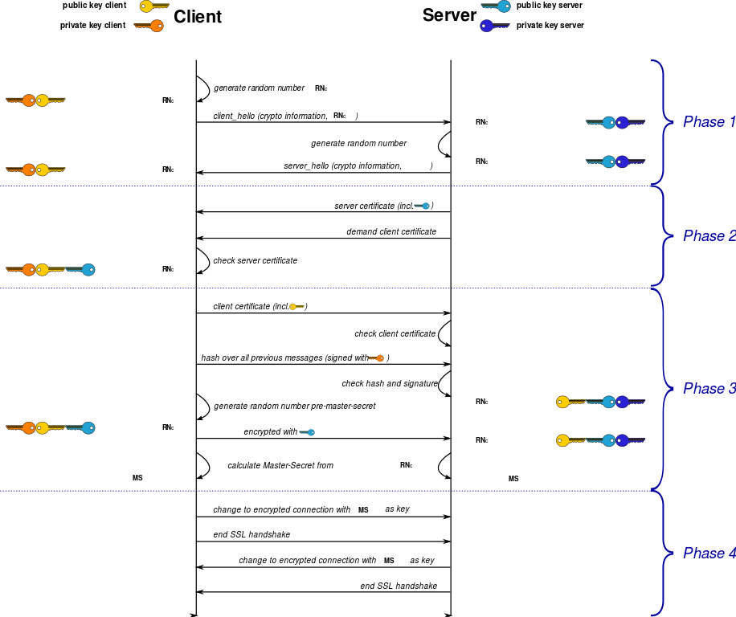

# Linux Services and Security

- OpenSSL(ssl/tls协议)
- OpenSSH(ssh协议)
- bind(dns协议)
- web(httpd协议): httpd(apache), php, mariadb(mysql),LAMP, nginx(tengine,OpenResty),LNMP
- file server: samba,ftp,nfs
- dhcp, pxe
- iptables
- pam,nsswitch

## 网通通信协议

- 传输层协议：TCP, UDP, SCTP
  - port: 进程地址，进程向内核注册使用某端口（独占）
- 同一主机上的进程间通信：IPC, message queue, shm, semerphor
- 不同主机上的进程间通信：socket(ip:port成对出现)
- Client (ip:port) <-----> (ip:port) Server
- 监听模式：LISTEN（服务器有没有访问都运行服务监听客户端请求资源）

- **SSL: Secure Sockets Layer** (安全套接层)
  - 介于**应用层与传输层之间的库程序**(加密/解密)
  - 有些程序自带了安全(加密/解密)的库文件

- http + ssl => https（C/S增加开销CPU、MEM、IO）

## 网络通信安全的目标

- confidentiality(保密性)
- integrity(系统完整性、数据完整性)
- availability(可用性或有效性)

## 攻击类型

- 威胁保密性的攻击：窃听(被动攻击)、通信量分析(主动攻击)
- 威胁完整性的攻击：更改、伪装、重放、否认
- 威胁可用性攻击：拒绝服务(DoS， Denial Of Service)
  - DDoS: Destributed Denial of Service，分布式拒绝服务

## 解决方案

- 技术（加密和解密）
- 服务（用于抵御攻击的服务，解决安全目标而特地设计的安全服务）

### 加密和解密

- 传统加密方法：替代加密方法（偶数位向前移3位，奇数位向后移3位）、置换加密方法
- 现代加密方法：现代块加密方法（每个块都进行加密，每个块之间建立关联关系，前一个快与后一个块之间异或运算结果发送）

### 服务

- 认证机制
- 访问控制机制

### 密钥算法和协议：密钥交换的服务

- 对称加密
- 公钥加密（非对称加密）
- 单向加密
- 认证协议

## Linux 实现服务

- OpenSSL(ssl)
- GPG(gpg)

###　OpenSSL组成

1. libencrypto: 加密/解密库
2. libssl ssl: 安全通信机制 数据交换
3. openssl: 多用途命令行工具

## 加密算法和协议

### 1. 对称加密

> 加密和解密使用同一个密钥

- DES: Data Encryption Standard(IBM开发，现代加密方法，56bit)
- 3DES: Triple DES(3倍DES)
- AES: Advanced Encryption Standard(128bits, 192bits, 256bits, 384bits)

- Blowfish
- Twofish

- IDEA（商业）
- RC6（商业）
- CAST5（商业）

#### 对称加密特性

1. 加密、解密使用同一个密钥
2. 将原始数据分割称为固定大小的块，逐个进行加密

#### 对称加密缺陷

1. 密钥过多
2. 密钥分发困难

### 2. 公钥加密

> 密钥分为公钥与之配对的私钥

- 公钥：从私钥中提取产生；可公开给所有人;pubkey
- 私钥：通过工具创建，使用者自己留存，必须保存其私密性；secret key;
- 特点：用公钥加密的数据，只能使用与之配对儿的私钥解密；反之亦然；

#### 公钥加密用途

- 数字签名：主要在于让接受方确认发送方的身份
  - 使用私钥加密单项加密的特征码 = 生成数字签名
  - 身份认证和数据完整性得到验证
- 密钥交换：发送方用对方公钥加密一个对称密钥，并发送给对方
  - 数据保密性

#### 公钥加密算法

- RSA (能数字签名、加密/解密) 公司名/加密算法名/创始人合并名子缩写
- DSA (仅能数字签名，不能加密/解密)
  - DSA: Digital Signature Algorithm
  - DSS: Digital Signature Standard
- ELGamal

### 3. 单向加密

> 提取数据**指纹**；只能加密，不能解密

- 特性：定长输出、雪崩效应
- 功能：数据完整性校验
- 常见算法：
  - md5: Message Digest version5 消息摘要(128bits定常输入)
  - sha1: Secure Hash Algorithm version1 安全的哈希算法, (160bits定常输入)
  - sha224, sha256, sha384, sha512(CentOS 7用户加密算法)

### 4. 密钥交换

> IKE(Internet Key Exchange) 互联网密钥交换

1. 公钥加密（使用对方的公钥加密并发送，有可能暴力破解)
2. DH(Deffie-Hellman，发明者两人姓名) 算法

- A: p大素数,g
- B: p大素数,g

- A: x(私有数据)
  - p^x%g ==传递=> B
  - B得到 (p^x%g)
  - (p^x%g)^y = p^xy%g

- B: y(私有数据)
  - p^y%g ==传递==> A
  - A得到 p^y%g
  - (p^y%g)^x = p^yx%g

- 11111111素数^3891%g=abc
  - 有p,g,abc求3891？
  - abc 是密钥

### Alice 把数据安全保密的发送给 Bob

#### 加密过程

1. Alice 用单向加密算法计算数据的特征码；
2. 数字签名：Alice 用私钥进行加密特征码，并附加在数据后面；
3. Alie 生成一个临时的对称密钥并使用对称密钥加密整个数据；
4. Alice 获取 Bob 公钥并用 Bob 公钥对临时的对称密钥进行加密（密钥交换），并附加在加密数据的后面，发送给 Bob

#### 解密过程

1. Bob 使用私钥对对称加密的密钥进行解密
2. 用对称加密解密整段内容
3. 身份认证：用 Alice 公钥解密特征码，能解密得到 Alice 身份得到验证
4. Bob 在同样再用对称加密方法计算对称加密的特征码，并与解密出来的数据进行比较，相同则数据完整得到验证，否则数据不完整。

### 问题

Bob 与 Alice 从来没有交流过，怎么确定他俩的通信

Bob 和 Alice 都各自把自己的公钥公开到互联网

Bob 和 Alice 通信，Eve 截取到他们的公钥之后在他们之间建立联系

Bob 看着 Eve 像 Alice

Alice 看着 Eve 像 Bob

所有数据都通过 Eve 都周转一次，而 Alice和Bob 都蒙在鼓里

缺失：可靠身份的公钥

解决：Bob 把自己的公钥提请给CA。在 CA 机构做一些特殊防伪技术返回给Bob,以后任何人与 Bob 通信，Bob 把特殊防伪标签的公钥(证书)发给 Alice。Alice 刚开始不认可此证书，Alice 到 CA 机构验证此证书获得证书认可。

Eve 冒充 Alice 请求CA获取Alice的防伪证书。CA 查看调查 Eve 是否是 Alice

##　PKI

> Public Key Infrastructure　公钥基础设施

- 签证机构：CA(Certificate Authority)
- 注册机构：RA(Registration Authority)
- 证书吊销列表：CRL(Certificate Revoke List)
- 证书存取库：CB（公共存取库）

- verisign 机构

办理身份证？当地派出所接受申请办理身份证（注册机构），区公安局可以签发身份证(签证机构)，在签发的身份证全国都认可。丢了身份证，到派出所吊销身份证（证书吊销列表）

### CA签发整数流程

Bob 请求CA机构签发证书：

1. 拥有者的名称
2. 拥有者的公钥
3. 证书有效期限
4. CA 自己的私钥加密以上这个数据的特征码，并附加在数据后面（数字签名）

Bob 把此证书发给 Alice

Alice 如何验证此证书？Alice 使用 CA 公钥解密数字签名，能解密就说明CA签发的证书，还要使用同样的单向加密算法进行对数据提取特征码并与验证解密出来的特征码是否相等。如果一样，就说明证书内容没有问题。

问题：Alice 如何获取 CA 的公钥？如何可靠获取 CA 证书

解决：CA 给自己发证（央行发行获取？你信不信？有枪有权利），半路有人给你发其他机构证书，但是你与其他的通信时，对方不认可此证书。CA 为了能验证它发的证书是它发的，CA把整数会提请给每一个信任它的人，为了整个链是完整的，CA 首先自己给发一个证书，这个证书里包含了自己的信息和 CA的公钥。因此 Alice 拿到 CA 的证书才能获的 CA 的公钥，只有拿到CA的公钥，才能解密CA的签名。包括其他人给他发的证书是否OK。如何可靠的获得CA证书？能不能通过网络发送呢？可以当面交易。一年的证书使用费5万元以上。
每一个请求CA获得证书的时候，会检查你的各种信息核实你的身份。全球几千万都当面交易？CA 在全球有护心链，CA -> CA1 -> CA2 -> 信任关系互相传递。为了CA管理方便全球有一个**根CA**，根下有很多派出机构，所有我们CA关系是互相传递的。这是第一层。第二层，全球CA数量是有限的，而且基本都是固定的。因此，很多操作系统的发行者，尤其像微软这样的系统，直接装完操作系统之后，全球著名的有公信力的CA证书机构证书已经在系统上了。可以拿去使用。不用通过互联网进行获取。如果安装的是到盗版系统，另当别论。

伪装CA机构非常困难，只能在本地进行伪装。影响不了上线。

Linux 系统本地都没有内置的CA证书。我们自行可靠手段获取证书。

### CA 能够通信双方可靠的获取到对方公钥的一种基础保证机制

但是 Bob 私钥丢了怎么办？任何人都冒充 Bob 与别人通信，为了防止降低损失。断臂求生，立即向CA申请吊销证书，把证书声明作废，但声明作废别人怎么知道？

### X.509

> 国际标准化组织定义证书的结构以及认证协议标准

- 版本号(证书版本号，身份证1代/2代，v1/v2/v3(最常用版本))
- 序列号(第几个证书)
- 签名算法ID(签名算法，需要对方解密)

- 发行者名称（CA自己的名字，签发证书的机构名称）
- 发行者的唯一标识(CA机构标识)
- 有效期限（证书有效期）

- 主体名称
- 主体公钥
- 主体的惟一标识

- 扩展信息
- 发行者的签名(CA获取数据特征码，并进行CA的私钥进行加密特征码得到签名)

## SSL 协议

> Secure Sockets Layer 安全套接层

SSL 负责调用TCP/IP协议进行通信

- 1994 Netscape 开发的 ssl协议，Netscape 拥有版权
- v1.0(没有公开过)
- v2.0(因为有数个漏洞升级为v3.0)
- v3.0(google发现有漏洞，所以废弃)

## TLS

> Transport Layer Security 传输层安全

- 1999年发布 IETF 与 SSL 兼容
- v1.0
- v1.1(2006)
- v1.2(常用, 2008)
- v1.3(2014年草案，支持椭圆曲线算法)
- 事实上的标准

### TLS 分层设计

1. 最底层：基础算法原语的实现：`aes, rsa, md5`
2. 向上一层：各种算法的实现
3. 再向上一层：组合算法实现的半成品
4. 用各种组件拼装而成的各种成品密码学协议软件

### 协议的开源实现

- OpenSSL

###　加密算法和协议

- 对称加密：数据加密（保密性）（3DES，AES）
- 公钥加密：身份认证、密钥交换、数据加密（不常用，比对称加密要慢3个数量级）RSA, DSA, ECDH
- 单项加密：数据完整性（MD5，SHA1, ...）
- 密钥交换：DH（迪菲-赫尔曼），ECDH（椭圆曲线DH），ECDHE（临时椭圆曲线DH）

### SSL会话主要三部

- 客户端向服务器端索要并验证证书
- 双方协商生成“会话密钥”（对称密钥）
- 双方采用“会话密钥”进行加密通信

### SSL Handshake Protocol



- 第一阶段：ClientHello
  - 支持的协议版本，比如tls1.2
  - 客户端生成一个随机数，稍后用户生成“会话密钥”
  - 支持的加密算法，比如AES、RSA
  - 支持的压缩算法

- 第二阶段：ServerHello
  - 确认使用的通信加密协议版本，比如tls1.2
  - 服务器端生成一个随机数，稍后用于生成“会话密钥”
  - 确认使用的加密方法
  - 发送服务器证书

- 第三阶段：
  - 验证服务器证书，在确认无误后取出其公钥（发证机构、验证完整性、证书持有者、证书有效期、吊销列表）
  - 发送一下信息给服务器端：
    - 一个随机数
    - 编码变更通知，表示随后的信息都将用双方商定的的加密方法和密钥发送；
    - 客户端握手结束通知

- 第四阶段：
  - 收到客户端发来的第二个随机数pre-master-key后，计算生成本次会话所有到的“会话密钥”
  - 向客户端发送如下信息：
    - 编码变更通知，表示随后的信息都将用双方商定的的加密方法和密钥发送；
    - 服务端握手结束通知；

## Openssl (众多子命令，分为三类)

- Standard command 标准命令(enc, ca, req, genrsa等)
- Message Digest commands 消息摘要命令（dgst子命令）
- Cipher commands 加密命令（enc子命令）

## 1.对称加密

- 工具：openssl [enc|gpg]
- 支持的算法：3des, aes, blowfish, towfish

### enc命令

- `# man enc`
- `# openssl ?`

- 选项
  - -e/d：加密/解密
  - -a|-base64: base64编码，默认二进制格式
  - -des3：加密/解密算法
- 加密: `# openssl enc -e -des3 -a -salt -in fstab -out fstab.ciphertext`
- 解密: `# openssl enc -d -des3 -a -salt -out fstab.plaintext -in fstab.ciphertext`

## 2.单项加密

- 工具：openssl dgst, md5sum, sha1sum, sha224shum,sha256shum,sha384shum,sha512sum

### dgst命令：

- `# openssl dgst -md5 fstab` 
- `# md5sum fstab`
- `# openssl dgst -shal384 fstab` 
- `# sha384sum fstab`

## 3.生成用户密码

- 工具：passwd 或 openssl passwd

`# opensl passswd -1 -salt 1234567` -1：MD5-based password algorithm

`# openssl -1 -salt $(openssl rand -hex 4)` -hex: 16进制

## 4.随机数

- 工具：openssl rand
  - `# openssl rand -base64 10` 10个字节
  - `# openssl rand -hex 10`

## 5.公钥加密

### 5.1 加密解密：

- 算法：RSA, ELGamal
- 工具：openssl [rsautl | gpg]

### 5.2 数字签名

- 算法：RSA，DSA(数字签名算法)，ELGamal
- 工具：openssl [rsautl | gpg]

### 5.3 密钥交换

- 算法：DH

### 生成私钥

- `# openssl genrsa 1024(位数，必须是2N次方倍数)`
- `# openssl genrsa 1024 > /tmp/mykey.private`
- `# openssl genrsa 1024 -out /tmp/mykey.private2`
- `# (umask 077; openssl genrsa -out /tmp/mykey.private 2048)`

`# (umask 077` 只对子shell有效

### 提出公钥

`# openssl ras -in /tmp/mykey.private -pubout`

## Linux系统上的随机数生成器：

- /dev/random：仅从熵(shang1)池返回随机数；随机数用尽，阻塞(se4)；
- /dev/urandom：从熵池返回随机数；随机数用尽，会利用软件生成伪随机数，非阻塞
  - 伪随机数不安全

## 熵池中随机数的来源

- 硬盘IO中断时间间隔
- 键盘IO中断时间间隔

## CA

- 公共信任的CA
- 私有CA

### 建立私有CA

- openssl（测试CA）
- OpenCA(开源，企业级,银行等私有CA)

### openssl命令

- 配置文件：`# cat /etc/pki/tls/openssl.conf`

### 构建私有CA(172.16.7.1)

>在确定配置为CA的服务器上生成一个自签证书，并为CA提供所需要的目录及文件即可

### 1.生成私钥

``` shell
# ls /etc/pki/CA/private/
# (umask 077; openssl genrsa -out /etc/pki/CA/private/cakey.pem 4096
# ls -l /etc/pki/CA/private/
```

### 2.生成自签证书

``` shell
~]# openssl req -new -x509 -key /etc/pki/CA/private/cakey.pem -out /etc/pki/CA/cacert.pem -days 3655


req：证书请求
-new：生成新证书签署请求
-x509：生成自签格式证书，专用于创建私有CA时；
-key：生成请求时用到的私有文件路径
-out：生成请求文件路径；如果自签操作将直接生成签署过的证书；
-days：证书的有效时长，单位是day

Country Name(2 letter code) [XX]: CN
State of Province Name(full name): Beijing
Locality Name.................: Beijing
Organization Name().....: lingyima
Organizational Unit Name...: Ops
Common Name: ca.lingyima.com
Email: lingyima@qq.com

~]# ls -l /etc/pki/CA

cacert.pem
目录：certs crl mewcerts private
```

###　３.为CA提供所需的目录及文件

``` shell
# mkdir -pv /etc/pki/CA/{certs,crl,newcerts}
# touch /etc/pki/CA/{serial,index.txt}
# echo 01 > /etc/pki/CA/serial` 序列号
```

### 要用到证书进行安全通信的服务器，需要向CA请求签署证书(172.16.7.1)

> server: 172.16.7.0

``` shell
~]# cd /etc/httpd
~]# mkdir ssl
~]# cd ssl
~]# (umask 077; openssl genrsa -out httpd.key 2048)
~]# openssl req -new -key httpd.key -out httpd.csr -days 365
csr: certificate signature request

CN
Beijing
Beijing
lingyima
Ops
www.yinglima.com
webmaster@lingyima.com

httpd.csr：证书签署请求
~]# scp httpd.csc root@172.16.100.67:/tmp/`

CA验证
~]# openssl ca -in /tmp/httpd.csr -out /etc/pki/CA/certs/httpd.crt -days 365
```

- CA主机(172.16.7.1)

``` SHELL
~]# touch /etc/pki/CA/{serial,index.txt}
~]# echo 01 > /etc/pki/CA/serial
~]# openssl ca -in /tmp/httpd.csr -out /etc/pki/CA/certs/httpd.crt -days 365
~]# cd /etc/pki/CA
~]# cat index.txt
~]# scp certs/httpd.crt root@171.16.7.0:/etc/httpd/ssl/
```

- 删除服务器上：http.csr文件

## httpd的为例

### 1.用到证书的主机生成证书签署请求：

``` SHELL
~]# mkdir /etc/httpd/ssl
~]# cd /etc/httpd/ssl
~]# (umask 077; openssl genrsa -out /etc/httpd/ssl/httpd.key 2048
```

### 2.生成证书签署请求

``` SHELL
~]# openssl req -new -key /etc/httpd/ssl/httpd.key -out /etc/httpd/ssl/httpd.csr -days 365
```

### 3.将请求通过可靠方式发送给CA主机；

``` SHELL
~]# scp /etc/httpd/ssl/httpd.csr root@172.16.100.67:/tmp/
```

### 4.在CA主机上签署证书

``` SHELL
~]# openssl ca -in /tmp/httpd.csr -out /etc/pki/CA/certs/httpd.crt -days 365
```

- 查看证书中的信息：`# openssl x509 -in /etc/pki/CA/certs/httpd.crt -noout -serial -subject`

## 吊销证书：步骤(CA主机上执行)

### 1.客户端获取要吊销的证书的serial(使用证书的主机执行)：

`# openssl x509 -in /etc/pki/CA/certs/httpd.crt -noout -serial -subject`

### 2.CA主机吊销证书

>先根据客户提交的serial和subject信息，对比其本机数据库index.txt中存储的是否一致；

- 吊销：

`# openssl ca -revoke /etc/pki/CA/newcerts/SERIAL.pem`
其中的SERIAL要换成证书真正的序列号

### 3.生成吊销证书的吊销编号（第一次吊销证书时执行）

`# echo 01 > /etc/pki/CA/crinumber`

### 4.更新证书吊销列表

`# openssl ca -gencrl -out thisca.crl`

- 查看crl文件：

`# openssl crl -in /PATH/FROM/CRL_FILE.crl -noout -text`

博客作业：加密解密技术基础、PKI及创建私有CA