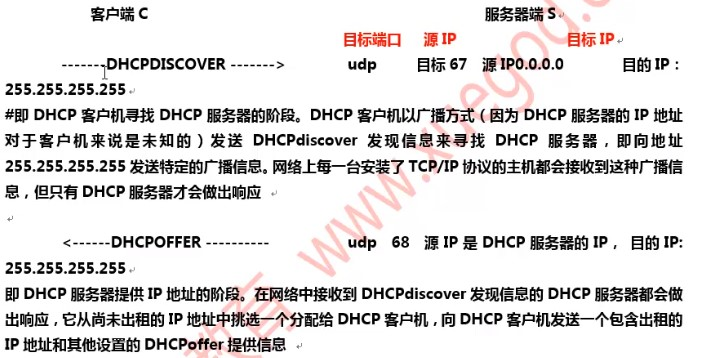
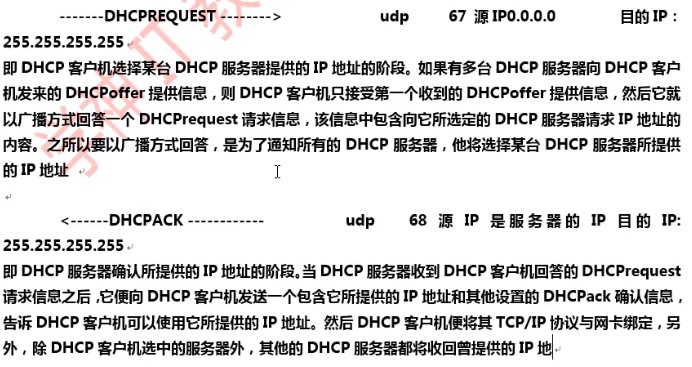
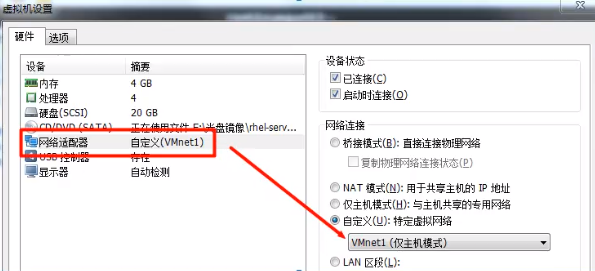
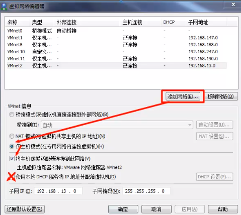

# DHCP

- 把一个主机接入TCP/IP网络，要为配置哪些网络参数
  - IP/mask
  - Gateway
  - DNS Server
  - Wins Server
  - NTP Server
  - 参数配置方式
    - 静态指定
    - 动态分配
      - 早期：bootp: boot protocol 一次性租约
      - 后来：dhcp， 引入了“租约”的bootp；也可以实现为特定主机保留某固定地址

## DHCP Introduction

> 动态主机配置协议 Dynamic Host Configuration Protocol

- 为局域网主机动态配置IP地址协议，是局域网的网络协议

- 使用 DHCP 协议工作，主要有两个用途：
  - 1.给内部网络或网络服务供应商自动分配IP地址，主机名，DNS服务器，域名
  - 2.配合其他服务，实现集成化管理功能。如：无人值守安装服务器

- arp: address resolving protocol
  - ip -> mac
- rarp: reverse arp
  - mac -> ip
  - 我有MAC地址进行广播有谁知道我的IP地址，服务器收到之后在地址池获取IP地址返回给客户端
  - 多个DHCP服务器响应，以最早响应的IP地址为主

- 监听的端口：
  - Server: 67/UDP
  - client: 68/UDP

## DHCP Features

- **C/S** 模式
- **自动分配**IP地址
- 不会同时**租借**相同的IP地址给两台主机
- DHCP管理员可以**约束**特定的计算机使用特定的IP地址
- 可以为每个DHCP**作用域**设置很多选项
- 客户机在不同**子网间移动时不需要重新设置IP地址。每次都自动获取 IP 地址就可以了
  - 在商城多层楼之间的局域网自动切换，WiFi不会覆盖那么多。

## DHCP 的去缺点

- 当网络上存在多服务器时，一个DHCP服务器不能查出已被其他服务器租出去的IP地址
- DHCP服务器不能跨路由器与客户机通信，除非路由器允许 BOOTP 协议转发
  - 不能跨路由器，DHCP中继可以跨路由器与其他局域网通信

- 两台DHCP服务器
  - Node1: 192.168.100-200
  - Node2: 192.168.1.160-180
  - 有冲突范围

  - 一台PC通过Node1获取IP 192.168.1.170
    - Node2不知道客户机从Node1获得了IP
  - 另一台PC通过 Node2 获取 IP 192.168.1.170
    - IP地址冲突

## DHCP 端口号

``` sh
# vim /etc/services
  bootps      BOOTP server: 68/tcp 68/udp
  bootpc      BOOTP client: 68/tcp 68/udp

```
DHCP 协议由 bootp 协议发展而来，是 BOOTP 的**增强版本**，**bootps** 代表服务端端口，**bootpc**代表客户端端口。

## bootp 协议

> 引导程序（BOOTP），它可以让误判工作站从一个中心服务器上获得IP地址，为局域网中无盘工作站分配动态IP地址，并不需要每个用户去设置静态IP地址。

- BOOTP缺点：在设定前须实现获得客户端的硬件地址，而且，**MAC 地址与IP的对应是静态的**。换而言之，BOOTP 非常缺乏“动态性”，若在有限的IP资源环境中，BOOTP的一对对应会造成非常可观的浪费。
  - 大型商场无线网覆盖，逛街时连接无线WiFi并获取动态IP地址，但是你在商场待多久（待几个小时）。你离开了，但是你的设备MAC地址与WiFi无线IP地址绑定且不能给其他用户使用。

- DHCP 是 BOOTP 的**增强版本**，它分为两个部分：一个是服务器端，而另一个客户端。**所有的IP网络设定数据都由 DHCP 服务器集中管理**，并**负责处理客户端的 DHCP 要求**；而客户端则会使用从服务器分配下来的IP环境数据。比较 BOOTP, DHCP 透过“**租约**”的概念，有效且动态的分配客户端的 TCP/IP设定，而且，作为兼容考虑，DHCP也完全照顾了 BOOTP Client 的需求。

## DHCP 工作原理

- DHCP 服务运行原理
  - DHCP 客户端向服务端请求过程





注意：客户端执行 DHCP DISCOVER 后，如果没有 DHCP 服务器响应客户端的请求，客户端会使用 169.254.0.0/16 网段中的一个IP 地址配置本机地址。

169.254.0.0/16 是 Windows 的自动专有IP寻址范围，也就是在无法通过、DHCP获取IP地址时，由系统自动分配的 IP 地址段。

``` sh
# route -n
```

## 工作流程

- 整个流程都基于广播形式

1. client: dhcp discover
2. Server: dhcp offer(IP/mask, gw, ...) lease time(租约期限)
3. Client: dhcp request
4. Server: dhcp ack

- 续租(50%，75%, 87.5%)：整个租约一般的时候续租
  - 单播给服务器:
    - dhcp request
    - dhcp ack

    - dhcp request
    - dhcp nak(不给租了，服务器地址列表可能改了)

    - dhcp discover(找其他房子)：广播

## 在两个局域网的其中一个局域网获取IP地址

- 一个局域网请求另一个局域网DHCP服务器
- 在没有DHCP服务的局域网部署中继服务器或路由器中继
- 中继服务器做什么？
  - 局域网主机广播请求中继服务器（第一步），中继服务器没有资源，则单播的形式向另一个局域网上的DHCP服务器（第二步），DHCP服务器已单播的形式响应给另一个局域网上的中继服务器（第三步）。中继在以广播的形式响应给客户端（第四步）。
- 给一个局域网上分配一个作用域，在给另一个局域网分配另一个作用域

## rpm安装 dhcp

- dhclient-version.rpm 客户端
- dpcp-common-version.rpm DHCP客户端和服务端共同需要一些的文件
- dhcp-version.rpm DHCP服务端

``` sh
# yum -y install dhcp

查看未安装的软件包
# rpm -qpi /mnt/Packages/dhcp-verison.rpm

dhcp 配置文件
# ls /etc/dhcp/dhcpd.conf

复制配置文件
# cp /usr/share/doc/dhcp-4.2.5/dhcpd.conf.example /etc/dhcp/dhcpd.conf -f

修改配置文件
# vim /etc/dhcp/dhcpd.conf
  全局配置

  定义客户端所属的域
  option domain-name "wovert.com";


  DNS服务器
  option domain-name-servers ns1.example.org ns2.example.org;


  租约（时间）：客户端可以使用这个IP地址的时间
  默认租约期限（50%=>续约，75%=>续租，87.5% => 续约）
  default-lease-time 43200; 单位：秒

  最大租约期限：定义客户端IP租约时间的最大值，当客户端超过租约时间，却尚未更新IP时，最长可以使用该IP的时间；比如机器在开机获得IP地址后，然后关机了。这是，当时间过了 default-lease-time 600秒后，没有机器向 DHCP 续约，DHCP会保留 7200秒，保留此IP地址不用于分配给其他机器。当超过7200秒后，将不再保留此IP地址给此机器。
  max-lease-time 86400;


  网管配置
  option routers 182.18.100.6;


  定义日志类型为 Local7
  log-facility local7;
  

  局部配置：网络配置
  作用域：可以分配IP的范围
  subnet 172.18.0.0(网段号) netmask 255.255.0.0(子网掩码) {
    range 172.18.100.101 172.18.100.120; 地址池：可以分配给客户端的IP
    option domain-name-servers ns1.internal.example.org; DNS服务器
    option domain-name "internal.example.org"; 客户端所属域
    options routers 网关; 网关地址
    option broadcast-address 10.5.5.31; 广播地址
    default-lease-time 600;
    max-lease-time 7200;
  
  
  };

  保留地址：指定某个客户端使用一个特定的IP，通过 host配置


租约文件：DHCP服务运行之后就可以在租约数据库文件查看
# cat /var/lib/dhcpd/dhcpd.leases


启动服务
# service dhcpd start

开机自动启动方法
# chkconfig dhcpd on
# chkconfig --level 3 dhcpd

开机关闭服务
# chkconfig --level 3 dhcpd off

查看开机自动启动状态
# chkconfig --list dhcpd
```

## 应用案例

公司有60台计算机，IP地址段为 192.168.0.1 - 192.168.0.254， 子网掩码是255.255.255.0，网管为 192.168.0.1， 192.168.0.2-192.168.0.30 网段地址给服务器配置，客户端可以使用的地址段为 192.168.0.100-200， 其余剩下的IP地址为保留地址

- 网络连接方式：vment1(仅主机)
- 虚拟网络编辑器 -> 使用本地DHCP服务器将IP地址分配给虚拟机（去掉勾选）





修改配置文件

``` sh
DHCP 主机

# vim /etc/dhcp/dhcpd.conf
  subnet 192.168.0.0  netmask 255.255.255.0 {
    range 192.168.0.100 192.168.0.200;
    option domain-name-servers 192.168.0.1; 路由器作为DNS
    option domain-name "wovert.com";
    option routers 192.168.0.1;
    option broadcast-address 192.168.0.255;
    default-lease-time 600;
    max-lease-time 7200;
  }

确保IP地址网段为 192.168.0.0
修改IP地址/网管/子网掩码：192.168.0.63、255.255.255.0
# service network restart

重启服务
# service dhcpd restart

```

验证登录-另外一台主机

``` sh
使用 Use DHCP: YES
# service network restart

查看分配的IP地址
# ifconfig

查看默认网关
# route -n

查看DNS
# cat /etc/resolv.conf

没有变化就删除 /etc/sysconfig/network-scripts/ifcfg-eth0 文件的 DNS1 配置

# service network restart

# cat /etc/resolve.conf
  nameserver 192.168.0.1
```

DHCP 主机查看租约数据库文件

``` sh
# cat /var/lib/dhcpd/dhcpd.leases
```

地址绑定：在DHCP 中的IP地址绑定用于给客户端分配固定IP地址。比如服务器需要使用固定IP地址就可以使用IP地址绑定，通过MAC地址与IP地址的对应关系为物理地址计算机分配固定IP地址。整个配置过程需要用到 host 声明和hardware、fixed-address 参数。

1. host 主机名 {.....}; 用于定义保留地址
2. hardware 类型 硬件地址; 定义网络接口类型和硬件地址。常用类型为以太网(ethernet)，地址为 MAC 地址
3. fixed-address IP地址; 定义DHCP客户端指定的IP地址

``` sh
# vim /etc/dhcp/dhcpd.conf
  subnet 192.168.0.0  netmask 255.255.255.0 {
    range 192.168.0.100 192.168.0.200;
    option domain-name-servers 192.168.0.1; 路由器作为DNS
    option domain-name "wovert.com";
    option routers 192.168.0.1;
    option broadcast-address 192.168.0.255;
    default-lease-time 600;
    max-lease-time 7200;

    host 客户端主机名 {
      hardware ethernet 00:0C:29:0F:90:AF;
      fixed-address 192.168.0.254;
    }
  }
# service network restart

客户端主机名登录验证
# ifconfig
```

注意：划分子网时，如果选择直接配置多作用域实现动态IP分配的任务，则必须要为DHCP服务器添加多块网卡，并配置多个IP地址，否则DHCP服务器只能分配与其现有的网卡IP地址对应网段的作用域

## CentOS

- 支持dhcp(ISC, named)
- 支持dnsmasq: dhcp & dns

- dhcp:
  - dhcpd: dhcp 服务
  - dhcrelay: 中继服务

- 192.18.100.6

``` sh
# yum info dhcp
# yum -y install dhcp
# rpm -ql dhcp
  /usr/sbin/dhcpd
  /usr/sbin/dhcrelay

启动服务
# vim /etc/dhcp/dhcpd.conf
# cp /usr/share/doc/dhcp-4.2.5/dhcpd.conf.example ./dhcpd.conf -f
# vim dpchd.conf
  域名
  option domain-name "wovert.com";

  网管配置
  option routers 182.18.100.6;

  dns 服务器
  option domain-name-servers 172.18.0.1;
  
  默认租约期限
  default-lease-time 43200; 单位：秒

  最大租约期限
  max-lease-time 86400;

  subnet 172.18.0.0 netmask 255.255.0.0 {
    range 172.18.100.101 172.18.100.120;
  };

  加载文件
  host passcaglia {
    hardware ethernet 0:0:c0:5d:bd:95;
    filename "pxelinux.O"; 指明加载引导文件名称
    next-server {host|IP}; 指明引导所在的服务器主机的IP地址
  }

  tftp: trvial ftp, udp

# systemctl start dhcpd.service
# ss -unl

```

- 虚拟主机更改网络连接位 hostonly

``` sh
RS1主机
# ss -tunl
 *:68
# dhclient -h

 运行前台
# dhclient -d
# dhclient -d

```

``` sh
# vim /etc/dhcp/dpchd.conf
  range 172.18.100.121 172.18.100.138
# systemctl restart dhcpd.service
```

``` sh
RS1主机
# dhclient -d
# dhclient -d
# route -n
# nmtui
 删除IP，网管
# systemctl restart network.service

```

## 实验环境

- 服务端: server.cn IP: 192.168.1.63
- 客户单：client.cn IP: 192.168.1.64

