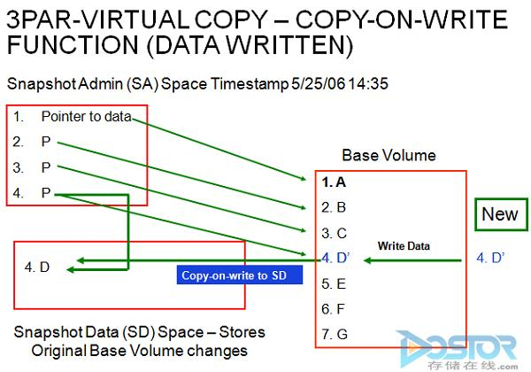
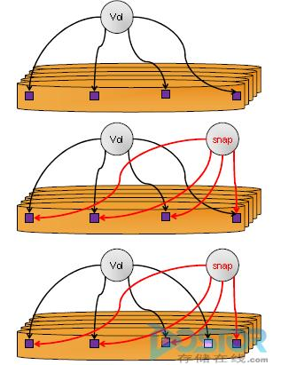
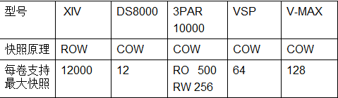

# LVM

> Logical Volume Manager, Version: 2

**dm模块**(device mapper)：将一个或多个底层块设备组织成一个逻辑设备的模块

- LV(Logical Volume) 逻辑卷（多个 PE 组成的一个 LV ）（一个逻辑卷对应一个/home）
  - LE (Logic Extent) 
- VG(Volume Group) 卷组
  - PE(Physical Extent)，默认4MB，物理盘区 (pv 加入到 VG 之后决定 PE 大小)
- PV(physical Volume)，物理卷，多个分区

设备文件：`/dev/md-#`

`/dev/mapper/VG_NAME-LV_NAME` == `/dev/mapper/vol0-root`

`/dev/VG_NAME/LV_NAME` == `/dev/vol0/root`

`/dev/mapper/vol0-root` <-- `/dev/vol0/root`(前面文件的符号链接文件) <-- `/dev/dm-0`(真正文件)

## LVM 创建步骤

`# cat /etc/centos-release` 查看系统版本

1. create pv(pe) 创建物理卷
2. create vg 创建卷组
3. create lv(le) 创建逻辑卷

``` shell
# fdisk /dev/sda
:p
:n
3
+10G
:n
+5G
:n
+8G

以上操作生成三个分区：sda3/sda5/sda6

LVM系统分区ID：8e, Linux LVM

: t
: 3
: 8e

: t
: 5
: 8e

: t
: 6
: 8e
: w
# partx -a /dev/sda
# partx -a /dev/sda


pv 管理工具
# pv tab 键
# pvs
# pvdisplay
# pvcreate /dev/sda3
# pvdisplay /dev/sda3
  PV Name /dev/sda3
  VG Name
  Allocatable : NO # 是否允许可分配的
  PE Size : 0 # PE大小
  Total PE : 0 # PE 总个数
  Free PE : 0 # 空闲 PE个数
  Allocated PE : 0 # 使用的 PE 个数
  PV UUID : jD512J-5BGy-xxxx-xxxx-xxxx-xxxx-xxxx
# pvremove /dev/sd3
  Labels on physical volume "/dev/sda3" successfully wiped
# pvdisplay /dev/sda3

vg 管理工具

# vg tag 键
# vgdisplay [vg0]
# vgcreate myvg /dev/sda3
# vgdisplay myvg
  VG Name : myvg
  System ID :
  Format : lvm2
  Metadata Areas : 1
  Metadata Sequence No : 1
  VG Access : read/write
  VG Status : resizable
  MAX LV : 0
  Cur LV : 0
  Open LV : 0
  Max PV : 0
  Cur PV : 1
  Act PV : 1
  VG Size : 10.00 GiB
  PE Size : 4.00 MiB
  Total PE : 2560
  Alloc PE / Size : 0 / 0
  Free PE / Size : 2560 / 10.00 GiB
  VG UUID : xxxx-xxxx-xxxx-xxxx-xxxx-xxxx-xxxx

# pv display /dev/sda3
  PV Name : /dev/sda3
  VG Name : myvg
  PV Size : 10.00 GiB / not usable 3.60 MiB
  Allocatable : yes
  PE Size : 4.00 MiB
  Total PE : 2560 # PE 总个数
  Free PE : 2560 # 空闲 PE个数
  Allocated PE : 0 # 使用的 PE 个数
  PV UUID : jD512J-5BGy-xxxx-xxxx-xxxx-xxxx-xxxx

# pvs
# pvcreate /dev/sda5
# vgextend myvg /dev/sda5
# vgdisplay myvg
  VG Name : myvg
  System ID :
  Format : lvm2
  Metadata Areas : 2
  Metadata Sequence No : 2
  VG Access : read/write
  VG Status : resizable
  MAX LV : 0
  Cur LV : 0
  Open LV : 0
  Max PV : 0
  Cur PV : 2
  Act PV : 2
  VG Size : 15.01 GiB
  PE Size : 4.00 MiB
  Total PE : 3842
  Alloc PE / Size : 0 / 0
  Free PE / Size : 3842 / 15.01 GiB
  VG UUID : xxxx-xxxx-xxxx-xxxx-xxxx-xxxx-xxxx

# pvmove /dev/sda5
  No data to move for myvg

# vgreduce myvg /dev/sda5

# vgdisplay myvg
  VG Name : myvg
  System ID :
  Format : lvm2
  Metadata Areas : 1
  Metadata Sequence No : 3
  VG Access : read/write
  VG Status : resizable
  MAX LV : 0
  Cur LV : 0
  Open LV : 0
  Max PV : 0
  Cur PV : 1
  Act PV : 1
  VG Size : 10.00 GiB
  PE Size : 4.00 MiB
  Total PE : 2560
  Alloc PE / Size : 0 / 0
  Free PE / Size : 2560 / 10.00 GiB
  VG UUID : xxxx-xxxx-xxxx-xxxx-xxxx-xxxx-xxxx

lv 管理工具命令
# lvs
# lvdisplay /dev/vg0/root
# lvdisplay /dev/mapper/vg0-root

# lvcreate -L 2G -n mylv myvg
# ls /dev/mapper
  myvg-mylv
# mke2fs -t ext4 -b 1024 -L MYLY /dev/myvg/mylv 格式化
# mkdir /backup
# mount /dev/myvg/mylv /backup/
# ls -l /backup/
# mount
  /dev/mapper/myvg-mylv on /backup type ext4 (rw)
# cd /backup
# cp /etc/issu /backup/
# cp /etc/grub.conf /backup/
# cd /backup
# ls
# cat issue

扩展逻辑圈
# lv extend -L 5G /dev/myvg/mylv
  Size of logical volume myvg/mylv changed from 2.00 GiB (512 extents) to 5.00 GiB (1280 extents).
  Logical volume mylv successfully resized.
# df -hl
  Filesystem : Size Used : Avail : use% : Mounted on
  /dev/mapper/myvg-mylv : 2.0G : 3.1M : 1.9G : 1% : /backup
# umount /backup/
# mount /dev/myvg/mylv /backup/
# df -hl
  Filesystem : Size Used : Avail : use% : Mounted on
  /dev/mapper/myvg-mylv : 2.0G : 3.1M : 1.9G : 1% : /backup
  扩展还没有变化，因为文件系统没有变化
# resize2fs /dev/myvg/mylv 扩展可用空间
  Filesystem at /dev/myvg/mylv is mounted on /backup, on-line resizing required
  old desc_blocks = 8, new_desc_blocks = 20
  Performing an on-line resize of /dev/myvg/mylv to 5242880 (1k) blocks.
  The filesystem on /dev/myvg/mylv is now 5242880 blocks long.
# df -hl
  Filesystem : Size Used : Avail : use% : Mounted on
  /dev/mapper/myvg-mylv : 4.9G : 3.4M : 4.7G : 1% : /backup

缩减逻辑圈

1. 卸载文件系统
# umount/dev/myvg/mylv

2. 强制检测和修复文件系统
# e2fsck -f /dev/myvg/mylv

3. 缩减系统文件大小至3G（缩减逻辑分区）
# resize2fs /dev/myvg/mylv 3G

4. 缩减逻辑卷（缩减物理分区）
# lvreduce -L 3G /dev/myvg/mylv

5. 重新挂载
# mount /dev/myvg/mylv /backup/

# df -hl
  Filesystem : Size Used : Avail : use% : Mounted on
  /dev/mapper/myvg-mylv : 3.0G : 3.3M : 2.8G : 1% : /backup
# cd /backup/ && cat issue

```

---

## pv 管理工具

### pvcreate：创建 pv

``` shell
# pvcreate /dev/DEVICE
  -v: verbose
  -f: force 覆盖数据
```

### pvremove：移除 pv

`# pvremove /dev/DEVICE`

### pvs/pvdisplay

`# pvs /dev/DEVICE` 简要显示信息

`# pvdisplay /dev/DEVICE` 详细显示信息

### 其他pv管理工具

- pvmove
- pvscan
- pvresize
- pvck
- pvchange

---

## vg 管理工具

### vgs,vgdisplay: 查看vg

``` shell
# vgs
# vgdisplay [vgName]
```

### vgcreate: 创建vg, 默认PE 4MB

`# vgcreate -s #[kKmMgGtTpPeE] vgName /dev/DEVICE ...`

### vgremove: 移除vg

`# vgremove -s #[kKmMgGtTpPeE] vgName /dev/DEVICE`

### vgextend: 扩展vg

`# vgextend vgname /dev/DEVICES`

### vgreduce: 缩减vg

``` shell
# pvmove /dev/DEVICE 移动数据
# vgreduce vgname /dev/DEVICE 后缩减vg
```

---

## lv 管理工具

### lvs,lvdisplay: 查看lv

``` shell
# lvs
# lvdisplay [/dev/vg0/root]
# lvdisplay [/dev/mapper/vg0-root]
```

### lvcreate, 创建lv

``` shell
# lvcreate -L #[mMgGtTpPeE] -n lvName vgName
# lcreate -L 8G -n lv0 vg0
# ls -l /dev/mapper/vg0-lv0 --> ../dm-0
```

### lvremove，移除lv

`# lvremove lvName vgName`

### lextend, 扩展lv

``` shell
# lvextend -L +#[mMgGtT] /dev/vg0/lv0
# lvextend -L +2G /dev/vg0/lv0

加多少
目标大小直接写大小

# umount /lvdata
# mount /dev/vg0/lv0 /lvdata

大小还是没有变化？
文件系统没有扩展，所以没有显示增加的大小

# resize2fs /dev/vg0/lv0 扩展文件系统占用空间
# df -hl
```

### 缩减逻辑卷

``` shell
1. 卸载文件系统
# umount /dev/VG_NAME/LV_NAME

2. 文件系统强制检测
# e2fsck -f /dev/VG_NAME/LV_NAME 

3. 缩减文件系统大小
# resize2fs /dev/VG_NAME/LV_NAME #[mMgGtT] 

4. 缩减逻辑卷
# lvreduce -L [-]#[mMgGtT] /dev/VG_NAME/LV_NAME

5. 重新挂载
# mount /dev/VG_NAME/LV_NAME /mount_dir

```

---

##　快照：snapshot

- 快照卷是访问原卷的另一个路径
- 原卷发生变化时，把原有数据存储到快照卷上，然后修改原卷的原数据
- 目的：文件的另一个访问路径，与硬链接相似

``` shell
# lvcreate -s -L 512M -n mylv-snap -p r /dev/myvg/mylv
# mount /dev/myvg/mylv-snap /mnt
# cd /mnt
# cat issue
# vim /backup/issue
  New line
# cat /backup/issue 原卷访问

# cat /mnt/issue 快照卷访问
  没有 New line

# cp -a /mnt/{grup.conf, issue} /tmp/
# umount /mnt
# lvremove /dev/myvg/mylv-snap
  y

# umount /backup
# lvremove /dev/myvg/mylv
# vgremove myvg
# vsg
# pvremove /dev/sda3
# pvremove /dev/sda5

```

### 创建快照, r只读

``` shell
# lvcreate -L sieze -p r -s -n snapshot_lv_name orginal_lv_name
# lvcreate -s -L 512M -n lv0-snap -p r /dev/vg0/lv0
# mount /dev/vg0/lv0-snap /mnt
```

-L 快照大小
-p : permission r 或 w

### 删除快照

``` shell
# umount /mnt
# lvremove /dev/vg0/lv0-snap
```

### 练习

1. 创建一个至少有两个 PV 组成的大小为 20G 的名为 testvg 的 VG；要求 PE 大小为 16MB，而后在卷组中创建大小为5G的逻辑卷testlv；挂载至 /users 目录
2. 新建用户 archlinux，其家目录为 /users/archlinux，而后 su 切换至 archlinux 用户，复制/etc/pam.d目录至自己的家目录
3. 扩展 testlv 至 7G，要求 archlinux 用户的文件不能丢失
4. 收缩 testlv 至 3G，要求 archilnux 用户的文件不能丢失
5. 对 testlv 创建快照，并尝试基于快照备份数据，验证快照的功能

### 快照补充

存储快照有两种实现方式：COW(写时复制Copy-On-Write)、ROW(写重定向Redirect-On-Write)，两种实现方法有区别，造成读写性能、应用场景有比较大的区别。
COW：

1)原卷数据是A~G。此卷Metedata像指针一样指向这些数据。

2)当做快照时，重新复制一份Metedata，并且也指向这些A~G数据。

3)当有数据要写入到源卷时(下图写入D')，写入到D的原位置之前，需要把D拷贝出放到一个新位置。然后修改快照的Metedata的其中一个指针指向拷贝出的位置[D](图中是Snapshot data的存储位置)。同时，把D’写入到D原来的位置。



此方式可以看出，源卷的Metedata的是没有变化的。对原卷是连续的数据，多次快照，多次写之后还是连续的数据，因此读性能或者对单个位置的多次写性能都不会有很大的影响。
但是，快照的数据是非连续的，如数据ABCEFG还是在源卷的位置，是连续数据。而数据D在存储的其他位置，非连续。 如果多次快照，不同位置的多次读写后，快照的数据可能就比较混乱。造成对快照的读写延时较大。

应用场景：
这种实现方式在第一次写入某个存储位置时需要完成一个读操作（读原位置的数据），两个写操作（写原位置与写快照空间），如果写入频繁，那么这种方式将非常 消耗IO时间。因此可推断，如果预计某个卷上的I/O多数以读操作为主，写操作较少的场景，这种方式的快照实现技术是一个较理想的选择，因为快照的完成需要较少 的时间。除此之外，如果一个应用易出现写入热点，即只针对某个有限范围内的数据进行写操作，那么COW的快照实现方式也是较较理想的选择。因为其数据更改都局限在一个范围内，对同一份数据的多次写操作只会出现一次写时复制操作。

但是这种方式的缺点也是非常明显的。如果写操作过于分散且频繁，那么 COW造成的开销则是不可忽略的，有时甚至是无法接受的。因此在应用时，则需要综合评估应用系统的使用场景，以判断这种方式的快照是否适用。

ROW：原理见下图

Vd是源卷的Metedata，分别指向4块数据。做快照时，snap的metadata也指向此4块数据。当有数据写入时，把数据写入另外一个位置，然后修改vd的其中一个metedata到新位置。snap的metedata数据不变化。



此方式源卷经过长时间写后，所有数据块的位置可能都会重定向到其他位置，导致源卷的数据不连续。在集中式存储情况下，会导致对源卷的读写性能降低。

两种方式的优缺点，及应用场景：

COW最大的问题是对写性能有影响。第一次修改原卷，需要复制数据，因此需要多一次读写的数据块迁移过程。这个就比较要命，应用需要等待时间比较长。但原卷数据的布局没有任何改变，因此对读性能没有任何影响。

ROW在传统存储情况下最大的问题是对读性能影响比较大。ROW写的时候性能基本没有损耗，只是修改指针，实现效率很高。但多次读写后，原卷的数据就分散到各个地方，对于连续读写的性能不如COW。这种方式比较适合Write-Intensive（写密集）类型的存储系统

但是，在分布式存储的情况下，ROW的连续读写的性能会比COW差吗？ 就不一定了。正常情况下，读写性能的瓶颈一般是在磁盘上。分布式存储情况下，业务层看到连续存储，实际上是分布在不同的服务器的不同硬盘中，数据越是分散，系统性能越高。而ROW把原数据打散之后，对性能反而有好处。

因此，整体情况下ROW基本上是对读写性能影响较小，因此是业界发展方向。



目前分布式存储比较流行，华为有个FusionStorage数据，说是无限次快照，而且0性能下降，vSAN快照10%~30%的性能下降。从上面的分析来看，就知道两个场景的实现方法了。 

快照另外一个非常重要的特性是快照一致性组（Consistency Group），这个功能就是支持多个LUN或者叫卷volume同时做快照，保证数据的一致性。

如果采用阵列的快照来做数据库的备份，必须所有的LUN都是一个时间点的才行，这样数据库恢复的时候才能起来，否则数据库必须回滚到某一个一致的时间点，意味数据的丢失。比较完美的做法就是在主 机安装一个快照的agent，最好是多路径软件具备这个功能，在高端存储要做快照的时候，对主机的快照agent说，别动， 要照相了。主机agent接受到摄影师的命令后，把ORACEL主机缓存的内容flush一下到陈列来，然后hold住，阵列也尽快把cache的内容 flush到硬盘里，ORACLE用到的所有硬盘一块喊”茄子“，摄像师一按快门，一幅完美的快照就产生了。

一致性组除了保证照相的时候一致性外，还有恢复的时候要一致性恢复。这块的实现的重要性就不如照相的时候重要，可以人工选择同一时间的LUN快照恢复就可以了。最重要的是照相的时候必须要一致，而且这个人工干不了。